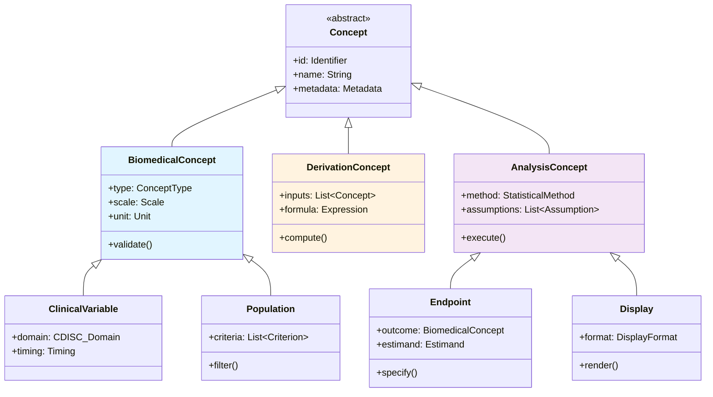
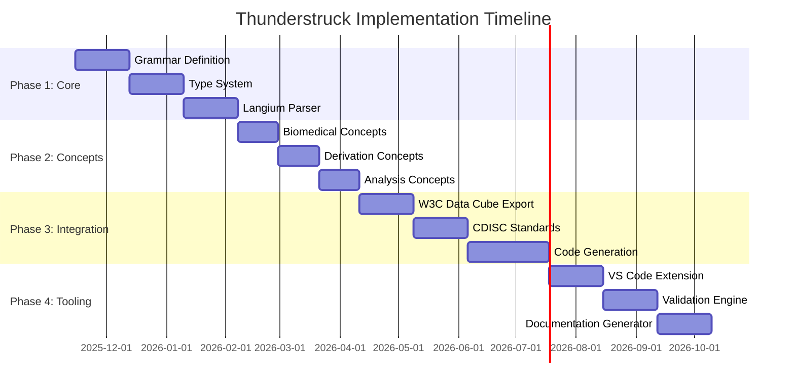

# 🌩️ Thunderstruck Language Proposal
## A Language-Oriented Programming Model for Clinical Trial Analysis

**Version:** 1.0
**Date:** 2025-11-14
**Status:** 🟡 Draft Proposal

---

## 📋 Table of Contents

1. [Executive Summary](#executive-summary)
2. [Introduction](#introduction)
3. [Conceptual Foundation](#conceptual-foundation)
4. [Language Design Principles](#language-design-principles)
5. [Core Language Syntax](#core-language-syntax)
6. [Type System & Concept Hierarchy](#type-system--concept-hierarchy)
7. [Worked Examples](#worked-examples)
8. [W3C Data Cube Integration](#w3c-data-cube-integration)
9. [Implementation Roadmap](#implementation-roadmap)
10. [Appendices](#appendices)

---

## Executive Summary

**Thunderstruck** is a domain-specific language (DSL) for describing statistical analyses of clinical trial data using a strongly-typed functional programming paradigm. Built on Langium, it integrates W3C Data Cube standards with clinical trial methodology to provide:

- 🎯 **Precision**: Strongly-typed concepts prevent analytical errors
- 🔗 **Traceability**: Direct linkage between SAP elements and data structures
- 🧩 **Composability**: Functional approach enables reusable analysis components
- 📊 **Standardization**: W3C Data Cube compliance ensures interoperability

---

## Introduction

### Problem Statement

Statistical Analysis Plans (SAPs) for clinical trials are typically written in natural language, leading to:

- **Ambiguity** in analytical specifications
- **Inconsistency** between protocol, SAP, and implementation
- **Manual effort** in translating specifications to code
- **Validation burden** ensuring correctness of implementation

### Solution: Language-Oriented Programming

Thunderstruck treats statistical analysis specifications as **executable artifacts** by:

1. **Formalizing concepts** from clinical and statistical domains
2. **Encoding relationships** between endpoints, estimands, and displays
3. **Leveraging type systems** to enforce correctness at compile-time
4. **Generating artifacts** (code, documentation, metadata) from single source

### Key Innovation: Concepts as Types

```
Biomedical Concepts     →  Domain Types (ADAS-Cog, Blood Pressure)
Analysis Concepts       →  Statistical Types (Mean, Dose-Response)
Derivation Concepts     →  Transformation Functions (ChangeFromBaseline)
```

---

## Conceptual Foundation

### Three-Tier Concept Architecture

```mermaid
graph TB
    subgraph "🧬 Biomedical Layer"
        BC[BiomedicalConcept]
        BC1[Clinical Variable]
        BC2[Population]
        BC3[Timepoint]
        BC --> BC1
        BC --> BC2
        BC --> BC3
    end

    subgraph "🔄 Derivation Layer"
        DC[DerivationConcept]
        DC1[Transformation]
        DC2[Aggregation]
        DC3[Computation]
        DC --> DC1
        DC --> DC2
        DC --> DC3
    end

    subgraph "📊 Analysis Layer"
        AC[AnalysisConcept]
        AC1[Statistical Method]
        AC2[Estimand]
        AC3[Display]
        AC --> AC1
        AC --> AC2
        AC --> AC3
    end

    BC1 --> DC1
    BC2 --> DC1
    DC1 --> AC1
    DC2 --> AC2
    AC1 --> AC3
    AC2 --> AC3

    style BC fill:#e1f5ff,stroke:#01579b,stroke-width:2px
    style DC fill:#fff3e0,stroke:#e65100,stroke-width:2px
    style AC fill:#f3e5f5,stroke:#4a148c,stroke-width:2px
```



### W3C Data Cube Alignment

| Thunderstruck Element | W3C Data Cube Component | Description |
|----------------------|-------------------------|-------------|
| **BiomedicalConcept** | Dimension | Observable characteristics (Age, Sex, Treatment) |
| **DerivationConcept** | Measure/Attribute | Computed values (Change from Baseline) |
| **AnalysisConcept** | Observation | Statistical results and displays |
| **Population** | Slice | Subset of data for analysis |
| **Endpoint** | Dataset | Collection of related observations |

---

## Language Design Principles

### 1. 🔒 Strong Typing

Every concept has an explicit type that is checked at compile-time:

```thunderstruck
// Type error: cannot assign numeric method to categorical outcome
concept: CategoricalOutcome {
    type: Categorical,
    method: LinearRegression  // ❌ Type mismatch
}
```

### 2. 🔄 Immutability

Concepts and derived values are immutable; transformations create new concepts:

```thunderstruck
let baseline: Measurement<ADASCog> = ...
let week24: Measurement<ADASCog> = ...

// Creates new concept, doesn't modify originals
let change: Derived<ADASCog> = ChangeFromBaseline(week24, baseline)
```

### 3. 🧩 Pure Functions

Analysis operations are pure functions with no side effects:

```thunderstruck
function DoseResponse(
    outcome: Measurement<T>,
    predictor: ContinuousVariable,
    covariates: List<Variable>
): AnalysisResult<LinearModel>
```

### 4. 🎯 Composition

Complex analyses are built from simpler components:

```thunderstruck
pipeline EfficacyAnalysis {
    derive: ChangeFromBaseline
    >> filter: EfficacyPopulation
    >> analyze: DoseResponseModel
    >> display: ForestPlot
}
```

---

## Core Language Syntax

### File Structure

```thunderstruck
namespace Study.ACME2024.Efficacy

import StandardConcepts.*
import CDISC.SDTM.*

// 1. Define Biomedical Concepts
biomedical concept ADASCog11 extends CognitiveAssessment {
    fullName: "Alzheimer's Disease Assessment Scale - Cognitive (11-item)"
    scale: 0..70
    direction: LowerIsBetter
    unit: "points"
}

// 2. Define Derivation Concepts
derivation ChangeFromBaseline<T: Measurement>
    (endpoint: T, baseline: T): Derived<T> {
    formula: endpoint.value - baseline.value
    unit: endpoint.unit
    interpretation: "Change from baseline"
}

// 3. Define Analysis Concepts
analysis DoseResponseLinear {
    method: LinearRegression
    family: Gaussian
    link: Identity
}

// 4. Define Endpoint
endpoint ADASCogChange {
    outcome: ChangeFromBaseline(ADASCog11.Week24, ADASCog11.Baseline)
    population: EfficacyPopulation
    estimand: DoseResponseEstimand
}

// 5. Define Display
display DoseResponseTable extends Table {
    source: ADASCogChange
    columns: [Dose, Estimate, StdError, CI95, PValue]
    format: StandardEfficacyTable
}
```

### Type System Core Syntax

```thunderstruck
// Primitive types
type Numeric = Int | Real
type Categorical = Ordered | Nominal
type Temporal = Date | DateTime | StudyDay

// Parameterized types
type Measurement<T: BiomedicalConcept> {
    value: T.scale
    unit: T.unit
    timepoint: Temporal
    subject: SubjectId
}

type Derived<T: BiomedicalConcept> extends Measurement<T> {
    derivation: DerivationConcept
    inputs: List<Measurement>
}

// Function types
type Transform<A, B> = A -> B
type Analysis<In, Out> = In -> AnalysisResult<Out>
```

### Concept Definitions

#### BiomedicalConcept Syntax

```thunderstruck
biomedical concept <Name> [extends <Parent>] {
    fullName: String
    code?: CodeSystem.Code          // CDISC, LOINC, SNOMED
    type: ConceptType               // Continuous, Categorical, etc.
    scale?: NumericRange | Categories
    unit?: String
    direction?: HigherIsBetter | LowerIsBetter
    metadata?: {
        source: DataSource
        collection: CollectionMethod
        derivation?: DerivationRule
    }
}
```

**Example:**

```thunderstruck
biomedical concept SystolicBP extends VitalSign {
    fullName: "Systolic Blood Pressure"
    code: LOINC."8480-6"
    type: Continuous
    scale: 0..300
    unit: "mmHg"
    direction: LowerIsBetter
    metadata: {
        source: SDTM.VS
        collection: StandardizedMeasurement
    }
}
```

#### DerivationConcept Syntax

```thunderstruck
derivation <Name><TypeParams>
    (<params>): <ReturnType> {
    formula: <Expression>
    [where: <Condition>]
    [unit: <Unit>]
    [interpretation: String]
}
```

**Example:**

```thunderstruck
derivation PercentChange<T: Measurement>
    (endpoint: T, baseline: T): Derived<T>
where baseline.value != 0 {
    formula: ((endpoint.value - baseline.value) / baseline.value) * 100
    unit: "percent"
    interpretation: "Percent change from baseline"
}
```

#### AnalysisConcept Syntax

```thunderstruck
analysis <Name> [extends <Parent>] {
    method: StatisticalMethod
    [family: DistributionFamily]
    [link: LinkFunction]
    [assumptions: List<Assumption>]
    [sensitivity: List<SensitivityAnalysis>]
}
```

**Example:**

```thunderstruck
analysis MixedModelRepeatedMeasures {
    method: MMRM
    family: Gaussian
    link: Identity
    assumptions: [
        NormalityOfResiduals,
        RandomMissingData
    ]
    sensitivity: [
        PatternMixtureModel,
        TippingPointAnalysis
    ]
}
```

---

## Type System & Concept Hierarchy

### Concept Type Hierarchy



### Type Constraints and Validation

```thunderstruck
// Type constraints ensure analytical validity
constraints {
    // Can only apply continuous methods to continuous outcomes
    LinearRegression.outcome: Continuous

    // Categorical outcomes require appropriate methods
    LogisticRegression.outcome: Binary | Ordinal

    // Repeated measures require temporal structure
    MMRM.data: hasStructure(Longitudinal)

    // Survival methods require time-to-event data
    CoxRegression.outcome: TimeToEvent
}
```

---

## Worked Examples

### Example 1: Dose-Response Linear Model

**Clinical Objective:**
*"Test for dose-response relationship using linear model for change in ADAS-Cog (11) Total Score from baseline to Week 24 with dose as continuous predictor adjusting for site group in efficacy population"*

```thunderstruck
namespace Examples.DoseResponse

// ═══════════════════════════════════════════════════════════
// 🧬 BIOMEDICAL CONCEPTS
// ═══════════════════════════════════════════════════════════

biomedical concept ADASCog11 extends CognitiveAssessment {
    fullName: "ADAS-Cog (11-item) Total Score"
    code: CDISC.SDTM.TESTCD."ACITM011"
    type: Continuous
    scale: 0..70
    unit: "points"
    direction: LowerIsBetter
}

biomedical concept TreatmentDose extends ExposureVariable {
    fullName: "Treatment Dose"
    type: Continuous
    scale: 0..100
    unit: "mg"
}

biomedical concept SiteGroup extends StratificationVariable {
    fullName: "Site Grouping"
    type: Categorical<Nominal>
    categories: ["SiteGroup1", "SiteGroup2", "SiteGroup3"]
}

population EfficacyPopulation {
    fullName: "Full Analysis Set (FAS)"
    criteria: [
        Randomized == true,
        ReceivedTreatment == true,
        HasBaselineAssessment == true
    ]
}

// ═══════════════════════════════════════════════════════════
// 🔄 DERIVATION CONCEPTS
// ═══════════════════════════════════════════════════════════

derivation ChangeFromBaseline<T: ContinuousVariable>
    (week24: Measurement<T>, baseline: Measurement<T>): Derived<T> {
    formula: week24.value - baseline.value
    unit: baseline.unit
    interpretation: "Change from baseline (negative = improvement for ADAS-Cog)"
}

let ADASCogBaseline = ADASCog11 at Baseline
let ADASCogWeek24 = ADASCog11 at Week24

derivation ADASCogChange = ChangeFromBaseline(ADASCogWeek24, ADASCogBaseline)

// ═══════════════════════════════════════════════════════════
// 📊 ANALYSIS CONCEPTS
// ═══════════════════════════════════════════════════════════

analysis DoseResponseLinearModel {
    method: LinearRegression
    family: Gaussian
    link: Identity

    formula: ADASCogChange ~ TreatmentDose + SiteGroup

    interpretation: {
        intercept: "Expected ADAS-Cog change at dose=0 for reference site group",
        TreatmentDose: "Change in ADAS-Cog per 1mg increase in dose",
        SiteGroup: "Site group effect on ADAS-Cog change"
    }

    assumptions: [
        LinearRelationship(predictor: TreatmentDose, outcome: ADASCogChange),
        NormalityOfResiduals,
        Homoscedasticity,
        IndependentObservations
    ]

    hypotheses: {
        null: "β_dose = 0 (no dose-response relationship)",
        alternative: "β_dose ≠ 0 (dose-response relationship exists)",
        alpha: 0.05,
        sided: TwoSided
    }
}

// ═══════════════════════════════════════════════════════════
// 🎯 ENDPOINT SPECIFICATION
// ═══════════════════════════════════════════════════════════

endpoint DoseResponseEndpoint {
    id: "EFF-01-DR"
    label: "ADAS-Cog Dose-Response Analysis"

    outcome: ADASCogChange
    population: EfficacyPopulation

    estimand: {
        treatment: TreatmentDose,
        outcome: ADASCogChange,
        population: EfficacyPopulation,
        intercurrentEvents: [
            DiscontinuationRule: "Treatment policy strategy",
            RescueMedication: "Treatment policy strategy"
        ],
        summaryMeasure: "Slope coefficient (β_dose)"
    }

    analysis: DoseResponseLinearModel

    primary: true
}

// ═══════════════════════════════════════════════════════════
// 📋 DISPLAY SPECIFICATIONS
// ═══════════════════════════════════════════════════════════

display DoseResponseTable extends Table {
    id: "T-EFF-01-DR"
    title: "Dose-Response Analysis for ADAS-Cog Change at Week 24"
    source: DoseResponseEndpoint

    columns: [
        Parameter {label: "Parameter", width: 200},
        Estimate {label: "Estimate", decimals: 3},
        StdError {label: "Std. Error", decimals: 3},
        CI95Lower {label: "95% CI Lower", decimals: 3},
        CI95Upper {label: "95% CI Upper", decimals: 3},
        TStatistic {label: "t-value", decimals: 2},
        PValue {label: "p-value", decimals: 4, format: ScientificIfSmall}
    ]

    rows: [
        Intercept,
        TreatmentDose,
        SiteGroup.levels
    ]

    footnotes: [
        "Linear regression model: Change from Baseline = β₀ + β₁(Dose) + β₂(SiteGroup)",
        "Negative change indicates improvement in ADAS-Cog score",
        "Analysis population: Full Analysis Set (FAS)"
    ]
}

display DoseResponsePlot extends ScatterPlot {
    id: "F-EFF-01-DR"
    title: "Dose-Response Relationship: ADAS-Cog Change at Week 24"
    source: DoseResponseEndpoint

    xAxis: {
        variable: TreatmentDose,
        label: "Treatment Dose (mg)",
        scale: Linear
    }

    yAxis: {
        variable: ADASCogChange,
        label: "Change from Baseline in ADAS-Cog Total Score",
        scale: Linear
    }

    layers: [
        Points {
            data: Individual observations,
            color: SiteGroup,
            alpha: 0.5
        },
        RegressionLine {
            data: Fitted values,
            color: SiteGroup,
            linewidth: 2
        },
        ConfidenceInterval {
            level: 0.95,
            color: SiteGroup,
            alpha: 0.2
        }
    ]

    legend: {
        position: TopRight,
        title: "Site Group"
    }
}
```

### Example 2: Continuous Dose Modeling in Regression

**Clinical Objective:**
*"Treatment dose modeled as a continuous numeric variable in regression models to assess dose-response relationships"*

```thunderstruck
namespace Examples.ContinuousDose

// ═══════════════════════════════════════════════════════════
// 🧬 BIOMEDICAL CONCEPTS
// ═══════════════════════════════════════════════════════════

biomedical concept Dose extends ExposureVariable {
    fullName: "Treatment Dose Level"
    type: Continuous
    scale: 0..200
    unit: "mg/day"

    metadata: {
        source: SDTM.EX,
        derivation: "Average daily dose during treatment period"
    }
}

// Alternative modeling strategies for dose
trait DoseModeling {
    // Strategy 1: Linear
    model Linear: Dose

    // Strategy 2: Log-transformed
    model LogTransformed: log(Dose + 1)

    // Strategy 3: Quadratic
    model Quadratic: Dose + Dose²

    // Strategy 4: Restricted cubic spline
    model Spline: rcs(Dose, knots: [25, 50, 100, 150])
}

// ═══════════════════════════════════════════════════════════
// 📊 ANALYSIS CONCEPTS - Multiple Dose Models
// ═══════════════════════════════════════════════════════════

analysis LinearDoseModel implements DoseModeling.Linear {
    method: GeneralizedLinearModel
    family: Gaussian
    formula: Outcome ~ Dose + Covariates

    interpretation: {
        Dose: "Linear effect: constant change per unit dose increase"
    }
}

analysis LogDoseModel implements DoseModeling.LogTransformed {
    method: GeneralizedLinearModel
    family: Gaussian
    formula: Outcome ~ log(Dose + 1) + Covariates

    interpretation: {
        logDose: "Logarithmic effect: diminishing returns at higher doses"
    }
}

analysis QuadraticDoseModel implements DoseModeling.Quadratic {
    method: GeneralizedLinearModel
    family: Gaussian
    formula: Outcome ~ Dose + I(Dose²) + Covariates

    interpretation: {
        Dose: "Linear component of dose effect",
        DoseSquared: "Quadratic component (curvature): positive = U-shaped, negative = inverted-U"
    }

    hypotheses: {
        nonlinearity: {
            null: "β_dose² = 0 (relationship is linear)",
            alternative: "β_dose² ≠ 0 (relationship is nonlinear)"
        }
    }
}

analysis SplineDoseModel implements DoseModeling.Spline {
    method: GeneralizedLinearModel
    family: Gaussian
    formula: Outcome ~ rcs(Dose, 4) + Covariates

    interpretation: {
        splineTerms: "Flexible dose-response allowing non-monotonic relationships"
    }

    knots: [25, 50, 100, 150]  // Based on dose quantiles or clinical relevance
}

// ═══════════════════════════════════════════════════════════
// 🔄 MODEL COMPARISON FRAMEWORK
// ═══════════════════════════════════════════════════════════

analysis DoseModelComparison {
    candidates: [
        LinearDoseModel,
        LogDoseModel,
        QuadraticDoseModel,
        SplineDoseModel
    ]

    criteria: {
        AIC: "Akaike Information Criterion",
        BIC: "Bayesian Information Criterion",
        LikelihoodRatioTest: "Nested model comparison",
        ResidualDiagnostics: "Visual assessment of model fit"
    }

    selection: {
        primary: BIC,  // Penalizes complexity more than AIC
        rule: "Select model with lowest BIC unless improvement < 2 units"
    }
}

// ═══════════════════════════════════════════════════════════
// 🎯 COMPREHENSIVE DOSE-RESPONSE ENDPOINT
// ═══════════════════════════════════════════════════════════

endpoint ComprehensiveDoseResponse {
    id: "EFF-02-DR-COMP"
    label: "Comprehensive Dose-Response Modeling"

    outcome: PrimaryEfficacyOutcome
    population: EfficacyPopulation

    analysisSequence: [
        // Step 1: Fit all candidate models
        FitModels(DoseModelComparison.candidates),

        // Step 2: Compare models
        CompareFit(DoseModelComparison.criteria),

        // Step 3: Select best model
        SelectBest(DoseModelComparison.selection),

        // Step 4: Perform inference on selected model
        Inference(selected: true)
    ]

    sensitivity: [
        "Robustness to outliers: Repeat with robust standard errors",
        "Influence diagnostics: Cook's distance and DFBETAS",
        "Alternative link functions: Identity vs. Log"
    ]
}

// ═══════════════════════════════════════════════════════════
// 📊 ADVANCED VISUALIZATION
// ═══════════════════════════════════════════════════════════

display DoseResponseComparisonPlot extends MultiPanelPlot {
    id: "F-EFF-02-DR-COMP"
    title: "Dose-Response Model Comparison"
    source: ComprehensiveDoseResponse

    layout: Grid(2, 2)

    panels: [
        Panel {
            position: (1, 1),
            content: ScatterWithFit {
                model: LinearDoseModel,
                title: "(A) Linear Model"
            }
        },
        Panel {
            position: (1, 2),
            content: ScatterWithFit {
                model: LogDoseModel,
                title: "(B) Log-Dose Model"
            }
        },
        Panel {
            position: (2, 1),
            content: ScatterWithFit {
                model: QuadraticDoseModel,
                title: "(C) Quadratic Model"
            }
        },
        Panel {
            position: (2, 2),
            content: ScatterWithFit {
                model: SplineDoseModel,
                title: "(D) Spline Model (4 knots)"
            }
        }
    ]

    commonElements: {
        xAxis: {variable: Dose, label: "Dose (mg/day)"},
        yAxis: {variable: PrimaryEfficacyOutcome, label: "Treatment Effect"}
    }
}

display ModelComparisonTable extends Table {
    id: "T-EFF-02-DR-COMP"
    title: "Dose-Response Model Selection Criteria"
    source: ComprehensiveDoseResponse

    columns: [
        Model {label: "Model Specification"},
        Parameters {label: "# Parameters"},
        LogLikelihood {label: "Log-Likelihood", decimals: 2},
        AIC {label: "AIC", decimals: 1},
        BIC {label: "BIC", decimals: 1},
        DeltaBIC {label: "ΔBIC", decimals: 1, reference: MinBIC}
    ]

    rows: DoseModelComparison.candidates

    highlighting: {
        BestModel: {criteria: MinBIC, style: Bold}
    }
}
```

---

## W3C Data Cube Integration

### Mapping Thunderstruck to Data Cube Vocabulary

```thunderstruck
// Thunderstruck provides native Data Cube export
export DataCube {
    format: W3C.DataCube.RDF
    vocabulary: QB  // qb: prefix for Data Cube vocabulary

    mapping: {
        BiomedicalConcept → qb:DimensionProperty
        DerivationConcept → qb:MeasureProperty
        AnalysisConcept → qb:Observation
        Population → qb:Slice
        Endpoint → qb:DataSet
    }
}
```

### Data Cube Structure Definition

```mermaid
graph LR
    subgraph "📦 Data Cube Dataset"
        DS[qb:DataSet<br/>Endpoint]
    end

    subgraph "📏 Dimensions"
        D1[Treatment]
        D2[Timepoint]
        D3[Population]
        D4[Site]
    end

    subgraph "📊 Measures"
        M1[Outcome Value]
        M2[Change from Baseline]
        M3[Percent Change]
    end

    subgraph "📋 Observations"
        O1[Observation 1]
        O2[Observation 2]
        O3[Observation N]
    end

    DS --> O1
    DS --> O2
    DS --> O3

    D1 --> O1
    D2 --> O1
    D3 --> O1
    D4 --> O1

    M1 --> O1
    M2 --> O1
    M3 --> O1

    style DS fill:#f3e5f5
    style D1 fill:#e1f5ff
    style D2 fill:#e1f5ff
    style D3 fill:#e1f5ff
    style D4 fill:#e1f5ff
    style M1 fill:#fff3e0
    style M2 fill:#fff3e0
    style M3 fill:#fff3e0
```



### Example Data Cube Export

```turtle
@prefix qb:    <http://purl.org/linked-data/cube#> .
@prefix rdfs:  <http://www.w3.org/2000/01/rdf-schema#> .
@prefix ts:    <http://thunderstruck.org/vocab#> .

# Data Structure Definition
:dsd-dose-response a qb:DataStructureDefinition ;
    qb:component
        [ qb:dimension ts:treatment-dose ],
        [ qb:dimension ts:timepoint ],
        [ qb:dimension ts:population ],
        [ qb:measure ts:adas-cog-change ],
        [ qb:attribute ts:standard-error ] .

# Dataset
:dataset-eff-01 a qb:DataSet ;
    rdfs:label "ADAS-Cog Dose-Response Analysis" ;
    qb:structure :dsd-dose-response .

# Observations
:obs-1 a qb:Observation ;
    qb:dataSet :dataset-eff-01 ;
    ts:treatment-dose "50"^^xsd:decimal ;
    ts:timepoint :week-24 ;
    ts:population :efficacy-population ;
    ts:adas-cog-change "-2.3"^^xsd:decimal ;
    ts:standard-error "0.8"^^xsd:decimal .
```

---

## Implementation Roadmap

### Phase 1: Language Core (Months 1-3) 🟢



### Deliverables by Phase

| Phase | Deliverable | Description |
|-------|-------------|-------------|
| **Phase 1** | Langium Grammar | Complete `.langium` grammar file |
| | Type Checker | Static type validation |
| | REPL | Interactive language shell |
| **Phase 2** | Concept Library | Standard biomedical, derivation, and analysis concepts |
| | Validators | Compile-time correctness checks |
| | Standard Library | Common functions and utilities |
| **Phase 3** | Data Cube Exporter | RDF/Turtle generation |
| | CDISC Mapper | SDTM/ADaM integration |
| | R Code Generator | Statistical code generation |
| | Python Code Generator | Statistical code generation |
| **Phase 4** | VS Code Extension | Syntax highlighting, IntelliSense, error checking |
| | Validation Service | Real-time SAP validation |
| | Doc Generator | Automatic SAP documentation |

### Technical Architecture

```mermaid
graph TD
    subgraph "🖊️ Authoring Layer"
        ED[Editor<br/>VS Code]
        LSP[Language Server<br/>Langium LSP]
    end

    subgraph "⚙️ Compilation Layer"
        PARSE[Parser]
        AST[Abstract Syntax Tree]
        TYPE[Type Checker]
        VAL[Semantic Validator]
    end

    subgraph "🔄 Transformation Layer"
        IR[Intermediate Representation]
        OPT[Optimizer]
    end

    subgraph "📤 Output Layer"
        CUBE[W3C Data Cube<br/>RDF/Turtle]
        R[R Code<br/>tidyverse/brms]
        PY[Python Code<br/>statsmodels/PyMC]
        DOC[Documentation<br/>Markdown/LaTeX]
        META[Metadata<br/>JSON-LD]
    end

    ED --> LSP
    LSP --> PARSE
    PARSE --> AST
    AST --> TYPE
    TYPE --> VAL
    VAL --> IR
    IR --> OPT
    OPT --> CUBE
    OPT --> R
    OPT --> PY
    OPT --> DOC
    OPT --> META

    style ED fill:#e3f2fd
    style LSP fill:#e3f2fd
    style PARSE fill:#fff9c4
    style AST fill:#fff9c4
    style TYPE fill:#fff9c4
    style VAL fill:#fff9c4
    style IR fill:#f3e5f5
    style OPT fill:#f3e5f5
    style CUBE fill:#c8e6c9
    style R fill:#c8e6c9
    style PY fill:#c8e6c9
    style DOC fill:#c8e6c9
    style META fill:#c8e6c9
```



---

## Appendices

### Appendix A: Complete Grammar Specification (EBNF)

```ebnf
// Top-level program structure
Program ::= Namespace Import* Definition*

Namespace ::= 'namespace' QualifiedName

Import ::= 'import' QualifiedName ('.' '*')?

Definition ::=
    | ConceptDefinition
    | DerivationDefinition
    | AnalysisDefinition
    | EndpointDefinition
    | DisplayDefinition
    | PopulationDefinition

// Concept definitions
ConceptDefinition ::=
    'biomedical' 'concept' ID ('extends' TypeRef)? '{' ConceptBody '}'

ConceptBody ::= ConceptProperty*

ConceptProperty ::=
    | 'fullName' ':' STRING
    | 'code' ':' CodeReference
    | 'type' ':' ConceptType
    | 'scale' ':' ScaleDefinition
    | 'unit' ':' STRING
    | 'direction' ':' ('HigherIsBetter' | 'LowerIsBetter')
    | 'metadata' ':' '{' MetadataProperty* '}'

// Derivation definitions
DerivationDefinition ::=
    'derivation' ID TypeParameters? '(' ParameterList ')' ':' TypeRef
    ('where' Expression)? '{' DerivationBody '}'

DerivationBody ::=
    'formula' ':' Expression
    ('unit' ':' STRING)?
    ('interpretation' ':' STRING)?

// Analysis definitions
AnalysisDefinition ::=
    'analysis' ID ('extends' TypeRef)? ('implements' TypeRef)?
    '{' AnalysisBody '}'

AnalysisBody ::= AnalysisProperty*

AnalysisProperty ::=
    | 'method' ':' StatisticalMethod
    | 'family' ':' DistributionFamily
    | 'link' ':' LinkFunction
    | 'formula' ':' Formula
    | 'assumptions' ':' '[' AssumptionList ']'
    | 'hypotheses' ':' '{' HypothesisDefinition* '}'

// Endpoint definitions
EndpointDefinition ::=
    'endpoint' ID '{' EndpointBody '}'

EndpointBody ::=
    ('id' ':' STRING)?
    ('label' ':' STRING)?
    'outcome' ':' Expression
    'population' ':' TypeRef
    ('estimand' ':' EstimandDefinition)?
    'analysis' ':' TypeRef
    ('primary' ':' BOOLEAN)?

// Display definitions
DisplayDefinition ::=
    'display' ID 'extends' DisplayType '{' DisplayBody '}'

DisplayBody ::= DisplayProperty*

// Type system
TypeRef ::= ID TypeArguments?

TypeArguments ::= '<' TypeRef (',' TypeRef)* '>'

TypeParameters ::= '<' TypeParameter (',' TypeParameter)* '>'

TypeParameter ::= ID (':' TypeConstraint)?

// Expressions
Expression ::=
    | Literal
    | ID
    | FunctionCall
    | BinaryOp
    | UnaryOp
    | MemberAccess
    | '(' Expression ')'

FunctionCall ::= ID '(' ArgumentList? ')'

BinaryOp ::= Expression Operator Expression

Operator ::= '+' | '-' | '*' | '/' | '^' | '==' | '!=' | '<' | '>' | '<=' | '>='

// Terminals
ID ::= [a-zA-Z_][a-zA-Z0-9_]*
STRING ::= '"' [^"]* '"'
NUMBER ::= [0-9]+ ('.' [0-9]+)?
BOOLEAN ::= 'true' | 'false'
```

### Appendix B: Standard Library Preview

```thunderstruck
// ═══════════════════════════════════════════════════════════
// Standard Thunderstruck Library
// ═══════════════════════════════════════════════════════════

namespace Thunderstruck.Std

// ────────────────────────────────────────────────────────────
// Common Biomedical Concepts
// ────────────────────────────────────────────────────────────

biomedical concept Age extends DemographicVariable {
    type: Continuous
    scale: 0..120
    unit: "years"
}

biomedical concept Sex extends DemographicVariable {
    type: Categorical<Nominal>
    categories: ["Male", "Female"]
}

biomedical concept Race extends DemographicVariable {
    type: Categorical<Nominal>
    categories: ["White", "Black", "Asian", "Other"]
}

// ────────────────────────────────────────────────────────────
// Common Derivations
// ────────────────────────────────────────────────────────────

derivation Mean<T: Numeric>(values: List<T>): T {
    formula: sum(values) / length(values)
}

derivation StdDev<T: Numeric>(values: List<T>): T {
    formula: sqrt(sum((values - mean(values))^2) / (length(values) - 1))
}

derivation ChangeFromBaseline<T: Measurement>(
    post: T,
    baseline: T
): Derived<T> {
    formula: post.value - baseline.value
    unit: baseline.unit
}

derivation PercentChangeFromBaseline<T: Measurement>(
    post: T,
    baseline: T
): Derived<Percent> where baseline.value != 0 {
    formula: ((post.value - baseline.value) / abs(baseline.value)) * 100
    unit: "percent"
}

// ────────────────────────────────────────────────────────────
// Common Statistical Methods
// ────────────────────────────────────────────────────────────

analysis TTest {
    method: StudentTTest
    sided: TwoSided
    alpha: 0.05
    assumptions: [
        NormalityOfResiduals,
        EqualVariances
    ]
}

analysis WelchTTest extends TTest {
    assumptions: [NormalityOfResiduals]  // Relaxes equal variance
}

analysis ANOVA {
    method: AnalysisOfVariance
    type: OneWay
    posthoc: Tukey
}

analysis ANCOVA extends ANOVA {
    type: WithCovariates
}
```

### Appendix C: Comparison with Existing Solutions

| Feature | Thunderstruck | R (Base) | SAS | Python (statsmodels) |
|---------|---------------|----------|-----|---------------------|
| **Type Safety** | ✅ Strong static typing | ❌ Dynamic typing | ⚠️ Weak typing | ❌ Dynamic typing |
| **Domain Concepts** | ✅ First-class | ❌ Manual encoding | ⚠️ Partial (PROC) | ❌ Manual encoding |
| **W3C Data Cube** | ✅ Native support | ❌ Requires packages | ❌ Not supported | ⚠️ Via RDFLib |
| **Functional Paradigm** | ✅ Pure functions | ⚠️ Multi-paradigm | ❌ Procedural | ⚠️ Multi-paradigm |
| **Compile-time Validation** | ✅ Full validation | ❌ Runtime only | ⚠️ Macro validation | ❌ Runtime only |
| **Code Generation** | ✅ Multi-target | N/A | N/A | N/A |
| **SAP Traceability** | ✅ Direct linkage | ❌ Manual | ⚠️ Comments only | ❌ Manual |
| **Learning Curve** | ⚠️ New paradigm | ✅ Familiar | ⚠️ Specialized | ✅ Familiar |

### Appendix D: Future Extensions

#### Natural Language Interface

```thunderstruck
// Future: Natural language → Thunderstruck compilation
@NaturalLanguage {
    input: "Calculate the mean change from baseline in systolic BP at week 12
            for the treated group versus placebo"

    compiles_to: {
        derivation: ChangeFromBaseline(SystolicBP.Week12, SystolicBP.Baseline)
        analysis: TTest(treatment: Treated, control: Placebo)
        population: SafetyPopulation
    }
}
```

#### Machine Learning Integration

```thunderstruck
// Future: ML concept discovery
analysis AdaptiveLasso {
    method: MachineLearning.Lasso
    tuning: CrossValidation(folds: 10)
    features: AutoSelect(
        candidates: [Demographics.*, Baseline.*, Stratification.*],
        criterion: MinimizeMSE
    )
}
```

#### Bayesian Extensions

```thunderstruck
// Future: Bayesian analysis primitives
analysis BayesianDoseResponse {
    method: BayesianRegression
    prior: {
        intercept: Normal(0, 10),
        dose: Normal(0, 5),
        sigma: HalfCauchy(5)
    }
    sampler: NUTS
    chains: 4
    iterations: 2000
}
```

---

## Summary & Next Steps

### Key Advantages of Thunderstruck

1. **🎯 Precision**: Types catch errors before execution
2. **🔗 Traceability**: Direct SAP → Code → Results lineage
3. **♻️ Reusability**: Concept libraries across studies
4. **🤝 Interoperability**: W3C standards enable data sharing
5. **📚 Documentation**: Self-documenting specifications
6. **✅ Validation**: Automated correctness checking

### Immediate Next Steps

1. **Stakeholder Review**: Gather feedback from statisticians, programmers, and regulators
2. **Prototype Development**: Build minimal viable grammar in Langium
3. **Example Library**: Expand worked examples covering common SAP scenarios
4. **Tool Integration**: Design VS Code extension mockups
5. **Standards Alignment**: Validate W3C Data Cube and CDISC mappings

### Community Engagement

We invite the clinical trials community to:

- 💬 **Provide Feedback**: What concepts are missing? What syntax is unclear?
- 🤝 **Collaborate**: Join working groups for concept standardization
- 🧪 **Pilot Projects**: Test Thunderstruck on real SAPs
- 📖 **Contribute**: Expand the standard library with domain expertise

---

**Document Version:** 1.0
**Last Updated:** 2025-11-14
**Authors:** Clinical Data Science Team
**License:** CC-BY-4.0

---

*"From statistical plans to executable precision—Thunderstruck brings the rigor of programming language design to clinical trial analysis."*

🌩️ **Thunderstruck** — *When analysis meets language-oriented programming*
