# ⚡️ Thunderstruck DSL 

> **Purpose:** A strongly typed, functional domain-specific language for expressing a **Statistical Analysis Plan (SAP)** as a **W3C Data Cube**—linking **Endpoints**, **Estimands**, and **Displays** (Tables, Figures, Listings) to well-defined **Concepts**.

---

## 1. Vision

Thunderstruck captures SAP intent as **typed, composable abstractions** over data cubes. It treats:

- **Concepts ≙ Types** (immutable, reusable, versioned)
- **Structural elements ≙ Functions** (pure, referentially transparent)
- **Analyses ≙ Typed programs** that transform cube slices into results

This enables:

- Deterministic validation (type- and unit-safety)
- Programmatic generation of displays and analysis results metadata (ARM/ARS)
- Traceability from **Protocol ↔ Estimand ↔ Endpoint ↔ Data ↔ Result**

---

## 2. Core Concept Taxonomy

Concepts are first-class **types**. Three disjoint kinds exist, each shown with an icon and color:

- 🧬 **BiomedicalConcept** (*green*) – clinical/biological meaning (e.g., *ADAS‑Cog (11) Total Score*)
- 📈 **AnalysisConcept** (*blue*) – analysis-space quantity (e.g., *Change from Baseline*)
- 🧮 **DerivationConcept** (*orange*) – computable transformation (e.g., *LOCF Imputation*)

> **Legend**: <span style="background:#E6F4EA;color:#0B8043;padding:0.15em 0.35em;border-radius:4px">Biomedical</span> · <span style="background:#E7F0FD;color:#1967D2;padding:0.15em 0.35em;border-radius:4px">Analysis</span> · <span style="background:#FFF3E0;color:#E37400;padding:0.15em 0.35em;border-radius:4px">Derivation</span>

### 2.1 Mapping to W3C Data Cube

| Thunderstruck | Data Cube | Example |
|---|---|---|
| **Dimension** | `qb:DimensionProperty` | Subject, Visit, SiteGroup, Dose |
| **Measure**   | `qb:MeasureProperty`   | CHG (Change), Score |
| **Attribute** | `qb:AttributeProperty` | Imputation, Population |

> Thunderstruck declares cube **DSDs** (Data Structure Definitions), **Datasets**, and **Slices** and binds them to Concept types.

---

## 3. Language Overview (Informal Syntax)

```thunder
module company.trials.alzheimers@1.0

import cdisc.adam.*
import cdisc.sdtm.*
import ncit.*

// Concepts (types)
biomedical concept ADAS_COG11_TOTAL : Numeric(points) {
  code: NCIT:C111295 // ADAS‑Cog (11) Total Score
}

analysis concept CHG<T: Numeric> : Numeric(points) {
  description: "Change from baseline"
}

derivation concept LOCF<T> : T {
  description: "Last Observation Carried Forward"
}

// Data Cube elements
cube ADAS_COG11_DSD {
  dimensions: [ USUBJID: Id, AVISIT: Visit, SITEGR1: Categorical, TRTDOSE: Numeric(mg) ]
  measures:   [ AVAL: Numeric(points), CHG: Numeric(points) ]
  attributes: [ IMP: Imputation, POP: Population ]
}

// Populations
population EFF = where( POP == "EFF" )

// Derivations as pure functions
fn change_from_baseline(x: Measure Numeric(points),
                        baseline: Visit,
                        at: Visit): Measure Numeric(points) =
  CHG<Numeric>( x(at) - x(baseline) )

fn locf(x: Measure Numeric(points)): Measure Numeric(points) =
  apply LOCF<Numeric>(x)

// Estimands (ICH E9(R1))
estimand DoseSlope_EFF {
  population: EFF
  variable: CHG(ADAS_COG11_TOTAL)
  intercurrent: treatment_policy
  summary: slope(dose)
}

// Analyses
analysis DoseResponseLinear {
  dataset: ADAS_COG11_DSD
  response: change_from_baseline(AVAL, baseline = "Baseline", at = "Week 24") |> locf
  predictors: [ dose := as_numeric(TRTDOSE), site_group := as_factor(SITEGR1), base := baseline_value(AVAL) ]
  model: lm( response ~ dose + site_group + base )
  target: DoseSlope_EFF
}

// Displays
figure "Figure 14‑3: Dose‑response for ADAS‑Cog(11) CHG at Week 24" {
  source: DoseResponseLinear
  layers: [ regression_line(dose, response), ci_band(95%), jitter(points) ]
}

table  "Table 14‑3.01: Primary Endpoint Analysis" {
  source: DoseResponseLinear
  columns: [ effect, estimate, se, df, t, p, ci95 ]
  footnotes: [ "Type III SS for dose", "Adjusted for site group and baseline" ]
}
```

> **Notes**
> - `|>` is the forward pipe for function composition (left‑to‑right).
> - All functions are **pure**; no hidden state or I/O.
> - Units are part of types (e.g., `Numeric(points)`, `Numeric(mg)`).

---

## 4. Worked Examples

### 4.1 Dose–response linear model (ADAS‑Cog (11))

> *“Test for dose‑response relationship using linear model for change in ADAS‑Cog (11) Total Score from baseline to Week 24 with dose as continuous predictor adjusting for site group in efficacy population.”*

```thunder
analysis ADAS11_DoseResponse_GLm {
  dataset: ADAS_COG11_DSD
  response: AVAL |> change_from_baseline(baseline = "Baseline", at = "Week 24") |> locf
  predictors: [ dose := as_numeric(TRTDOSE), site := as_factor(SITEGR1), base := baseline_value(AVAL) ]
  population: EFF
  model: lm( response ~ dose + site + base )
  target: DoseSlope_EFF
  outputs: [ p_value(term = dose, typeIII = true), slope(dose), adj_r2 ]
}

table "Dose‑response (Primary)" { source: ADAS11_DoseResponse_GLm }
```

**Semantic checks enforced:**

- `dose` has type `Numeric(mg)` and is coerced by `as_numeric` → **continuous** predictor
- `site` is categorical (`Factor`); encoded as a **dimension attribute** in the cube
- `response` is `Numeric(points)` and derived **only** from allowed BiomedicalConcepts
- `population: EFF` constraints the slice (`POP == "EFF"`)

### 4.2 Dose modeled as continuous variable in regression

> *“Treatment dose modeled as a continuous numeric variable in regression models to assess dose‑response relationships.”*

```thunder
fn dose_cont(x: Dimension Numeric(mg)): Predictor Continuous(mg) = as_numeric(x)

analysis GenericDoseSlope {
  dataset: ADAS_COG11_DSD
  response: CHG
  predictors: [ dose := dose_cont(TRTDOSE) ]
  model: lm( response ~ dose )
  target: DoseSlope_EFF
}
```

---

## 5. Formal Grammar (Langium)

> **File:** `src/language/thunderstruck.langium`

```langium
grammar Thunderstruck

entry Model: (declarations+=Declaration)*;

Declaration:
    ModuleDecl | ImportDecl | ConceptDecl | CubeDecl | PopulationDecl |
    EstimandDecl | AnalysisDecl | DisplayDecl | FunctionDecl;

ModuleDecl: 'module' name=QualifiedName '@' version=Version;
ImportDecl: 'import' importedNamespace=QualifiedName '.*'?;

ConceptDecl:
    kind=ConceptKind 'concept' name=ID (':' type=TypeRef)? ('=' expr=Expr)? '{' ConceptBody '}' ;

ConceptKind: 'biomedical' | 'analysis' | 'derivation';

ConceptBody: (meta+=MetaDecl | role+=RoleDecl | doc=DocString)*;
RoleDecl: ('dimension' | 'measure' | 'attribute') ':' type=TypeRef ('as' alias=ID)? ;

CubeDecl: 'cube' name=ID '{'
    'dimensions' ':' '[' dims+=DimDecl (',' dims+=DimDecl)* ']' 
    'measures'   ':' '[' meas+=MeasDecl (',' meas+=MeasDecl)* ']'
    ('attributes' ':' '[' attrs+=AttrDecl (',' attrs+=AttrDecl)* ']')?
'}';
DimDecl: name=ID ':' type=TypeRef;
MeasDecl: name=ID ':' type=TypeRef;
AttrDecl: name=ID ':' type=TypeRef;

PopulationDecl: 'population' name=ID '=' predicate=Expr;

EstimandDecl: 'estimand' name=ID '{'
    'population' ':' ref=[PopulationDecl|QualifiedName]
    'variable'   ':' expr=Expr
    ('intercurrent' ':' ic=ID)?
    'summary'    ':' summary=Expr
'}';

AnalysisDecl: 'analysis' name=ID '{'
    'dataset'   ':' ref=[CubeDecl|QualifiedName]
    'response'  ':' response=Expr
    ('predictors' ':' '[' predictors+=Assignment (',' predictors+=Assignment)* ']')?
    ('population' ':' pop=[PopulationDecl|QualifiedName])?
    'model'     ':' model=Expr
    'target'    ':' targ=[EstimandDecl|QualifiedName]
    ('outputs'  ':' '[' outs+=Expr (',' outs+=Expr)* ']')?
'}';

DisplayDecl: ('table' | 'figure' | 'listing') name=STRING '{'
    'source' ':' ref=[AnalysisDecl|QualifiedName]
    ('columns' ':' '[' columns+=ID (',' columns+=ID)* ']')?
    ('layers'  ':' '[' layers+=Expr (',' layers+=Expr)* ']')?
    ('footnotes' ':' '[' notes+=STRING (',' notes+=STRING)* ']')?
'}';

FunctionDecl: 'fn' name=ID '(' (params+=Param (',' params+=Param)*)? ')' ':' ret=TypeRef '=' body=Expr;
Param: name=ID ':' type=TypeRef;

TypeRef: name=QualifiedName ('<' typeArgs+=TypeRef (',' typeArgs+=TypeRef)* '>')?;

Expr: FunctionCall | PipeExpr | Primary;
PipeExpr: left=Primary '|>' right=FunctionCall;
FunctionCall: ref=[FunctionDecl|QualifiedName] '(' (args+=Arg (',' args+=Arg)*)? ')';
Arg: (name=ID '=')? value=Expr;

Primary: Literal | Ref;
Ref: [Declaration|QualifiedName];

Literal: STRING | INT | DECIMAL | BOOL;
BOOL: 'true' | 'false';

QualifiedName: ID ('.' ID)*;
Version: INT '.' INT ('.' INT)?;
DocString: 'description' ':' STRING;

terminal DECIMAL: INT '.' INT;
terminal ID: /[A-Za-z_][A-Za-z0-9_]*/;
terminal INT: /[0-9]+/;
terminal STRING: /"([^"\\]|\\.)*"/;
```

---

## 6. Type System & Static Semantics

1. **Kind separation**: `BiomedicalConcept ⟂ AnalysisConcept ⟂ DerivationConcept` (no subtyping across kinds).
2. **Unit safety**: Numeric types carry units; arithmetic allowed only on compatible units.
3. **Cube discipline**: Measures, dimensions, attributes must bind to declared Concept types.
4. **Purity**: All functions are total and side‑effect free; dataset access is via explicit cube references.
5. **Population slicing**: `population` expressions reduce the cube to a **Slice**; models consume slices only.
6. **Estimand matching**: `analysis.target` must accept the response’s type and population.
7. **Provenance**: Every derived measure retains a lineage chain of source concepts and functions.

---

## 7. Code Generation Targets

- **W3C Data Cube (RDF/JSON‑LD)**: emit DSD (`qb:DataStructureDefinition`), component specs, dataset and slices
- **CDISC ARM/ARS**: emit Analysis Results Metadata records for displays
- **Execution stubs**: TypeScript/Arrow or R/SAS adapters from typed model specs

### 7.1 JSON‑LD sketch

```json
{
  "@context": { "qb": "http://purl.org/linked-data/cube#" },
  "@id": "adas11-dsd",
  "@type": "qb:DataStructureDefinition",
  "qb:component": [
    { "qb:dimension": "USUBJID" },
    { "qb:dimension": "AVISIT" },
    { "qb:dimension": "SITEGR1" },
    { "qb:dimension": "TRTDOSE" },
    { "qb:measure":   "CHG" },
    { "qb:attribute": "POP" },
    { "qb:attribute": "IMP" }
  ]
}
```

---

## 8. Diagrams

### 8.1 Domain Model (Mermaid)


### 8.2 Lifecycle

```mermaid
flowchart LR
  A[Author ✍️\nThunderstruck] --> B[Type Check ✅]
  B --> C[Codegen 🔧\nData Cube + ARM]
  C --> D[Engines ▶️\nR/SAS/Arrow]
  D --> E[Displays 📊\nTables/Figures/Listings]
  C --> F[Traceability 🔗\nProtocol ↔ Results]
```



---

## 9. Tooling (Langium)

**Project layout**

```
packages/
  thunderstruck-lang/
    src/
      language/thunderstruck.langium
      validation/semantics.ts
      generator/cube.ts
      generator/ars.ts
```

**Validation example (TypeScript)**

```ts
export function checkUnits(ctx: Ctx, expr: Expr): void {
  const u = inferUnit(expr);
  if (!u.compatibleWith(expr.expectedUnit)) {
    ctx.error(`Unit mismatch: expected ${expr.expectedUnit}, got ${u}` , expr);
  }
}
```

**Codegen stub (TypeScript)**

```ts
export function emitDSD(cube: Cube): JsonLd {
  return {
    '@context': { qb: 'http://purl.org/linked-data/cube#' },
    '@id': cube.name,
    '@type': 'qb:DataStructureDefinition',
    'qb:component': [
      ...cube.dimensions.map(d => ({ 'qb:dimension': d.name })),
      ...cube.measures.map(m => ({ 'qb:measure': m.name })),
      ...cube.attributes.map(a => ({ 'qb:attribute': a.name }))
    ]
  };
}
```

---

## 10. Error Messages (Clear & Actionable)

- `E1001 KindError`: cannot use *BiomedicalConcept* where *AnalysisConcept* is required
- `E2002 UnitError`: `points` not compatible with `mg` in `AVAL - BASE`
- `E3003 PopulationError`: unknown flag `SAFFL`; did you mean `EFF`?
- `E4004 ModelError`: predictor `site` must be categorical

---

## 11. Style & Conventions

- **Snake_case** for cube fields, **PascalCase** for Concepts
- Every `analysis` must declare `dataset`, `response`, `model`, `target`
- Keep functions small and composable; prefer `|>` pipelines

---

## 12. Roadmap

- Library of pre‑typed Concepts (CDISC, NCIt)
- Backends: R (tidymodels), SAS PROC wrappers, PyArrow
- Authoring support: snippets, quick‑fixes, hover docs, go‑to‑concept
- Graph exports for lineage and estimand audit trails

---

## 13. Appendix A — Reserved Words

`module, import, biomedical, analysis, derivation, concept, cube, dimensions, measures, attributes, population, estimand, analysis, table, figure, listing, fn, model`

---

## 14. Appendix B — Color Legend (HTML)

- <span style="background:#E6F4EA;color:#0B8043;padding:0.15em 0.35em;border-radius:4px">BiomedicalConcept</span>
- <span style="background:#E7F0FD;color:#1967D2;padding:0.15em 0.35em;border-radius:4px">AnalysisConcept</span>
- <span style="background:#FFF3E0;color:#E37400;padding:0.15em 0.35em;border-radius:4px">DerivationConcept</span>

---

*Thunderstruck — strike your SAP with type‑safe power.* ⚡️
