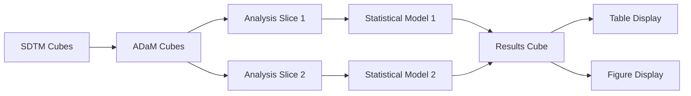
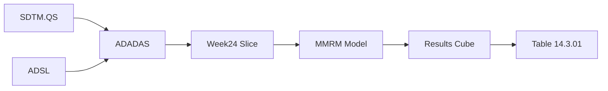
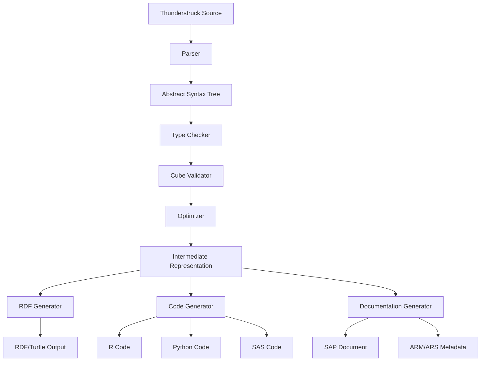
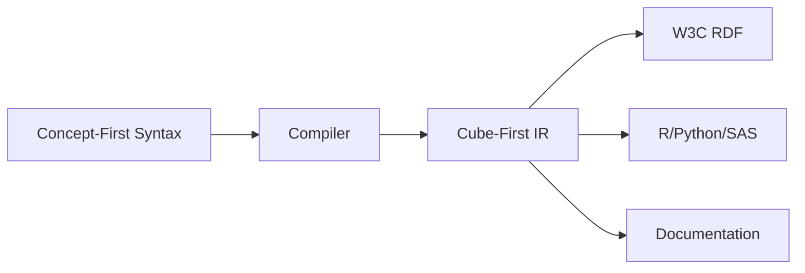

# W3C Data Cube-Centric Language-Oriented Programming Proposal
## Thunderstruck DSL for Statistical Analysis Plans

**Version:** 1.0
**Date:** 2025-11-14
**Status:** Draft Proposal
**Focus:** W3C Data Cube Standard as Primary Abstraction

---

## Table of Contents

1. [Executive Summary](#executive-summary)
2. [Introduction](#introduction)
3. [W3C Data Cube Fundamentals](#w3c-data-cube-fundamentals)
4. [Cube-First Design Philosophy](#cube-first-design-philosophy)
5. [Thunderstruck Cube Language Specification](#thunderstruck-cube-language-specification)
6. [Mapping Clinical Trials to Data Cubes](#mapping-clinical-trials-to-data-cubes)
7. [Worked Examples](#worked-examples)
8. [Integration with CDISC Standards](#integration-with-cdisc-standards)
9. [Advantages of Cube-Centric Approach](#advantages-of-cube-centric-approach)
10. [Implementation Architecture](#implementation-architecture)
11. [Comparison with Alternative Approaches](#comparison-with-alternative-approaches)
12. [Roadmap and Next Steps](#roadmap-and-next-steps)

---

## Executive Summary

This proposal presents **Thunderstruck**, a domain-specific language (DSL) built on the W3C Data Cube standard as its foundational abstraction layer. Unlike traditional SAP implementations that bolt data cube representations onto existing statistical frameworks, Thunderstruck makes the data cube the **primary organizing principle** for all statistical analysis specifications.

### Key Innovation: Cube as First-Class Construct

Instead of treating data cubes as an export format, Thunderstruck treats them as the **native representation** of clinical trial data and analyses:

```
Traditional Approach:  R/SAS Code → Analysis → Results → (optional) Data Cube Export
Thunderstruck:        Data Cube Definition → Typed Operations → Results → Multi-format Export
```

### Core Benefits

1. **Semantic Precision**: W3C Data Cube vocabulary provides unambiguous meaning for every data point
2. **Interoperability**: Native RDF representation enables seamless data exchange across systems
3. **Traceability**: Cube structure captures provenance from raw data through all transformations
4. **Validation**: Cube integrity constraints enforce correctness at the semantic level
5. **Queryability**: SPARQL enables rich querying across study datasets
6. **Standardization**: Leverages mature W3C standard rather than inventing new primitives

---

## Introduction

### The Problem: SAP Ambiguity and Non-Interoperability

Statistical Analysis Plans in clinical trials suffer from:

- **Natural Language Ambiguity**: Prose descriptions lead to interpretation errors
- **Implementation Divergence**: Same SAP → different code → different results
- **Data Silos**: Results trapped in proprietary formats (SAS datasets, custom CSVs)
- **Manual Reconciliation**: Checking SAP compliance requires human verification
- **Limited Reuse**: Analytical patterns not captured in reusable form

### The W3C Data Cube Solution

The [W3C Data Cube vocabulary](https://www.w3.org/TR/vocab-data-cube/) provides:

- **qb:DataSet**: A collection of observations organized by dimensions
- **qb:DimensionProperty**: The axes along which data varies (e.g., Subject, Visit, Treatment)
- **qb:MeasureProperty**: The actual measured values (e.g., ADAS-Cog Score, Change from Baseline)
- **qb:AttributeProperty**: Metadata about observations (e.g., Imputation Method, Population Flag)
- **qb:Slice**: A subset of a dataset along specified dimensions
- **qb:DataStructureDefinition (DSD)**: The schema defining the cube's structure

### Why Language-Oriented Programming?

Traditional approaches require statisticians to:
1. Write prose SAP
2. Have programmers interpret and code
3. Manually verify implementation matches intent

LOP with Data Cube enables:
1. Write SAP directly as typed cube specifications
2. Generate implementation code automatically
3. Validate mechanically via type system and cube constraints

---

## W3C Data Cube Fundamentals

### Core Vocabulary

The Data Cube vocabulary provides RDF predicates for multidimensional data:

```turtle
@prefix qb: <http://purl.org/linked-data/cube#> .
@prefix rdf: <http://www.w3.org/1999/02/22-rdf-syntax-ns#> .
@prefix rdfs: <http://www.w3.org/2000/01/rdf-schema#> .

# Define a dimension
:subjectId a qb:DimensionProperty ;
    rdfs:label "Subject Identifier" ;
    rdfs:range xsd:string .

# Define a measure
:adasCogScore a qb:MeasureProperty ;
    rdfs:label "ADAS-Cog Total Score" ;
    rdfs:range xsd:decimal .

# Define the structure
:dsd-efficacy a qb:DataStructureDefinition ;
    qb:component [ qb:dimension :subjectId ] ,
                 [ qb:dimension :visitId ] ,
                 [ qb:dimension :treatmentArm ] ,
                 [ qb:measure :adasCogScore ] .

# Create a dataset
:dataset-study001-efficacy a qb:DataSet ;
    rdfs:label "Study 001 Efficacy Analysis Dataset" ;
    qb:structure :dsd-efficacy .

# Add observations
:obs-001 a qb:Observation ;
    qb:dataSet :dataset-study001-efficacy ;
    :subjectId "001-001" ;
    :visitId "Week24" ;
    :treatmentArm "50mg" ;
    :adasCogScore 32.5 .
```

### Data Cube Integrity Constraints

The W3C standard defines 20 integrity constraints (IC-1 through IC-21) that ensure cube validity:

- **IC-1**: Unique DataSet
- **IC-2**: Unique DSD
- **IC-11**: All dimensions required
- **IC-12**: No duplicate observations
- **IC-18**: Consistent attributes
- (and others...)

These constraints provide **automatic validation** of data structure.

---

## Cube-First Design Philosophy

### Principle 1: Everything is a Cube

In Thunderstruck, all data structures are cubes:

- **Raw Data** (SDTM): Cubes with dimensions [Subject, Domain, Timepoint]
- **Analysis Datasets** (ADaM): Cubes with dimensions [Subject, Visit, Treatment, ...]
- **Results**: Cubes with dimensions [Parameter, Treatment, Statistic, ...]
- **Summaries**: Cubes with dimensions [Treatment, Visit, Summary Measure]

```thunderstruck
// Raw SDTM Vital Signs as a cube
cube SDTM_VS {
    structure: {
        dimensions: [
            USUBJID: Identifier,
            VSTESTCD: CodedTest,
            VISITNUM: Integer,
            VSDTC: DateTime
        ],
        measures: [
            VSSTRESN: Numeric
        ],
        attributes: [
            VSORRESU: Unit,
            VSSTAT: Status
        ]
    }
}
```

### Principle 2: Operations are Cube Transformations

All statistical operations are **typed transformations between cubes**:

```thunderstruck
// Function signature: takes one cube, returns another
transform ChangeFromBaseline:
    Cube[Subject, Visit, Measure] → Cube[Subject, Visit, Change]

// Application
let baselineData = SDTM_VS | filter(VISITNUM == 1)
let week24Data = SDTM_VS | filter(VISITNUM == 24)
let changeData = ChangeFromBaseline(week24Data, baselineData)
```

### Principle 3: Concepts are Cube Components

The three concept types map directly to cube components:

| Concept Type | Cube Component | Role |
|--------------|----------------|------|
| **BiomedicalConcept** | Dimension or Measure | Observable clinical characteristics |
| **DerivationConcept** | Transformation Function | Cube → Cube mappings |
| **AnalysisConcept** | Slice + Aggregation | Query over cube producing results |

### Principle 4: SAP is a Cube Pipeline

A complete SAP is a **directed acyclic graph (DAG)** of cube transformations:



---

## Thunderstruck Cube Language Specification

### Cube Structure Definition

```thunderstruck
cube <CubeName> {
    namespace: "<URI>"
    structure: {
        dimensions: [
            <DimName>: <Type> [role: "<Role>"],
            ...
        ],
        measures: [
            <MeasName>: <Type> [unit: "<Unit>"],
            ...
        ],
        attributes: [
            <AttrName>: <Type>,
            ...
        ]
    }
    integrity: {
        // Optional additional constraints beyond standard IC-1..IC-21
        constraint <Name>: <Predicate>
    }
}
```

**Example:**

```thunderstruck
cube ADADAS {
    namespace: "http://example.org/studies/alzheimers/adam#"

    structure: {
        dimensions: [
            USUBJID: Identifier role: "Subject",
            AVISITN: Integer role: "Visit Number",
            AVISIT: CodedValue role: "Visit Name",
            TRT01A: CodedValue role: "Actual Treatment",
            SITEGR1: CodedValue role: "Site Group"
        ],
        measures: [
            AVAL: Numeric unit: "points",
            BASE: Numeric unit: "points",
            CHG: Numeric unit: "points"
        ],
        attributes: [
            DTYPE: CodedValue,      // Derivation Type (e.g., LOCF)
            PARAMCD: CodedValue,    // Parameter Code
            PARAM: Text,            // Parameter Description
            ITTFL: Flag,            // ITT Population Flag
            SAFFL: Flag,            // Safety Population Flag
            EFFFL: Flag             // Efficacy Population Flag
        ]
    }

    integrity: {
        constraint OneParamPerObs:
            forall obs. exists unique PARAMCD
        constraint BaselineBeforeWeek24:
            forall obs where AVISIT = "Week 24".
                exists baseline where AVISIT = "Baseline"
                    and baseline.USUBJID = obs.USUBJID
    }
}
```

### Cube Transformations

```thunderstruck
// Generic transformation signature
transform <Name> <TypeParams>:
    <InputCubeType> → <OutputCubeType>
where
    <Constraints>
{
    operation: <TransformSpec>
}

// Concrete example
transform ChangeFromBaseline:
    Cube[Subject, Visit, Measure[T]] × Visit → Cube[Subject, Visit, Derived[T]]
where
    baselineVisit ∈ inputCube.dimensions.Visit
{
    operation: {
        for each (subject, visit, measure) in inputCube {
            let baseline = inputCube[subject, baselineVisit, measure]
            emit (subject, visit, measure - baseline)
        }
    }
}
```

### Cube Slicing and Dicing

```thunderstruck
// Slice: fix some dimensions, vary others
slice <Name> from <Cube> {
    fix: {
        <Dimension>: <Value>,
        ...
    }
    vary: [<Dimension>, ...]
    measures: [<Measure>, ...]
}

// Example: Efficacy population at Week 24
slice Week24Efficacy from ADADAS {
    fix: {
        AVISIT: "Week 24",
        EFFFL: "Y"
    }
    vary: [USUBJID, TRT01A, SITEGR1]
    measures: [CHG, BASE]
}
```

### Cube Aggregations

```thunderstruck
// Aggregation: collapse dimensions using aggregation functions
aggregate <Name> from <Slice> {
    groupBy: [<Dimension>, ...]
    compute: {
        <ResultMeasure>: <AggFunction>(<Measure>),
        ...
    }
}

// Example: Mean change by treatment
aggregate MeanChangeByTreatment from Week24Efficacy {
    groupBy: [TRT01A]
    compute: {
        MeanCHG: mean(CHG),
        StdDevCHG: stddev(CHG),
        N: count(USUBJID),
        MedianCHG: median(CHG)
    }
}
```

### Statistical Models as Cube Operations

```thunderstruck
model <Name> {
    input: <Slice>
    formula: <DependentVar> ~ <Predictors>
    family: <DistributionFamily>
    link: <LinkFunction>
    output: <ResultCube>
}

// Example: Dose-response model
model DoseResponseLinear {
    input: Week24Efficacy
    formula: CHG ~ TRTDOSE + SITEGR1 + BASE
    family: Gaussian
    link: Identity
    output: DoseResponseResults {
        dimensions: [Parameter, TRT01A]
        measures: [Estimate, StdError, TValue, PValue, CI_Lower, CI_Upper]
    }
}
```

### Display Specifications

```thunderstruck
display table <TableName> {
    title: "<Title>"
    source: <ResultCube>
    rows: [<Dimension>, ...]
    columns: [<Measure>, ...]
    format: {
        <Measure>: {decimals: N, style: "<Style>"}
    }
    footnotes: ["<Note>", ...]
}

display figure <FigureName> {
    title: "<Title>"
    source: <ResultCube>
    type: <PlotType>
    aesthetic: {
        x: <Dimension>,
        y: <Measure>,
        color: <Dimension>,
        facet: <Dimension>
    }
    layers: [<Layer>, ...]
}
```

---

## Mapping Clinical Trials to Data Cubes

### CDISC SDTM → Data Cubes

Each SDTM domain becomes a cube:

```thunderstruck
cube SDTM_DM {  // Demographics
    structure: {
        dimensions: [USUBJID: Identifier, STUDYID: Text],
        measures: [AGE: Integer],
        attributes: [SEX: CodedValue, RACE: CodedValue, ETHNIC: CodedValue,
                     ARMCD: CodedValue, ARM: Text, ACTARMCD: CodedValue, ACTARM: Text]
    }
}

cube SDTM_VS {  // Vital Signs
    structure: {
        dimensions: [USUBJID: Identifier, VSTESTCD: CodedTest, VISITNUM: Integer, VSDTC: DateTime],
        measures: [VSSTRESN: Numeric],
        attributes: [VSORRESU: Unit, VSSTAT: Status, VSREASND: Text]
    }
}

cube SDTM_AE {  // Adverse Events
    structure: {
        dimensions: [USUBJID: Identifier, AESEQ: Integer, AESTDTC: DateTime],
        measures: [],
        attributes: [AETERM: Text, AEDECOD: CodedValue, AESEV: CodedValue,
                     AESER: Flag, AEREL: CodedValue, AEACN: CodedValue, AEOUT: CodedValue]
    }
}
```

### CDISC ADaM → Data Cubes

ADaM datasets are derived cubes from SDTM cubes:

```thunderstruck
// ADSL: Subject-Level Analysis Dataset
cube ADSL {
    structure: {
        dimensions: [USUBJID: Identifier],
        measures: [AGE: Integer, HEIGHTBL: Numeric, WEIGHTBL: Numeric],
        attributes: [
            SEX: CodedValue, RACE: CodedValue, ETHNIC: CodedValue,
            TRT01P: CodedValue, TRT01A: CodedValue,  // Planned/Actual Treatment
            SAFFL: Flag, ITTFL: Flag, EFFFL: Flag,    // Population Flags
            DTHFL: Flag, DTHDY: Integer,              // Death
            TRTSDT: Date, TRTEDT: Date                // Treatment dates
        ]
    }
}

// ADADAS: ADAS-Cog Analysis Dataset
derive cube ADADAS from SDTM_QS, ADSL {
    where: {
        QS.QSTESTCD in ["ACTOT11", "ACTOT13"],  // ADAS-Cog 11 or 13
        QS.QSSTAT != "NOT DONE"
    }

    join: ADSL.USUBJID = QS.USUBJID

    structure: {
        dimensions: [
            USUBJID: from ADSL.USUBJID,
            AVISITN: from QS.VISITNUM,
            AVISIT: from QS.VISIT,
            ATPTN: Integer,  // Analysis Timepoint
            TRT01A: from ADSL.TRT01A,
            SITEGR1: from ADSL.SITEGR1
        ],
        measures: [
            AVAL: from QS.QSSTRESN,  // Analysis Value
            BASE: derived,            // Baseline (computed)
            CHG: derived              // Change from Baseline (computed)
        ],
        attributes: [
            PARAMCD: from QS.QSTESTCD,
            PARAM: from QS.QSTEST,
            DTYPE: CodedValue,        // Derivation Type (LOCF, BOCF, etc.)
            ITTFL: from ADSL.ITTFL,
            EFFFL: from ADSL.EFFFL
        ]
    }

    // Derive BASE and CHG
    derive: {
        BASE = AVAL where AVISITN = 0  // Baseline visit
        CHG = AVAL - BASE where AVISITN > 0
    }
}
```

### Estimands as Cube Specifications

ICH E9(R1) estimands map naturally to cube specifications:

```thunderstruck
estimand DoseResponseEstimand {
    // Treatment
    treatment: {
        variable: TRTDOSE,  // Dimension in cube
        type: Continuous,
        values: [0, 25, 50, 100] // mg
    }

    // Population
    population: {
        cube: ADADAS,
        filter: EFFFL = "Y"  // Efficacy population
    }

    // Variable
    variable: {
        measure: CHG,  // Change from baseline
        parameter: ACTOT11  // ADAS-Cog (11)
    }

    // Intercurrent Events
    intercurrentEvents: {
        event: "Treatment Discontinuation",
        strategy: "Treatment Policy",  // Analyze regardless of discontinuation
        implementation: {
            // Include all post-randomization data
            filter: none
        }
    }

    // Population-level Summary
    summary: {
        measure: "Slope of dose-response relationship",
        computation: {
            model: LinearRegression(CHG ~ TRTDOSE + SITEGR1 + BASE),
            parameter: coefficient(TRTDOSE)
        }
    }
}
```

---

## Worked Examples

### Example 1: ADAS-Cog Dose-Response Analysis

**Clinical Question:**
*"Test for dose-response relationship using linear model for change in ADAS-Cog (11) Total Score from baseline to Week 24 with dose as continuous predictor adjusting for site group in efficacy population."*

#### Step 1: Define the Base Cube

```thunderstruck
cube ADADAS {
    namespace: "http://example.org/study/alzheimers/adam#"
    structure: {
        dimensions: [
            USUBJID: Identifier,
            AVISITN: Integer,
            AVISIT: CodedValue,
            TRT01A: CodedValue,
            TRTDOSE: Numeric unit: "mg",
            SITEGR1: CodedValue
        ],
        measures: [
            AVAL: Numeric unit: "points",
            BASE: Numeric unit: "points",
            CHG: Numeric unit: "points"
        ],
        attributes: [
            PARAMCD: CodedValue,
            PARAM: Text,
            EFFFL: Flag,
            DTYPE: CodedValue
        ]
    }
}
```

#### Step 2: Create Analysis Slice

```thunderstruck
slice Week24EfficacySlice from ADADAS {
    fix: {
        AVISIT: "Week 24",
        PARAMCD: "ACTOT11",  // ADAS-Cog (11)
        EFFFL: "Y"           // Efficacy population only
    }
    vary: [USUBJID, TRT01A, TRTDOSE, SITEGR1]
    measures: [CHG, BASE]
}
```

#### Step 3: Define Statistical Model

```thunderstruck
model DoseResponseLinearModel {
    input: Week24EfficacySlice

    formula: CHG ~ TRTDOSE + SITEGR1 + BASE

    family: Gaussian
    link: Identity

    contrasts: {
        SITEGR1: Treatment  // Treatment coding for site group
    }

    output: DoseResponseResults {
        structure: {
            dimensions: [Parameter: Text],
            measures: [
                Estimate: Numeric,
                StdError: Numeric,
                DF: Numeric,
                TValue: Numeric,
                PValue: Numeric,
                CI_Lower: Numeric,
                CI_Upper: Numeric
            ]
        }
    }
}
```

#### Step 4: Specify Displays

```thunderstruck
display table "Table 14.3.01: Dose-Response Linear Model Results" {
    title: "Analysis of ADAS-Cog (11) Change from Baseline at Week 24"
    subtitle: "Linear Model with Dose as Continuous Predictor"
    source: DoseResponseResults

    rows: [Parameter]
    columns: [Estimate, StdError, DF, TValue, PValue, CI_Lower, CI_Upper]

    format: {
        Estimate: {decimals: 3},
        StdError: {decimals: 3},
        DF: {decimals: 1},
        TValue: {decimals: 2},
        PValue: {decimals: 4, style: "scientific-if-small"},
        CI_Lower: {decimals: 3},
        CI_Upper: {decimals: 3}
    }

    footnotes: [
        "Population: Full Analysis Set (Efficacy)",
        "Model: CHG ~ TRTDOSE + SITEGR1 + BASE",
        "Missing data: No imputation (observed cases only)"
    ]
}

display figure "Figure 14.3.01: Dose-Response Relationship" {
    title: "ADAS-Cog (11) Change from Baseline vs. Dose at Week 24"
    source: Week24EfficacySlice
    type: ScatterPlot

    aesthetic: {
        x: TRTDOSE,
        y: CHG,
        color: SITEGR1
    }

    layers: [
        Points {alpha: 0.5, size: 2},
        RegressionLine {method: "lm", se: true, level: 0.95},
        HorizontalLine {y: 0, linetype: "dashed", color: "gray"}
    ]

    labels: {
        x: "Treatment Dose (mg)",
        y: "Change from Baseline in ADAS-Cog (11) Total Score (points)",
        color: "Site Group"
    }
}
```

#### Step 5: Complete Pipeline

```thunderstruck
pipeline DoseResponseAnalysis {
    name: "Primary Efficacy Analysis: Dose-Response"
    version: "1.0"

    input: {
        cubes: [ADADAS, ADSL]
    }

    steps: [
        // 1. Create analysis slice
        Week24EfficacySlice,

        // 2. Fit statistical model
        DoseResponseLinearModel,

        // 3. Generate displays
        "Table 14.3.01",
        "Figure 14.3.01"
    ]

    validation: {
        check: [
            IC-11,  // All required dimensions present
            IC-12,  // No duplicate observations
            IC-19   // Codes from code lists
        ]
    }

    output: {
        formats: [RDF-Turtle, JSON-LD, CSV, SAS7BDAT, XPT]
    }
}
```

### Example 2: Summary Statistics by Treatment

**Clinical Question:**
*"Descriptive statistics (N, Mean, SD, Median, Min, Max) for ADAS-Cog change at Week 24 by treatment group."*

```thunderstruck
// Reuse the same slice
slice Week24EfficacySlice from ADADAS { ... }

// Define aggregation
aggregate SummaryStatsByTreatment from Week24EfficacySlice {
    groupBy: [TRT01A]

    compute: {
        N: count(USUBJID),
        Mean: mean(CHG),
        StdDev: stddev(CHG),
        Median: median(CHG),
        Q1: quantile(CHG, 0.25),
        Q3: quantile(CHG, 0.75),
        Min: min(CHG),
        Max: max(CHG)
    }

    output: SummaryStatsResults {
        structure: {
            dimensions: [TRT01A: CodedValue],
            measures: [
                N: Integer,
                Mean: Numeric unit: "points",
                StdDev: Numeric unit: "points",
                Median: Numeric unit: "points",
                Q1: Numeric unit: "points",
                Q3: Numeric unit: "points",
                Min: Numeric unit: "points",
                Max: Numeric unit: "points"
            ]
        }
    }
}

display table "Table 14.2.01: Summary Statistics" {
    title: "Descriptive Statistics for ADAS-Cog (11) Change at Week 24"
    source: SummaryStatsResults

    rows: [TRT01A]
    columns: [N, Mean, StdDev, Median, Q1, Q3, Min, Max]

    format: {
        N: {decimals: 0},
        Mean: {decimals: 2},
        StdDev: {decimals: 2},
        Median: {decimals: 1},
        Q1: {decimals: 1},
        Q3: {decimals: 1},
        Min: {decimals: 1},
        Max: {decimals: 1}
    }
}
```

### Example 3: Repeated Measures MMRM

**Clinical Question:**
*"Mixed Model for Repeated Measures (MMRM) analyzing ADAS-Cog change over time (Weeks 4, 8, 12, 24) with unstructured covariance."*

```thunderstruck
// Slice includes all post-baseline visits
slice PostBaselineEfficacy from ADADAS {
    fix: {
        PARAMCD: "ACTOT11",
        EFFFL: "Y"
    }
    filter: AVISITN > 0  // Exclude baseline
    vary: [USUBJID, AVISITN, AVISIT, TRT01A, SITEGR1]
    measures: [CHG, BASE]
}

model MMRMAnalysis {
    input: PostBaselineEfficacy

    formula: CHG ~ TRT01A * AVISIT + BASE + SITEGR1

    family: Gaussian
    method: REML  // Restricted Maximum Likelihood

    random: {
        subject: USUBJID,
        structure: Unstructured(AVISIT)  // Unstructured covariance across visits
    }

    contrasts: {
        TRT01A: Treatment,
        AVISIT: Polynomial(degree: 1)
    }

    output: MMRMResults {
        structure: {
            dimensions: [
                Effect: Text,      // Fixed effect name
                Visit: CodedValue  // For interaction effects
            ],
            measures: [
                Estimate: Numeric,
                StdError: Numeric,
                DF: Numeric,
                TValue: Numeric,
                PValue: Numeric,
                CI_Lower: Numeric,
                CI_Upper: Numeric
            ]
        }
    }
}

// LS Means at each visit
aggregate LSMeansByVisit from MMRMAnalysis {
    compute: {
        LSMean: lsmeans(TRT01A, AVISIT),
        SE: stderr(LSMean),
        CI_Lower: ci_lower(LSMean, 0.95),
        CI_Upper: ci_upper(LSMean, 0.95)
    }
    output: LSMeansResults {
        structure: {
            dimensions: [TRT01A: CodedValue, AVISIT: CodedValue],
            measures: [
                LSMean: Numeric unit: "points",
                SE: Numeric unit: "points",
                CI_Lower: Numeric unit: "points",
                CI_Upper: Numeric unit: "points"
            ]
        }
    }
}

display figure "Figure 14.3.02: LS Means Over Time" {
    title: "ADAS-Cog (11) Least Squares Means by Visit (MMRM)"
    source: LSMeansResults
    type: LinePlot

    aesthetic: {
        x: AVISIT,
        y: LSMean,
        color: TRT01A,
        ymin: CI_Lower,
        ymax: CI_Upper
    }

    layers: [
        Line {size: 1},
        Point {size: 3},
        Ribbon {alpha: 0.2}  // Confidence interval
    ]

    labels: {
        x: "Visit",
        y: "LS Mean Change from Baseline (points)",
        color: "Treatment"
    }
}
```

---

## Integration with CDISC Standards

### SDTM → Cube Mapping

Every SDTM domain has a canonical cube representation:

```thunderstruck
namespace CDISC.SDTM.Cubes {

    // Standard dimensions across all domains
    dimension STUDYID: Text
    dimension DOMAIN: CodedValue
    dimension USUBJID: Identifier
    dimension --SEQ: Integer  // Domain-specific sequence number

    // Demographics (DM) - subject-level data
    cube DM {
        dimensions: [STUDYID, DOMAIN, USUBJID]
        measures: [AGE: Integer]
        attributes: [
            RFSTDTC: DateTime,  // Reference Start Date
            RFENDTC: DateTime,  // Reference End Date
            SITEID: Text,
            SEX: CodedValue,
            RACE: CodedValue,
            ETHNIC: CodedValue,
            ARMCD: CodedValue,
            ARM: Text,
            ACTARMCD: CodedValue,
            ACTARM: Text,
            COUNTRY: CodedValue
        ]
    }

    // Adverse Events (AE)
    cube AE {
        dimensions: [STUDYID, DOMAIN, USUBJID, AESEQ: Integer, AESTDTC: DateTime]
        measures: []
        attributes: [
            AETERM: Text,
            AEDECOD: CodedValue,  // Dictionary-Derived Term
            AEBODSYS: CodedValue, // Body System
            AESEV: CodedValue,    // Severity
            AESER: Flag,          // Serious Event
            AEREL: CodedValue,    // Relationship to Treatment
            AEACN: CodedValue,    // Action Taken
            AEOUT: CodedValue     // Outcome
        ]
    }

    // Vital Signs (VS)
    cube VS {
        dimensions: [
            STUDYID, DOMAIN, USUBJID,
            VSSEQ: Integer,
            VSTESTCD: CodedTest,
            VISITNUM: Integer,
            VSDTC: DateTime
        ]
        measures: [
            VSSTRESN: Numeric,  // Numeric result
            VSSTRESU: Unit      // Standard unit (as attribute? or tied to measure?)
        ]
        attributes: [
            VSTEST: Text,       // Test name
            VSPOS: CodedValue,  // Position (e.g., "SITTING")
            VSLOC: CodedValue,  // Location (e.g., "ARM")
            VSSTAT: Status,     // Completion status
            VSREASND: Text      // Reason not done
        ]
    }
}
```

### ADaM → Cube Mapping

ADaM datasets follow stricter structure, making cube mapping more direct:

```thunderstruck
namespace CDISC.ADaM.Cubes {

    // ADSL: Subject-Level Analysis Dataset (one record per subject)
    cube ADSL {
        dimensions: [STUDYID, USUBJID]
        measures: [
            AGE: Integer,
            HEIGHTBL: Numeric unit: "cm",
            WEIGHTBL: Numeric unit: "kg",
            BMIBL: Numeric unit: "kg/m2"
        ]
        attributes: [
            // Demographics
            AGEGR1: CodedValue, SEX: CodedValue, RACE: CodedValue, ETHNIC: CodedValue,

            // Treatment
            TRT01P: CodedValue, TRT01PN: Integer,     // Planned treatment
            TRT01A: CodedValue, TRT01AN: Integer,     // Actual treatment

            // Population Flags
            SAFFL: Flag, ITTFL: Flag, EFFFL: Flag, COMPLFL: Flag,

            // Dates
            TRTSDT: Date, TRTEDT: Date, RFSTDTC: DateTime, RFENDTC: DateTime,

            // Disposition
            DCSREAS: CodedValue, DTHFL: Flag, DTHDY: Integer,

            // Stratification
            SITEGR1: CodedValue, REGION1: CodedValue
        ]
    }

    // BDS (Basic Data Structure): template for most ADaM datasets
    template BDS_Cube {
        dimensions: [
            STUDYID, USUBJID,
            PARAMCD: CodedValue,  // Parameter Code
            AVISITN: Integer,     // Analysis Visit Number
            AVISIT: CodedValue    // Analysis Visit Name
        ]
        measures: [
            AVAL: Numeric,        // Analysis Value
            BASE: Numeric,        // Baseline Value
            CHG: Numeric,         // Change from Baseline
            PCHG: Numeric         // Percent Change from Baseline
        ]
        attributes: [
            PARAM: Text,          // Parameter Description
            DTYPE: CodedValue,    // Derivation Type (e.g., LOCF, BOCF)
            ABLFL: Flag,          // Baseline Record Flag
            ANL01FL: Flag,        // Analysis Flag 1
            // Population flags (inherited from ADSL)
            ITTFL: Flag, EFFFL: Flag, SAFFL: Flag
        ]
    }

    // ADADAS: instantiation of BDS template for ADAS-Cog
    cube ADADAS extends BDS_Cube {
        constraints: {
            PARAMCD in ["ACTOT11", "ACTOT13"],  // ADAS-Cog 11 or 13 items
            AVAL.unit = "points",
            CHG.unit = "points"
        }
    }

    // ADAE: Adverse Events Analysis Dataset
    cube ADAE {
        dimensions: [STUDYID, USUBJID, AESEQ: Integer, ASTDT: Date]
        measures: [
            ASTDY: Integer,  // Study Day of Start
            AENDY: Integer   // Study Day of End
        ]
        attributes: [
            // Event characteristics
            AETERM: Text, AEDECOD: CodedValue, AEBODSYS: CodedValue,
            AESEV: CodedValue, AESER: Flag, AEREL: CodedValue,

            // Treatment
            TRTEMFL: Flag,  // Treatment-emergent flag
            TRT01A: CodedValue,

            // Population
            SAFFL: Flag,

            // Outcomes
            AEOUT: CodedValue, AEACN: CodedValue
        ]
    }
}
```

### Automatic CDISC Validation

Cube definitions enable automatic validation:

```thunderstruck
validator CDISC_SDTM_Validator {
    // Check that all required variables are present
    rule RequiredVariables {
        for each cube in CDISC.SDTM.Cubes {
            assert: cube.has_dimension(STUDYID)
            assert: cube.has_dimension(DOMAIN)
            assert: cube.has_dimension(USUBJID)
        }
    }

    // Check controlled terminology
    rule ControlledTerminology {
        for each attribute in cube.attributes where attribute.type = CodedValue {
            let codelist = CDISC.CT.codelist_for(attribute)
            assert: attribute.values ⊆ codelist.permitted_values
        }
    }

    // Check ISO 8601 dates
    rule ISO8601Dates {
        for each attribute in cube.attributes where attribute.name matches /.*DTC$/ {
            assert: attribute.values all match ISO8601_PATTERN
        }
    }
}

validator CDISC_ADaM_Validator {
    // ADaM-specific rules
    rule OneRecordPerSubject_ADSL {
        assert: ADSL.dimensions.cardinality(USUBJID) = 1
    }

    rule BaselineFlag {
        for each cube extends BDS_Cube {
            assert: exactly_one record per (USUBJID, PARAMCD) has ABLFL = "Y"
        }
    }

    rule AnalysisValueNonMissing {
        for each cube extends BDS_Cube {
            where ANL01FL = "Y"
            assert: AVAL is not missing
        }
    }
}
```

---

## Advantages of Cube-Centric Approach

### 1. Semantic Clarity

**Problem**: Traditional code obscures intent
```r
# What does this do? Hard to tell without tracing execution
data_subset <- data %>%
  filter(AVISIT == "Week 24" & EFFFL == "Y") %>%
  select(USUBJID, TRT01A, CHG)
```

**Solution**: Cube operations make intent explicit
```thunderstruck
slice Week24Efficacy from ADADAS {
    fix: {AVISIT: "Week 24", EFFFL: "Y"}
    vary: [USUBJID, TRT01A]
    measures: [CHG]
}
// Semantics: "A 3D cube varying over subjects and treatments, measuring change"
```

### 2. Automatic Validation

**Problem**: Manual checking required
- Did we use the right population?
- Are units consistent?
- Do we have duplicate records?

**Solution**: Cube integrity constraints + type system
```thunderstruck
// Compilation fails if:
// - Wrong population used
// - Incompatible units in arithmetic
// - Violations of IC-1 through IC-21
// - Type mismatches
```

### 3. Provenance Tracking

**Problem**: Lost lineage between data and results

**Solution**: Every cube knows its derivation


RDF encoding preserves full lineage:
```turtle
:table-14-3-01 prov:wasDerivedFrom :mmrm-results .
:mmrm-results prov:wasDerivedFrom :week24-slice .
:week24-slice prov:wasDerivedFrom :adadas .
:adadas prov:wasDerivedFrom :sdtm-qs, :adsl .
```

### 4. Interoperability

**Problem**: Data trapped in proprietary formats

**Solution**: Native RDF export enables:
- SPARQL queries across studies
- Linked data integration with biomedical ontologies
- Semantic web tooling (SHACL validation, reasoning, etc.)

```sparql
# Query: Find all studies with ADAS-Cog endpoints and mean change < -3
PREFIX qb: <http://purl.org/linked-data/cube#>
PREFIX ts: <http://thunderstruck.org/vocab#>

SELECT ?study ?treatment ?mean_chg
WHERE {
  ?dataset a qb:DataSet ;
           ts:study ?study ;
           ts:parameter "ACTOT11" ;
           qb:slice ?slice .

  ?slice ts:treatment ?treatment ;
         ts:mean_chg ?mean_chg .

  FILTER(?mean_chg < -3)
}
ORDER BY ?study ?treatment
```

### 5. Reusability

**Problem**: Copy-paste programming across studies

**Solution**: Cube templates and composition
```thunderstruck
// Define once, reuse everywhere
template EfficacyAnalysis<OutcomeCube, ParameterCode> {
    slice PostBaseline from OutcomeCube {
        fix: {PARAMCD: ParameterCode, EFFFL: "Y"}
        filter: AVISITN > 0
        vary: [USUBJID, AVISITN, TRT01A]
        measures: [CHG]
    }

    model MMRM {
        input: PostBaseline
        formula: CHG ~ TRT01A * AVISIT + BASE + SITEGR1
        random: {subject: USUBJID, structure: Unstructured(AVISIT)}
    }
}

// Instantiate for different parameters
analysis ADAS11_Efficacy = EfficacyAnalysis<ADADAS, "ACTOT11">
analysis ADAS13_Efficacy = EfficacyAnalysis<ADADAS, "ACTOT13">
analysis MMSE_Efficacy = EfficacyAnalysis<ADMMSE, "MMSCORE">
```

### 6. Multi-target Code Generation

**Problem**: Lock-in to one statistical environment

**Solution**: Generate code for multiple backends from single specification
```
Thunderstruck Spec
        ↓
    [Compiler]
        ↓
   ┌────┴────┬────────┬─────────┐
   ↓         ↓        ↓         ↓
  R      Python    SAS     Julia
(tidymodels) (statsmodels) (PROC) (MixedModels.jl)
```

Example generated R code:
```r
# Generated from Thunderstruck specification
# DO NOT EDIT MANUALLY

library(tidyverse)
library(mmrm)

# Load cube data
adadas <- qread("adadas.parquet") %>%
  # Apply cube integrity constraints
  validate_cube(dsd = "adadas-dsd")

# Create slice: Week24Efficacy
week24_efficacy <- adadas %>%
  filter(
    AVISIT == "Week 24",
    PARAMCD == "ACTOT11",
    EFFFL == "Y"
  ) %>%
  select(USUBJID, TRT01A, TRTDOSE, SITEGR1, CHG, BASE)

# Fit model: DoseResponseLinearModel
model_dose_response <- lm(
  CHG ~ TRTDOSE + SITEGR1 + BASE,
  data = week24_efficacy
)

# Extract results into cube structure
results_dose_response <- tidy(model_dose_response, conf.int = TRUE) %>%
  rename(
    Parameter = term,
    Estimate = estimate,
    StdError = std.error,
    TValue = statistic,
    PValue = p.value,
    CI_Lower = conf.low,
    CI_Upper = conf.high
  )

# Generate table
gt_table <- results_dose_response %>%
  gt() %>%
  fmt_number(columns = c(Estimate, StdError, CI_Lower, CI_Upper), decimals = 3) %>%
  fmt_number(columns = TValue, decimals = 2) %>%
  fmt_scientific(columns = PValue, decimals = 4) %>%
  tab_header(
    title = "Table 14.3.01: Dose-Response Linear Model Results",
    subtitle = "Analysis of ADAS-Cog (11) Change from Baseline at Week 24"
  )

gtsave(gt_table, "table_14_3_01.rtf")
```

---

## Implementation Architecture

### Compiler Pipeline



### Key Components

#### 1. Langium Grammar

```langium
grammar Thunderstruck

entry Model: (declarations+=Declaration)*;

Declaration:
    CubeDecl | SliceDecl | TransformDecl | ModelDecl |
    AggregateDecl | DisplayDecl | PipelineDecl;

CubeDecl:
    'cube' name=ID '{'
        'namespace' ':' namespace=STRING
        'structure' ':' '{' structure=CubeStructure '}'
        ('integrity' ':' '{' constraints+=Constraint* '}')?
    '}';

CubeStructure:
    'dimensions' ':' '[' dimensions+=Dimension (',' dimensions+=Dimension)* ']'
    'measures' ':' '[' measures+=Measure (',' measures+=Measure)* ']'
    ('attributes' ':' '[' attributes+=Attribute (',' attributes+=Attribute)* ']')?;

Dimension:
    name=ID ':' type=TypeRef ('role' ':' role=STRING)?;

Measure:
    name=ID ':' type=TypeRef ('unit' ':' unit=STRING)?;

Attribute:
    name=ID ':' type=TypeRef;

TypeRef:
    name=QualifiedName ('<' typeArgs+=TypeRef (',' typeArgs+=TypeRef)* '>')?;

SliceDecl:
    'slice' name=ID 'from' cube=[CubeDecl] '{'
        'fix' ':' '{' fixes+=FixDimension (',' fixes+=FixDimension)* '}'
        ('filter' ':' filter=Expression)?
        'vary' ':' '[' vary+=[Dimension] (',' vary+=[Dimension])* ']'
        'measures' ':' '[' measures+=[Measure] (',' measures+=[Measure])* ']'
    '}';

ModelDecl:
    'model' name=ID '{'
        'input' ':' input=[SliceDecl]
        'formula' ':' formula=Formula
        'family' ':' family=ID
        ('link' ':' link=ID)?
        ('method' ':' method=ID)?
        ('random' ':' '{' random=RandomSpec '}')?
        'output' ':' output=CubeDecl
    '}';

// ... (additional rules)
```

#### 2. Type System

```typescript
// Core types
type CubeType = {
    kind: 'Cube';
    dimensions: Map<string, Type>;
    measures: Map<string, Type>;
    attributes: Map<string, Type>;
    dsd: URI;
};

type SliceType = {
    kind: 'Slice';
    parent: CubeType;
    fixed: Map<string, Value>;
    varying: Set<string>;
    measures: Set<string>;
};

type TransformType = {
    kind: 'Transform';
    input: CubeType;
    output: CubeType;
    constraints: Constraint[];
};

// Type checker
class TypeChecker {
    checkCube(cube: CubeDecl): CubeType {
        // Validate dimensions, measures, attributes
        // Check for name conflicts
        // Verify type references
        // Apply IC-1 through IC-21
    }

    checkSlice(slice: SliceDecl): SliceType {
        // Verify parent cube exists
        // Check fixed dimensions exist
        // Verify varying dimensions exist
        // Ensure measures exist
        // Check filter expression types
    }

    checkModel(model: ModelDecl): void {
        // Verify input slice exists
        // Type-check formula
        // Verify family/link compatibility
        // Check output cube structure matches model output
    }

    checkTransform(transform: TransformDecl): TransformType {
        // Verify input/output cube compatibility
        // Type-check transformation logic
        // Ensure constraints are satisfiable
    }
}
```

#### 3. Cube Validator

```typescript
// Implements W3C Data Cube integrity constraints
class CubeValidator {
    // IC-1: Unique DataSet
    checkIC1(cube: CubeType): ValidationResult {
        // Every observation must belong to exactly one dataset
    }

    // IC-11: All dimensions required
    checkIC11(cube: CubeType, obs: Observation): ValidationResult {
        for (const dim of cube.dimensions.keys()) {
            if (!obs.has(dim)) {
                return error(`Missing required dimension: ${dim}`);
            }
        }
        return ok();
    }

    // IC-12: No duplicate observations
    checkIC12(cube: CubeType, observations: Observation[]): ValidationResult {
        const keys = observations.map(obs =>
            cube.dimensions.keys().map(d => obs.get(d)).join('|')
        );
        const duplicates = keys.filter((k, i) => keys.indexOf(k) !== i);
        if (duplicates.length > 0) {
            return error(`Duplicate observations: ${duplicates}`);
        }
        return ok();
    }

    // ... (IC-2 through IC-21)
}
```

#### 4. Code Generators

```typescript
// R Code Generator
class RCodeGenerator {
    generate(model: Model): string {
        let code = `# Generated from Thunderstruck\n`;
        code += `library(tidyverse)\n\n`;

        // Generate cube loading
        for (const cube of model.cubes) {
            code += this.generateCubeLoad(cube);
        }

        // Generate slices
        for (const slice of model.slices) {
            code += this.generateSlice(slice);
        }

        // Generate models
        for (const modelDecl of model.models) {
            code += this.generateModel(modelDecl);
        }

        // Generate displays
        for (const display of model.displays) {
            code += this.generateDisplay(display);
        }

        return code;
    }

    generateSlice(slice: SliceDecl): string {
        let code = `${slice.name} <- ${slice.cube.name} %>%\n`;
        code += `  filter(\n`;
        for (const [dim, val] of slice.fixes) {
            code += `    ${dim} == ${JSON.stringify(val)},\n`;
        }
        code = code.slice(0, -2) + `\n  ) %>%\n`;
        code += `  select(${slice.varying.concat(slice.measures).join(', ')})\n\n`;
        return code;
    }

    generateModel(model: ModelDecl): string {
        const method = model.method || 'lm';
        let code = `${model.name} <- ${method}(\n`;
        code += `  ${model.formula},\n`;
        code += `  data = ${model.input.name}\n`;
        code += `)\n\n`;
        return code;
    }
}

// Python Code Generator (similar structure)
class PythonCodeGenerator { ... }

// SAS Code Generator
class SASCodeGenerator { ... }
```

#### 5. RDF Generator

```typescript
class RDFGenerator {
    generate(model: Model): string {
        const writer = new N3.Writer({
            prefixes: {
                qb: 'http://purl.org/linked-data/cube#',
                ts: 'http://thunderstruck.org/vocab#',
                xsd: 'http://www.w3.org/2001/XMLSchema#'
            }
        });

        for (const cube of model.cubes) {
            // Generate DSD
            writer.addQuad(
                this.cubeURI(cube),
                this.qb('structure'),
                this.dsdURI(cube)
            );

            writer.addQuad(
                this.dsdURI(cube),
                this.rdf('type'),
                this.qb('DataStructureDefinition')
            );

            // Add dimension components
            for (const [name, type] of cube.dimensions) {
                const compURI = this.componentURI(cube, name);
                writer.addQuad(
                    this.dsdURI(cube),
                    this.qb('component'),
                    compURI
                );
                writer.addQuad(
                    compURI,
                    this.qb('dimension'),
                    this.dimURI(cube, name)
                );
            }

            // Add measure components
            for (const [name, type] of cube.measures) {
                const compURI = this.componentURI(cube, name);
                writer.addQuad(
                    this.dsdURI(cube),
                    this.qb('component'),
                    compURI
                );
                writer.addQuad(
                    compURI,
                    this.qb('measure'),
                    this.measureURI(cube, name)
                );
            }

            // Add attribute components
            for (const [name, type] of cube.attributes) {
                const compURI = this.componentURI(cube, name);
                writer.addQuad(
                    this.dsdURI(cube),
                    this.qb('component'),
                    compURI
                );
                writer.addQuad(
                    compURI,
                    this.qb('attribute'),
                    this.attrURI(cube, name)
                );
            }
        }

        return writer.end();
    }
}
```

### VS Code Extension

```typescript
// Provides IDE support for Thunderstruck
export function activate(context: vscode.ExtensionContext) {
    // Language Server setup
    const languageClient = createLanguageClient(context);

    // Register commands
    context.subscriptions.push(
        vscode.commands.registerCommand('thunderstruck.validate', () => {
            validateCurrentDocument();
        }),
        vscode.commands.registerCommand('thunderstruck.exportRDF', () => {
            exportToRDF();
        }),
        vscode.commands.registerCommand('thunderstruck.generateCode', () => {
            showCodeGenerationDialog();
        }),
        vscode.commands.registerCommand('thunderstruck.visualizeCube', () => {
            visualizeCubeStructure();
        })
    );

    // Start language client
    languageClient.start();
}

// Semantic highlighting for cube components
class ThunderstuckSemanticTokensProvider implements vscode.DocumentSemanticTokensProvider {
    provideDocumentSemanticTokens(document: vscode.TextDocument): vscode.ProviderResult<vscode.SemanticTokens> {
        const tokens = [];

        // Highlight dimensions in green
        // Highlight measures in blue
        // Highlight attributes in orange

        return new vscode.SemanticTokens(tokens);
    }
}
```

---

## Comparison with Alternative Approaches

### Thunderstruck vs. Traditional R/SAS Programming

| Aspect | Traditional | Thunderstruck Cube-Centric |
|--------|-------------|----------------------------|
| **Specification** | Prose SAP + code | Formal cube definitions |
| **Validation** | Manual review | Automatic (type + integrity constraints) |
| **Interoperability** | Low (proprietary formats) | High (W3C RDF standard) |
| **Reusability** | Copy-paste | Compositional (templates, inheritance) |
| **Provenance** | Comments/documentation | Built-in (RDF provenance) |
| **Learning Curve** | Moderate (R/SAS) | Steep initially, but higher productivity |
| **Tooling** | Mature (RStudio, SAS) | In development |
| **Execution** | Direct | Via code generation |

### Thunderstruck vs. Other LOP Approaches

#### Comparison with Concept-First Approach (LOP-PROPOSAL-CC.md)

The two Thunderstruck proposals differ in their primary abstraction:

| Aspect | Concept-First (CC) | Cube-First (This Proposal) |
|--------|-------------------|----------------------------|
| **Primary Abstraction** | Concepts as types | Cubes as first-class entities |
| **Organization** | Hierarchical (Biomedical → Derivation → Analysis) | Structural (Dimensions → Measures → Attributes) |
| **Standard Basis** | Custom type hierarchy | W3C Data Cube |
| **Interoperability** | Via mapping to Data Cube | Native Data Cube |
| **Strength** | Closer to clinical thinking | Closer to data structures |
| **Best For** | Clinicians/statisticians | Data engineers/informaticians |

**When to use each:**
- **Concept-First**: When SAP authors think primarily in terms of clinical concepts (endpoints, estimands, populations)
- **Cube-First**: When working with existing data infrastructure, need maximum interoperability, or have data engineering focus

#### Hybrid Approach (Recommended)

Combine both:
- **High-level** authoring uses **Concept-First** syntax (easier for statisticians)
- **Compilation** produces **Cube-First** intermediate representation (better for tooling)
- **Export** generates both W3C RDF and execution code



---

## Roadmap and Next Steps

### Phase 1: Proof of Concept (Months 1-3)

**Deliverables:**
- [ ] Langium grammar for cube definitions
- [ ] Type checker for cube structures
- [ ] W3C IC-1 through IC-21 validator
- [ ] Simple RDF export
- [ ] Basic R code generation (lm, ggplot)

**Milestone:** Can specify and compile simple dose-response analysis

### Phase 2: CDISC Integration (Months 4-6)

**Deliverables:**
- [ ] SDTM → Cube mapping library
- [ ] ADaM → Cube mapping library
- [ ] CDISC controlled terminology validator
- [ ] Standard cube templates for common ADaM datasets

**Milestone:** Can import SDTM/ADaM and perform standard analyses

### Phase 3: Advanced Models (Months 7-9)

**Deliverables:**
- [ ] MMRM support
- [ ] Survival analysis (Cox, Kaplan-Meier)
- [ ] Bayesian models
- [ ] Multiple imputation handling

**Milestone:** Can specify complex longitudinal and survival analyses

### Phase 4: Tooling and UX (Months 10-12)

**Deliverables:**
- [ ] VS Code extension with full LSP support
- [ ] Cube structure visualizer
- [ ] Interactive query builder (SPARQL generation)
- [ ] Documentation generator (SAP documents from specs)

**Milestone:** Production-ready IDE experience

### Phase 5: Ecosystem (Year 2)

**Deliverables:**
- [ ] Python code generator (statsmodels, PyMC)
- [ ] SAS code generator (PROC MIXED, PROC PHREG)
- [ ] Julia code generator (MixedModels.jl)
- [ ] Standard library of analysis patterns
- [ ] Public repository of reusable cube definitions

**Milestone:** Multi-backend support, community contributions

### Success Criteria

1. **Adoption**: 5+ pharmaceutical companies pilot Thunderstruck
2. **Standards**: W3C or CDISC formal recognition
3. **Publications**: Academic papers demonstrating benefits
4. **Tooling**: VS Code extension with 1000+ downloads
5. **Library**: 50+ standard analysis patterns documented

---

## Appendices

### Appendix A: W3C Data Cube Integrity Constraints

Full list of integrity constraints from the W3C specification:

1. **IC-1** (Unique DataSet): Every qb:Observation has exactly one associated qb:DataSet
2. **IC-2** (Unique DSD): Every qb:DataSet has exactly one qb:DataStructureDefinition
3. **IC-3** (DSD includes measure): Every qb:DataStructureDefinition must include at least one declared measure
4. **IC-4** (Dimensions have range): Every dimension declared in a qb:DataStructureDefinition must have a declared rdfs:range
5. **IC-5** (Concept dimensions have code lists): Every dimension with range skos:Concept must have a qb:codeList
6. **IC-6** (Only attributes may be optional): The only components of a qb:DataStructureDefinition that may be marked as optional are attributes
7. **IC-7** (Slice keys must be declared): Every qb:SliceKey must be declared as part of a qb:DataStructureDefinition
8. **IC-8** (Slice keys consistent with DSD): Every qb:componentProperty in a qb:SliceKey must also be declared as a qb:component by the associated qb:DataStructureDefinition
9. **IC-9** (Unique slice structure): Each qb:Slice must have exactly one associated qb:sliceStructure
10. **IC-10** (Slice dimensions fixed): Every dimension declared in a qb:SliceKey must be fixed in all qb:Observations of the corresponding qb:Slice
11. **IC-11** (All dimensions required): Every qb:Observation must have a value for each dimension declared in its qb:DataStructureDefinition
12. **IC-12** (No duplicate observations): No two qb:Observations in the same qb:DataSet may have the same value for all dimensions
13. **IC-13** (Required attributes): Every qb:Observation must have a value for each declared attribute that is required
14. **IC-14** (All measures present in measure dimension cube): In a qb:DataSet which uses a Measure dimension then every qb:Observation must have a value for the measure corresponding to its given measure dimension value
15. **IC-15** (Measure dimension consistent with measures): In a qb:DataSet which uses a Measure dimension then every qb:Observation must have a value for the measure dimension which corresponds to one of the declared measures
16. **IC-16** (Single measure on measure dimension observation): In a qb:DataSet which uses a Measure dimension then each qb:Observation must only have a value for one measure (i.e. the measure corresponding to its measure dimension value)
17. **IC-17** (All measures present in measures dimension cube): In a qb:DataSet which does not use a Measure dimension then each individual qb:Observation must have a value for every declared measure
18. **IC-18** (Attributes on dimension): If an attribute is declared on a dimension then every observation must have a value for that attribute
19. **IC-19** (Codes from code list): If a dimension property has a qb:codeList, then every qb:Observation must have a value for that dimension which is in the code list
20. **IC-20** (Codes from hierarchy): If a dimension property has a qb:HierarchicalCodeList with a hierarchyRoot then every qb:Observation must have a value for that dimension which is in the hierarchy
21. **IC-21** (Codes from hierarchy (inverse)): If a dimension property has a qb:HierarchicalCodeList with an inverse hierarchyRoot then every qb:Observation must have a value for that dimension which is in the hierarchy

### Appendix B: Example RDF Export

Complete RDF serialization of dose-response analysis:

```turtle
@prefix qb:    <http://purl.org/linked-data/cube#> .
@prefix rdf:   <http://www.w3.org/1999/02/22-rdf-syntax-ns#> .
@prefix rdfs:  <http://www.w3.org/2000/01/rdf-schema#> .
@prefix xsd:   <http://www.w3.org/2001/XMLSchema#> .
@prefix prov:  <http://www.w3.org/ns/prov#> .
@prefix ts:    <http://thunderstruck.org/vocab#> .
@prefix ex:    <http://example.org/study/alzheimers#> .

# ═══════════════════════════════════════════════════════════
# Data Structure Definition
# ═══════════════════════════════════════════════════════════

ex:dsd-adadas a qb:DataStructureDefinition ;
    rdfs:label "ADADAS Data Structure" ;
    qb:component
        [ qb:dimension ex:dim-usubjid ],
        [ qb:dimension ex:dim-avisitn ],
        [ qb:dimension ex:dim-avisit ],
        [ qb:dimension ex:dim-trt01a ],
        [ qb:dimension ex:dim-trtdose ],
        [ qb:dimension ex:dim-sitegr1 ],
        [ qb:measure ex:meas-aval ],
        [ qb:measure ex:meas-base ],
        [ qb:measure ex:meas-chg ],
        [ qb:attribute ex:attr-paramcd ],
        [ qb:attribute ex:attr-efffl ] .

# Dimension definitions
ex:dim-usubjid a qb:DimensionProperty ;
    rdfs:label "Subject Identifier" ;
    rdfs:range xsd:string .

ex:dim-avisitn a qb:DimensionProperty ;
    rdfs:label "Analysis Visit Number" ;
    rdfs:range xsd:integer .

ex:dim-avisit a qb:DimensionProperty ;
    rdfs:label "Analysis Visit Name" ;
    rdfs:range xsd:string ;
    qb:codeList ex:codelist-visits .

ex:dim-trt01a a qb:DimensionProperty ;
    rdfs:label "Actual Treatment" ;
    rdfs:range xsd:string ;
    qb:codeList ex:codelist-treatments .

ex:dim-trtdose a qb:DimensionProperty ;
    rdfs:label "Treatment Dose" ;
    rdfs:range xsd:decimal ;
    ts:unit "mg" .

ex:dim-sitegr1 a qb:DimensionProperty ;
    rdfs:label "Site Group" ;
    rdfs:range xsd:string ;
    qb:codeList ex:codelist-sitegroups .

# Measure definitions
ex:meas-aval a qb:MeasureProperty ;
    rdfs:label "Analysis Value" ;
    rdfs:range xsd:decimal ;
    ts:unit "points" .

ex:meas-base a qb:MeasureProperty ;
    rdfs:label "Baseline Value" ;
    rdfs:range xsd:decimal ;
    ts:unit "points" .

ex:meas-chg a qb:MeasureProperty ;
    rdfs:label "Change from Baseline" ;
    rdfs:range xsd:decimal ;
    ts:unit "points" .

# Attribute definitions
ex:attr-paramcd a qb:AttributeProperty ;
    rdfs:label "Parameter Code" ;
    rdfs:range xsd:string ;
    qb:codeList ex:codelist-params .

ex:attr-efffl a qb:AttributeProperty ;
    rdfs:label "Efficacy Population Flag" ;
    rdfs:range xsd:string ;
    qb:codeList ex:codelist-yn .

# ═══════════════════════════════════════════════════════════
# Dataset
# ═══════════════════════════════════════════════════════════

ex:dataset-adadas a qb:DataSet ;
    rdfs:label "ADADAS Dataset - Study XYZ-123" ;
    qb:structure ex:dsd-adadas ;
    prov:wasDerivedFrom ex:sdtm-qs, ex:adsl .

# ═══════════════════════════════════════════════════════════
# Slice: Week 24 Efficacy
# ═══════════════════════════════════════════════════════════

ex:slice-week24-efficacy a qb:Slice ;
    rdfs:label "Week 24 Efficacy Analysis Slice" ;
    qb:sliceStructure ex:slice-key-week24 ;
    ex:dim-avisit "Week 24" ;
    ex:attr-paramcd "ACTOT11" ;
    ex:attr-efffl "Y" ;
    prov:wasDerivedFrom ex:dataset-adadas .

ex:slice-key-week24 a qb:SliceKey ;
    rdfs:label "Week 24 Slice Key" ;
    qb:componentProperty ex:dim-avisit, ex:attr-paramcd, ex:attr-efffl .

# ═══════════════════════════════════════════════════════════
# Statistical Model Results
# ═══════════════════════════════════════════════════════════

ex:results-dose-response a qb:DataSet ;
    rdfs:label "Dose-Response Model Results" ;
    qb:structure ex:dsd-results ;
    prov:wasDerivedFrom ex:slice-week24-efficacy ;
    prov:wasGeneratedBy ex:activity-linear-model .

ex:dsd-results a qb:DataStructureDefinition ;
    rdfs:label "Statistical Results Structure" ;
    qb:component
        [ qb:dimension ex:dim-parameter ],
        [ qb:measure ex:meas-estimate ],
        [ qb:measure ex:meas-stderr ],
        [ qb:measure ex:meas-df ],
        [ qb:measure ex:meas-tvalue ],
        [ qb:measure ex:meas-pvalue ],
        [ qb:measure ex:meas-ci-lower ],
        [ qb:measure ex:meas-ci-upper ] .

# Result observations
ex:obs-result-intercept a qb:Observation ;
    qb:dataSet ex:results-dose-response ;
    ex:dim-parameter "Intercept" ;
    ex:meas-estimate 5.23 ;
    ex:meas-stderr 1.45 ;
    ex:meas-df 347 ;
    ex:meas-tvalue 3.61 ;
    ex:meas-pvalue 0.0003 ;
    ex:meas-ci-lower 2.38 ;
    ex:meas-ci-upper 8.08 .

ex:obs-result-dose a qb:Observation ;
    qb:dataSet ex:results-dose-response ;
    ex:dim-parameter "TRTDOSE" ;
    ex:meas-estimate -0.042 ;
    ex:meas-stderr 0.015 ;
    ex:meas-df 347 ;
    ex:meas-tvalue -2.80 ;
    ex:meas-pvalue 0.0053 ;
    ex:meas-ci-lower -0.072 ;
    ex:meas-ci-upper -0.012 .

# ... (more result observations)

# ═══════════════════════════════════════════════════════════
# Provenance
# ═══════════════════════════════════════════════════════════

ex:activity-linear-model a prov:Activity ;
    rdfs:label "Dose-Response Linear Model" ;
    prov:used ex:slice-week24-efficacy ;
    ts:method "LinearRegression" ;
    ts:formula "CHG ~ TRTDOSE + SITEGR1 + BASE" ;
    ts:family "Gaussian" ;
    ts:link "Identity" ;
    prov:wasAssociatedWith ex:agent-thunderstruck ;
    prov:startedAtTime "2025-11-14T10:30:00Z"^^xsd:dateTime ;
    prov:endedAtTime "2025-11-14T10:30:02Z"^^xsd:dateTime .

ex:agent-thunderstruck a prov:SoftwareAgent ;
    rdfs:label "Thunderstruck Compiler" ;
    prov:actedOnBehalfOf ex:agent-statistician .

ex:agent-statistician a prov:Person ;
    rdfs:label "Jane Doe, PhD" ;
    prov:mbox <mailto:jane.doe@example.org> .
```

### Appendix C: Glossary

**ADaM**: Analysis Data Model - CDISC standard for analysis datasets

**Attribute**: Metadata about observations (e.g., imputation method, population flag)

**BDS**: Basic Data Structure - ADaM template for most analysis datasets

**Cube**: Multidimensional data structure with dimensions, measures, and attributes

**Dimension**: An axis along which data varies (e.g., Subject, Visit, Treatment)

**DSD**: Data Structure Definition - schema describing a cube's structure

**Estimand**: ICH E9(R1) framework specifying treatment, population, variable, intercurrent events, and summary

**IC**: Integrity Constraint - W3C Data Cube validation rules (IC-1 through IC-21)

**Langium**: TypeScript-based language workbench for building DSLs

**LOP**: Language-Oriented Programming - approach using DSLs for specific domains

**LSP**: Language Server Protocol - standard for IDE-language integration

**Measure**: Observed or computed values in a cube (e.g., ADAS-Cog score, change from baseline)

**MMRM**: Mixed Model for Repeated Measures - statistical method for longitudinal data

**Observation**: Single data point in a cube, identified by unique combination of dimension values

**qb**: Namespace prefix for W3C Data Cube vocabulary

**RDF**: Resource Description Framework - W3C standard for semantic data

**SAP**: Statistical Analysis Plan - document specifying planned analyses

**SDTM**: Study Data Tabulation Model - CDISC standard for raw clinical data

**Slice**: Subset of a cube obtained by fixing some dimensions

**SPARQL**: Query language for RDF data

**Turtle**: Terse RDF Triple Language - human-readable RDF serialization

---

## Conclusion

This proposal presents a **cube-centric Language-Oriented Programming approach** to Statistical Analysis Plan specification using the **W3C Data Cube standard** as the foundational abstraction. By making data cubes first-class constructs in the Thunderstruck DSL, we achieve:

1. **Semantic precision** through formal cube structure definitions
2. **Automatic validation** via W3C integrity constraints and type checking
3. **Native interoperability** through RDF serialization
4. **Provenance tracking** built into the data model
5. **Multi-target code generation** from a single authoritative specification

The cube-first approach complements the concept-first approach (LOP-PROPOSAL-CC.md) by providing a **data-centric intermediate representation** that bridges the gap between high-level statistical thinking and low-level implementation details.

We invite feedback from:
- **Clinical statisticians**: Is this expressive enough for your analyses?
- **Data engineers**: Does this integrate well with your infrastructure?
- **Regulatory experts**: Does this provide sufficient traceability and validation?
- **Tool developers**: Is this implementable with existing technology stacks?

Together, we can strike the Statistical Analysis Plan with type-safe, cube-powered precision.

⚡ **Thunderstruck** — *Where cubes meet clinical trials*

---

**Version:** 1.0
**Date:** 2025-11-14
**License:** CC-BY-4.0
**Contact:** [Your Organization]
