# Example 1 AC/DC Model Structure (Prompt 3)

This document presents a comprehensive AC/DC model derived from the CDISC ADaM Example 1, which describes an ANCOVA analysis of lumbar spine bone mineral density (BMD) comparing Drug ABC to Placebo over a 3-year period. The model captures the hierarchical classification of concepts (abstract semantic entities), structures (concrete data entities), and derivations (analytical transformations and displays) that comprise the statistical analysis plan.

## Structure

```yaml
model:
  concepts:
    biomedical:
      - BoneMineralDensity:
          description: "Measurement of bone density at lumbar spine"
          standardCode: "CDISC SDTM: XX domain"
      - LumbarSpineBMD:
          description: "Bone mineral density specifically measured at lumbar spine location"
          parent: BoneMineralDensity
      - MachineType:
          description: "Type of densitometry machine used for BMD measurement"
          role: "Covariate affecting BMD measurement"

    derivation:
      - ChangeFromBaseline:
          description: "Absolute change in measurement from baseline value"
          formula: "Value - BaselineValue"
      - PercentChangeFromBaseline:
          description: "Relative change from baseline expressed as percentage"
          formula: "(Value - BaselineValue) / BaselineValue * 100"
      - TreatmentDifference:
          description: "Difference between treatment arms in derived endpoint"
          formula: "TreatmentA_Mean - TreatmentB_Mean"
      - LOCFImputation:
          description: "Last Observation Carried Forward imputation method"
          purpose: "Handle missing data at analysis timepoint"

    analysis:
      - EfficacyEndpoint:
          description: "Primary or secondary efficacy outcome measure"
      - PrimaryEfficacyAnalysis:
          description: "Pre-specified primary analysis for regulatory submission"
          parent: EfficacyEndpoint
      - ANCOVAModel:
          description: "Analysis of Covariance statistical model"
          modelType: "Linear model with continuous response and categorical/continuous predictors"
      - LeastSquaresMean:
          description: "Adjusted mean estimate from linear model"
          abbreviation: "LS Mean"
      - ConfidenceInterval:
          description: "Range estimate for parameter uncertainty"
          abbreviation: "CI"
          defaultLevel: 0.95
      - PValue:
          description: "Statistical significance measure"
      - PlannedTreatment:
          description: "Treatment assignment according to randomization"
      - ITTPopulation:
          description: "Intent-to-Treat analysis population"
          definition: "All randomized subjects"

  structures:
    dimensions:
      - Subject:
          description: "Unique subject identifier"
          type: "categorical"
          role: "Observational unit"
      - TreatmentArm:
          description: "Assigned treatment group"
          type: "categorical"
          values: ["Drug ABC", "Placebo"]
          role: "Primary comparison factor"
      - TimePoint:
          description: "Scheduled assessment visit"
          type: "categorical/temporal"
          values: ["Baseline", "Month 6", "Month 12", "Month 18", "Month 24", "Month 30", "Month 36"]
          role: "Temporal dimension for longitudinal analysis"
      - MachineTypeDim:
          description: "Densitometry machine type as analytical dimension"
          type: "categorical"
          role: "Stratification factor"
      - AnalysisVisit:
          description: "Specific timepoint for analysis"
          type: "categorical"
          values: ["Month 24"]
          parent: TimePoint

    attributes:
      - Population:
          description: "Analysis population indicator"
          type: "categorical"
          values: ["ITT", "PP", "Safety"]
      - ImputationFlag:
          description: "Indicator of whether value was imputed"
          type: "boolean"
      - ImputationMethod:
          description: "Method used for imputation"
          type: "categorical"
          values: ["LOCF", "Observed"]
      - SampleSize_N:
          description: "Total number of subjects in population"
          type: "integer"
          symbol: "N"
      - SampleSize_n:
          description: "Number of subjects with non-missing values"
          type: "integer"
          symbol: "n"
      - Unit:
          description: "Unit of measurement"
          type: "string"
          examples: ["g/cm²", "%"]

    measures:
      - BMDValue:
          description: "Observed bone mineral density value"
          concept: BoneMineralDensity
          type: "continuous"
          unit: "g/cm²"
      - BaselineBMDValue:
          description: "BMD value at baseline visit"
          parent: BMDValue
          timepoint: "Baseline"
      - PercentChangeValue:
          description: "Percent change from baseline BMD value"
          concept: PercentChangeFromBaseline
          type: "continuous"
          unit: "%"
      - LSMeanValue:
          description: "Least squares mean estimate from ANCOVA model"
          concept: LeastSquaresMean
          type: "continuous"
      - CILowerValue:
          description: "Lower bound of confidence interval"
          concept: ConfidenceInterval
          type: "continuous"
      - CIUpperValue:
          description: "Upper bound of confidence interval"
          concept: ConfidenceInterval
          type: "continuous"
      - PValueValue:
          description: "P-value for treatment comparison"
          concept: PValue
          type: "continuous"
          range: "[0, 1]"

    cubes:
      - ADBMD:
          description: "Analysis Dataset for Bone Mineral Density"
          dimensions: [Subject, TreatmentArm, TimePoint, MachineTypeDim]
          measures: [BMDValue, BaselineBMDValue, PercentChangeValue]
          attributes: [Population, ImputationFlag, ImputationMethod, Unit]
          source: "ADSL + SDTM XX domain"
      - ANCOVAResults:
          description: "ANCOVA model parameter estimates and statistics"
          dimensions: [TreatmentArm, AnalysisVisit]
          measures: [LSMeanValue, CILowerValue, CIUpperValue, PValueValue]
          attributes: [Population, ImputationMethod, SampleSize_N, SampleSize_n]

  derivations:
    slices:
      - ITT_Month24_LOCF:
          description: "Primary analysis slice: ITT population at Month 24 with LOCF"
          sourceCube: ADBMD
          filters:
            - dimension: AnalysisVisit
              value: "Month 24"
            - attribute: Population
              value: "ITT"
            - attribute: ImputationMethod
              value: "LOCF"
      - DrugABC_Slice:
          description: "Drug ABC treatment group"
          sourceCube: ITT_Month24_LOCF
          filters:
            - dimension: TreatmentArm
              value: "Drug ABC"
      - Placebo_Slice:
          description: "Placebo treatment group"
          sourceCube: ITT_Month24_LOCF
          filters:
            - dimension: TreatmentArm
              value: "Placebo"

    methods:
      - ComputePercentChange:
          description: "Calculate percent change from baseline"
          concept: PercentChangeFromBaseline
          input:
            - BMDValue
            - BaselineBMDValue
          output: PercentChangeValue
          formula: "((BMDValue - BaselineBMDValue) / BaselineBMDValue) * 100"
      - ApplyLOCF:
          description: "Impute missing Month 24 values using LOCF"
          concept: LOCFImputation
          input: ADBMD
          output: ADBMD (with imputed values)
          logic: "For each subject, if Month 24 is missing, use last non-missing post-baseline value"
      - FitANCOVAModel:
          description: "Fit ANCOVA model for primary efficacy analysis"
          concept: ANCOVAModel
          input: ITT_Month24_LOCF
          output: ANCOVAResults
          model: "PercentChangeValue ~ TreatmentArm + BaselineBMDValue + MachineTypeDim + BaselineBMDValue*MachineTypeDim"
          parameters:
            dependent: PercentChangeValue
            independent: [TreatmentArm, BaselineBMDValue, MachineTypeDim]
            interaction: ["BaselineBMDValue*MachineTypeDim"]
            treatment: TreatmentArm
      - ComputeLSMeans:
          description: "Extract adjusted least squares means from ANCOVA model"
          concept: LeastSquaresMean
          input: FitANCOVAModel
          output: LSMeanValue (by TreatmentArm)
      - ComputeCI:
          description: "Calculate 95% confidence intervals for LS means and differences"
          concept: ConfidenceInterval
          input: FitANCOVAModel
          output: [CILowerValue, CIUpperValue]
          level: 0.95
      - ComputeTreatmentDifference:
          description: "Calculate difference in LS means between Drug ABC and Placebo"
          concept: TreatmentDifference
          input: [DrugABC_Slice, Placebo_Slice]
          output: TreatmentDifference measure
          formula: "LSMean_DrugABC - LSMean_Placebo"
      - TestTreatmentEffect:
          description: "Test statistical significance of treatment difference"
          concept: PValue
          input: FitANCOVAModel
          output: PValueValue
          hypothesis: "H0: TreatmentDifference = 0"

    displays:
      - Table_2_1_3_1:
          description: "Lumbar Spine BMD Percent Change From Baseline at Month 24"
          title: "Lumbar Spine Bone Mineral Density Percent Change From Baseline at Month 24"
          subtitle: "(ITT Population, LOCF Data, ANCOVA Model)"
          label: "Table 2.1.3.1"
          summaryLabel: "Summary E.1"
          dataSource: ANCOVAResults
          slices: [DrugABC_Slice, Placebo_Slice]
          rows:
            - dimension: TreatmentArm
              order: ["Drug ABC", "Placebo"]
          columns:
            - section: "% Change From Baseline"
              measures: [SampleSize_n, LSMeanValue, CILowerValue, CIUpperValue]
            - section: "Treatment Difference (Drug ABC - Placebo)"
              measures: [LSMeanValue, CILowerValue, CIUpperValue, PValueValue]
          footnotes:
            - "N = ITT population, n = number of subjects with non-missing percent change from baseline at month 24"
            - "CI = Confidence interval"
            - "LS = Least squares"
            - "[a] Based on ANCOVA model adjusting for planned treatment, baseline BMD value, machine type, and baseline BMD value by machine type interaction."
          formatting:
            LSMeanValue: "x.x"
            CILowerValue: "x.x"
            CIUpperValue: "x.x"
            PValueValue: "x.xxxx"
            CI_display: "(lower, upper)"
```

## Dependency Diagram

The following diagram illustrates the end-to-end dependency chain from display outputs back through derivations and structural entities to foundational concepts. Key dependency paths include:

1. **Display → Methods → Slices → Cubes → Measures → Concepts**: Table 2.1.3.1 displays results from ANCOVA methods, which operate on ITT/Month 24 slices of the ADBMD cube, which contains BMD measures implementing biomedical concepts.

2. **Concept Realization**: Abstract concepts (BoneMineralDensity, PercentChangeFromBaseline) are implemented as concrete measures (BMDValue, PercentChangeValue) within cubes, then transformed by methods, and finally displayed in tables.

3. **Dimensional Structure**: Cubes are indexed by dimensions (Subject, TreatmentArm, TimePoint, MachineType) that provide the organizational structure for filtering, grouping, and comparison.

4. **Method Dependencies**: Statistical methods form a dependency chain: ApplyLOCF → FitANCOVAModel → ComputeLSMeans/ComputeCI → ComputeTreatmentDifference → Table_2_1_3_1.

```mermaid
classDiagram
    %% Top-level categories
    class Concept {
        <<abstract>>
    }
    class Structure {
        <<concrete>>
    }
    class Derivation {
        <<transformation>>
    }

    %% Concept hierarchy
    class BoneMineralDensity {
        <<biomedical concept>>
    }
    class PercentChangeFromBaseline {
        <<derivation concept>>
    }
    class LeastSquaresMean {
        <<analysis concept>>
    }
    class ANCOVAModel {
        <<analysis concept>>
    }
    class ITTPopulation {
        <<analysis concept>>
    }
    class LOCFImputation {
        <<derivation concept>>
    }

    %% Structure hierarchy
    class ADBMD {
        <<cube>>
        +dimensions
        +measures
        +attributes
    }
    class ANCOVAResults {
        <<cube>>
    }
    class BMDValue {
        <<measure>>
        +type: continuous
        +unit: g/cm²
    }
    class BaselineBMDValue {
        <<measure>>
        +timepoint: Baseline
    }
    class PercentChangeValue {
        <<measure>>
        +type: continuous
        +unit: %
    }
    class LSMeanValue {
        <<measure>>
    }
    class CILowerValue {
        <<measure>>
    }
    class CIUpperValue {
        <<measure>>
    }
    class PValueValue {
        <<measure>>
    }
    class TreatmentArm {
        <<dimension>>
        +values: Drug ABC, Placebo
    }
    class TimePoint {
        <<dimension>>
        +values: Baseline, Month6-36
    }
    class AnalysisVisit {
        <<dimension>>
        +values: Month 24
    }
    class Subject {
        <<dimension>>
    }
    class MachineTypeDim {
        <<dimension>>
    }
    class Population {
        <<attribute>>
        +values: ITT, PP, Safety
    }
    class ImputationMethod {
        <<attribute>>
        +values: LOCF, Observed
    }
    class SampleSize_n {
        <<attribute>>
    }

    %% Derivation hierarchy
    class ITT_Month24_LOCF {
        <<slice>>
        +filters: ITT, Month24, LOCF
    }
    class DrugABC_Slice {
        <<slice>>
        +filter: Drug ABC
    }
    class Placebo_Slice {
        <<slice>>
        +filter: Placebo
    }
    class ComputePercentChange {
        <<method>>
        +formula: ((V - B) / B) * 100
    }
    class ApplyLOCF {
        <<method>>
        +logic: carry forward
    }
    class FitANCOVAModel {
        <<method>>
        +model: Y ~ Trt + B + M + B*M
    }
    class ComputeLSMeans {
        <<method>>
        +extracts: adjusted means
    }
    class ComputeCI {
        <<method>>
        +level: 0.95
    }
    class ComputeTreatmentDifference {
        <<method>>
        +formula: Drug - Placebo
    }
    class TestTreatmentEffect {
        <<method>>
        +hypothesis: H0: Diff=0
    }
    class Table_2_1_3_1 {
        <<display>>
        +title: Lumbar Spine BMD...
        +label: Table 2.1.3.1
    }

    %% Relationships: Concepts to Structures
    Concept <|-- BoneMineralDensity
    Concept <|-- PercentChangeFromBaseline
    Concept <|-- LeastSquaresMean
    Concept <|-- ANCOVAModel
    Concept <|-- ITTPopulation
    Concept <|-- LOCFImputation

    BoneMineralDensity ..> BMDValue : implements
    BoneMineralDensity ..> BaselineBMDValue : implements
    PercentChangeFromBaseline ..> PercentChangeValue : implements
    LeastSquaresMean ..> LSMeanValue : implements

    %% Structure relationships
    Structure <|-- ADBMD
    Structure <|-- ANCOVAResults
    Structure <|-- BMDValue
    Structure <|-- PercentChangeValue
    Structure <|-- TreatmentArm
    Structure <|-- TimePoint

    ADBMD --> BMDValue : contains
    ADBMD --> BaselineBMDValue : contains
    ADBMD --> PercentChangeValue : contains
    ADBMD --> TreatmentArm : indexed by
    ADBMD --> TimePoint : indexed by
    ADBMD --> Subject : indexed by
    ADBMD --> MachineTypeDim : indexed by
    ADBMD --> Population : qualified by
    ADBMD --> ImputationMethod : qualified by

    ANCOVAResults --> LSMeanValue : contains
    ANCOVAResults --> CILowerValue : contains
    ANCOVAResults --> CIUpperValue : contains
    ANCOVAResults --> PValueValue : contains
    ANCOVAResults --> TreatmentArm : indexed by
    ANCOVAResults --> AnalysisVisit : indexed by
    ANCOVAResults --> SampleSize_n : qualified by

    AnalysisVisit --|> TimePoint : specializes
    BaselineBMDValue --|> BMDValue : specializes

    %% Derivation relationships
    Derivation <|-- ITT_Month24_LOCF
    Derivation <|-- DrugABC_Slice
    Derivation <|-- Placebo_Slice
    Derivation <|-- ComputePercentChange
    Derivation <|-- ApplyLOCF
    Derivation <|-- FitANCOVAModel
    Derivation <|-- ComputeLSMeans
    Derivation <|-- ComputeCI
    Derivation <|-- ComputeTreatmentDifference
    Derivation <|-- TestTreatmentEffect
    Derivation <|-- Table_2_1_3_1

    %% Method dependencies and data flow
    ComputePercentChange --> BMDValue : input
    ComputePercentChange --> BaselineBMDValue : input
    ComputePercentChange --> PercentChangeValue : output

    ApplyLOCF --> ADBMD : transforms
    ApplyLOCF --> LOCFImputation : implements

    ITT_Month24_LOCF --> ADBMD : filters
    ITT_Month24_LOCF --> ITTPopulation : applies
    ITT_Month24_LOCF --> ApplyLOCF : uses

    DrugABC_Slice --> ITT_Month24_LOCF : filters
    Placebo_Slice --> ITT_Month24_LOCF : filters

    FitANCOVAModel --> ITT_Month24_LOCF : input
    FitANCOVAModel --> ANCOVAModel : implements
    FitANCOVAModel --> ANCOVAResults : output
    FitANCOVAModel --> BaselineBMDValue : covariate
    FitANCOVAModel --> MachineTypeDim : covariate

    ComputeLSMeans --> FitANCOVAModel : extracts from
    ComputeLSMeans --> LSMeanValue : produces

    ComputeCI --> FitANCOVAModel : extracts from
    ComputeCI --> CILowerValue : produces
    ComputeCI --> CIUpperValue : produces

    ComputeTreatmentDifference --> DrugABC_Slice : input
    ComputeTreatmentDifference --> Placebo_Slice : input
    ComputeTreatmentDifference --> ComputeLSMeans : uses

    TestTreatmentEffect --> FitANCOVAModel : input
    TestTreatmentEffect --> PValueValue : produces

    %% Display dependencies
    Table_2_1_3_1 --> ANCOVAResults : displays
    Table_2_1_3_1 --> DrugABC_Slice : shows
    Table_2_1_3_1 --> Placebo_Slice : shows
    Table_2_1_3_1 --> ComputeLSMeans : uses
    Table_2_1_3_1 --> ComputeCI : uses
    Table_2_1_3_1 --> ComputeTreatmentDifference : uses
    Table_2_1_3_1 --> TestTreatmentEffect : uses
```



## Definitions

### Top-Level Categories

- **Concept**: Abstract entities representing semantic meaning of biometric analyses in a Statistical Analysis Plan (SAP). Concepts define "what" we are measuring or computing, independent of how the data is organized.
- **Structure**: Concrete data entities implementing concepts as dimensions, attributes, measures, and cubes. Structures define "how" data is organized and stored.
- **Derivation**: Transformations and representations of structural entities as slices (filtered subsets), methods (computational transformations), and displays (formatted outputs). Derivations define "how" we compute results and present them.

### Concept Sub-Categories

- **Biomedical Concept**: Clinical observations and physical measurements made on study participants. Examples: Bone Mineral Density, Lumbar Spine location, Machine Type used for measurement.
- **Derivation Concept**: Computed or derived values calculated from observed measurements using mathematical formulas or algorithms. Examples: Change from Baseline, Percent Change, LOCF Imputation method.
- **Analysis Concept**: Analytical constructs and statistical methodologies used in biometric analysis. Examples: ANCOVA Model, Least Squares Mean, Efficacy Endpoint, ITT Population, Confidence Interval, P-value.

### Structure Sub-Categories

- **Dimension**: Data components that identify observations uniquely when combined; forms the index of a cube. A unique combination of dimension values points to exactly one observation. Examples: Subject ID, TreatmentArm, TimePoint, MachineType. Dimensions answer "which subject?", "which treatment?", "which visit?".
- **Measure**: Data components containing observed or computed quantitative/qualitative values being analyzed. Measures are the "facts" or "observations" in the data cube. Examples: BMDValue, PercentChangeValue, LSMeanValue. Measures answer "what value was observed/computed?".
- **Attribute**: Data components that qualify, interpret, or provide metadata about observations. Attributes don't identify observations but provide essential context. Examples: Population flag (ITT/PP), ImputationMethod (LOCF/Observed), sample size (n/N), Unit of measurement. Attributes answer "under what conditions?", "how was it measured?", "what does it mean?".
- **Cube**: Collections of observations (measures) organized by dimensions and qualified by attributes. Cubes represent complete datasets or result sets. Examples: ADBMD (analysis dataset), ANCOVAResults (statistical results).

### Derivation Sub-Categories

- **Slice**: A subset of a cube defined by fixing (filtering) one or more dimension or attribute values while allowing others to vary. Slices represent focused views of data for specific analyses. Example: ITT_Month24_LOCF slice fixes Population=ITT, TimePoint=Month 24, ImputationMethod=LOCF while Subject, TreatmentArm, and MachineType vary.
- **Method**: Statistical or mathematical computation that transforms input cubes/slices into output cubes/slices or measures. Methods implement derivation or analysis concepts as executable procedures. Examples: FitANCOVAModel (fits statistical model), ComputeLSMeans (extracts adjusted means), ApplyLOCF (imputes missing data).
- **Display**: Formatted representations of analysis results as tables, figures, or listings. Displays specify content, layout, formatting, titles, footnotes, and presentation details. Example: Table 2.1.3.1 showing LS means, confidence intervals, treatment differences, and p-values.

### Key Entity Definitions

#### Structural Entities

- **ADBMD** (Analysis Dataset for Bone Mineral Density): The primary analysis cube containing all BMD measurements and derived variables. Organized by Subject × TreatmentArm × TimePoint × MachineType dimensions, containing BMDValue, BaselineBMDValue, and PercentChangeValue measures, qualified by Population, ImputationMethod attributes.

- **ANCOVAResults**: Statistical results cube containing model-based estimates from the ANCOVA analysis. Organized by TreatmentArm × AnalysisVisit dimensions, containing LSMeanValue, CILowerValue, CIUpperValue, PValueValue measures, qualified by Population, ImputationMethod, sample sizes.

- **BMDValue**: Continuous measure representing observed bone mineral density value at lumbar spine, typically in g/cm² units. Implements the BoneMineralDensity biomedical concept.

- **PercentChangeValue**: Continuous measure representing percent change from baseline in BMD, calculated as ((Current - Baseline) / Baseline) × 100. Implements the PercentChangeFromBaseline derivation concept.

- **LSMeanValue**: Continuous measure representing adjusted least squares mean from ANCOVA model, holding covariates constant. Implements the LeastSquaresMean analysis concept.

#### Analytical Entities

- **ITT Population** (Intent-to-Treat): Analysis population concept including all randomized subjects, analyzed according to assigned treatment regardless of compliance or protocol deviations. The primary analysis population for regulatory efficacy assessments.

- **LOCF** (Last Observation Carried Forward): Imputation method concept where missing values at a target timepoint are replaced with the subject's last observed non-missing value. Used to handle missing Month 24 BMD measurements.

- **ANCOVA Model**: Analysis of Covariance statistical model concept. A linear regression model including continuous response variable (% change from baseline), categorical treatment factor, continuous and categorical covariates (baseline BMD, machine type), and interaction terms.

- **LS Mean** (Least Squares Mean): Model-based adjusted mean estimate from ANCOVA, representing the expected mean response for each treatment group holding covariates at their average values. Provides treatment comparison adjusted for baseline differences.

- **Confidence Interval**: Range of plausible values for a population parameter, constructed to contain the true value with specified probability (typically 95%). Quantifies estimation uncertainty.

#### Derivation Entities

- **ITT_Month24_LOCF**: Primary analysis slice representing the ITT population at Month 24 with LOCF imputation applied. This slice is the input to the primary efficacy ANCOVA analysis.

- **FitANCOVAModel**: Statistical method implementing the ANCOVA model with formula: PercentChangeValue ~ TreatmentArm + BaselineBMDValue + MachineTypeDim + BaselineBMDValue × MachineTypeDim. Produces ANCOVAResults cube containing LS means, confidence intervals, and p-values.

- **ComputePercentChange**: Mathematical method calculating percent change from baseline using formula ((BMDValue - BaselineBMDValue) / BaselineBMDValue) × 100. Transforms observed BMD values into the primary endpoint measure.

- **Table_2_1_3_1**: Primary efficacy display showing "Lumbar Spine Bone Mineral Density Percent Change From Baseline at Month 24 (ITT Population, LOCF Data, ANCOVA Model)". Presents LS means, 95% CIs, treatment difference, and p-value in structured table format with descriptive footnotes.

## Issues

### Open Questions

1. **Machine Type Values**: The specific machine types are not enumerated in the source document. Need to determine the categorical values (e.g., "Machine A", "Machine B", "Hologic", "Lunar", etc.) and whether this represents manufacturer, model, or equipment instance.

2. **Baseline BMD Continuous vs. Categorical**: The model includes BaselineBMDValue as both a measure in ADBMD and as a continuous covariate in FitANCOVAModel. Consider if baseline BMD should also be categorized (e.g., low/medium/high BMD tertiles) for subgroup analyses or stratification.

3. **Units for BMD**: The document does not explicitly state the unit of measurement for BMD. Standard units are g/cm² for bone densitometry, but this should be confirmed. Also consider if T-scores or Z-scores are relevant.

4. **Interaction Term Representation**: The baseline BMD by machine type interaction in the ANCOVA model is specified as a formula term. Consider whether interaction terms need explicit representation as derived measures or if formula specification within method definition is sufficient. Impact on model interpretation and result presentation.

5. **Missing Data Patterns and Extent**: The LOCF imputation is specified, but the document doesn't describe expected patterns or extent of missing data. May need additional attributes to track:
   - Missing data reason codes (dropout, missed visit, unscheduled termination)
   - Percentage of subjects requiring imputation
   - Temporal patterns (early vs. late dropouts)
   - Differential missingness by treatment arm

6. **Multiple Comparison Adjustments**: No mention of multiplicity adjustments for hypothesis testing. Clarify if Month 24 percent change in lumbar spine BMD is truly the single primary endpoint or if family-wise error rate control is needed for:
   - Multiple timepoints (Month 6, 12, 18, 24, 30, 36)
   - Multiple skeletal sites (lumbar spine vs. hip vs. femoral neck)
   - Multiple analysis populations (ITT vs. PP)

7. **Additional Timepoints and Secondary Analyses**: While Month 24 is the primary analysis timepoint, measurements are collected at 6-month intervals through 3 years (7 timepoints total). Consider:
   - Whether secondary analyses at other timepoints need similar model specification
   - Longitudinal/repeated measures analysis approach (GEE, mixed models)
   - Time-to-event analyses for clinically significant BMD loss

8. **Treatment Difference Representation**: Currently modeled as both a derived concept and a method (ComputeTreatmentDifference). Could alternatively be represented as a separate measure in ANCOVAResults cube with TreatmentArm dimension collapsed to a single "Difference" level. Evaluate which approach better supports result interpretation and display generation.

9. **Model Diagnostics and Assumptions**: No representation of ANCOVA model diagnostic outputs. Consider if the model should include:
   - Residual plots (normality, homoscedasticity)
   - Influential observations (Cook's D, leverage)
   - Model fit statistics (R², adjusted R², AIC)
   - Assumption violations and sensitivity analyses
   - These could be captured in a separate DiagnosticCube

10. **Source Data Mapping**: The "XX" placeholder for the SDTM domain needs to be resolved. Likely candidates:
    - QS (Questionnaire) if using a BMD questionnaire/scale
    - LB (Laboratory) if treating BMD as a lab test
    - Custom domain (e.g., BD for Bone Density)
    - PC (Pharmacokinetics) - unlikely but possible
    - Clarify CDISC standards for bone densitometry data

### Design Considerations

1. **Granularity of Method Specification**: Currently, ComputeLSMeans, ComputeCI, ComputeTreatmentDifference, and TestTreatmentEffect are modeled as separate method entities, but they are all outputs/derivatives of FitANCOVAModel. Consider:
   - **Option A**: Keep separate for clarity and reusability (current approach)
   - **Option B**: Consolidate as sub-methods or outputs of FitANCOVAModel
   - **Option C**: Represent as views/projections of ANCOVAResults cube
   - Impact on implementation complexity, reusability, and traceability

2. **Slice vs. Filter Specification**: The model uses slices as named entities (ITT_Month24_LOCF) with explicit filter specifications. Alternative approaches:
   - **Current**: Named slices as first-class entities with metadata
   - **Alternative**: Ad-hoc filter specifications directly in method calls
   - **Hybrid**: Named slices for frequently-used combinations, filters for one-offs
   - Trade-offs: reusability vs. flexibility, verbosity vs. clarity

3. **Display Formatting Detail Level**: Table_2_1_3_1 includes detailed formatting specifications (x.x, x.xxxx, CI display format). Consider:
   - Should formatting be part of the model or delegated to presentation layer?
   - How much formatting detail belongs in the SAP vs. implementation specifications?
   - Balance between reproducibility (detailed specs) and flexibility (implementation freedom)
   - Potential for a separate formatting/style specification system

4. **Extensibility for Multiple Analyses**: This model captures a single ANCOVA analysis. The structure should extend gracefully to:
   - **Multiple Endpoints**: Secondary efficacy endpoints (hip BMD, femoral neck BMD), safety parameters (AEs, lab values)
   - **Multiple Populations**: Per-Protocol (PP), Safety, completers, subgroups
   - **Sensitivity Analyses**: No imputation (observed cases), MMRM (mixed models), pattern-mixture models
   - **Subgroup Analyses**: By baseline BMD category, age group, sex, prior fracture history
   - Consider whether the model supports parameterization/templating for these extensions

5. **Temporal Representation**: TimePoint dimension has 7 discrete values (Baseline + 6 visits). Consider:
   - Should time also be represented as continuous (study day, months)?
   - How to handle unscheduled visits or visits outside windows?
   - Relationship between nominal visit (Month 24) and actual visit date
   - Support for both discrete visit-based and continuous time-based analyses

6. **Covariate Adjustments and Model Variations**: The ANCOVA model includes specific covariates (baseline BMD, machine type, interaction). Consider:
   - How to represent alternative covariate sets for sensitivity analyses
   - Stratification factors vs. model covariates
   - Handling of additional potential confounders (age, sex, baseline characteristics)
   - Model selection and variable selection procedures

7. **Hierarchical and Nested Structures**: The study likely involves nested structures not fully captured:
   - Sites within regions
   - Subjects within sites (clustering)
   - Measurements within subjects (repeated measures)
   - Consider if random effects or hierarchical modeling needs representation

8. **Provenance and Lineage**: For regulatory traceability, consider adding:
   - Version control for model specifications
   - Audit trail for data transformations
   - Source-to-result traceability (which observations contributed to which results)
   - Reproducibility metadata (software versions, random seeds)

9. **Standards Alignment**: Ensure model aligns with and leverages existing standards:
   - CDISC ADaM data structure requirements
   - CDISC Analysis Results Metadata (ARM)
   - FDA/ICH E9 statistical principles
   - STATO (Statistics Ontology) terms
   - BRIDG (Biomedical Research Integrated Domain Group) model

10. **Validation and Constraints**: The model should support data validation:
    - Value range constraints (BMD > 0, p-value ∈ [0,1])
    - Required vs. optional measures and attributes
    - Referential integrity (dimension values exist)
    - Business rules (ITT population ⊇ PP population)
    - Consider formal constraint language or validation rule representation
