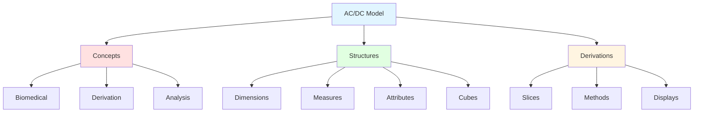
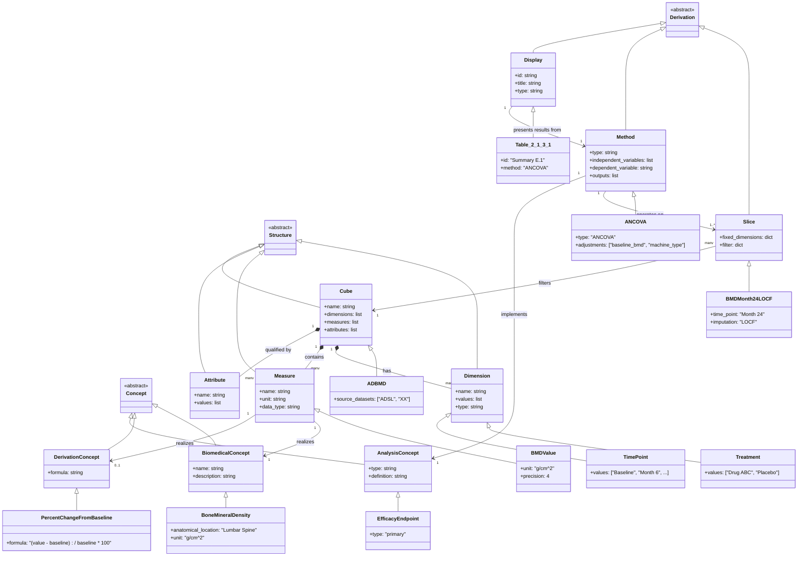

# AC/DC Model for BMD Analysis (Examples 1-4)

This document describes the AC/DC (Analysis Cube Design Cube) model derived from the CDISC ADaM Examples 1.0 document, specifically Examples 1-4 which analyze Bone Mineral Density (BMD) in a clinical trial comparing Drug ABC to Placebo. The analysis includes primary, secondary, and ad-hoc analyses using various statistical methods (ANCOVA, Fisher's Exact Test, Repeated Measures, and Descriptive Statistics) applied to the ADBMD analysis dataset.

## AC/DC Model (YAML)

```yaml
model:
  concepts:
    biomedical:
      - bone_mineral_density:
          description: "Bone Mineral Density measured at the Lumbar Spine"
          synonyms: [BMD, DXA BMD]
          anatomical_location: "Lumbar Spine"
          measurement_unit: "g/cm^2"
      - baseline_bmd:
          description: "Bone Mineral Density measurement taken at baseline"
          parent: bone_mineral_density

    derivation:
      - change_from_baseline:
          description: "Absolute change from baseline"
          formula: "value - baseline_value"
      - percent_change_from_baseline:
          description: "Percent change from baseline in BMD"
          formula: "(value - baseline_value) / baseline_value * 100"
          measurement_unit: "%"
      - treatment_difference:
          description: "Difference between treatment groups"
          formula: "treatment_a_mean - treatment_b_mean"
      - categorical_response:
          description: "Binary categorization of response"
          criteria: ">3% change from baseline"

    analysis:
      - efficacy_endpoint:
          type: "primary"
          definition: "Percent change from baseline at Month 24 in BMD at Lumbar Spine"
      - secondary_endpoint:
          type: "secondary"
          definition: "Proportion with >3% change from baseline at Month 36"
      - descriptive_analysis:
          type: "supportive"
          definition: "Summary statistics of BMD over time"
      - repeated_measures_endpoint:
          type: "ad-hoc"
          definition: "Percent change from baseline to Month 24 using repeated measures"

  structures:
    dimensions:
      - treatment:
          values: ["Drug ABC", "Placebo"]
          type: categorical
          role: "Independent variable"
      - time_point:
          values: ["Baseline", "Month 6", "Month 12", "Month 18", "Month 24", "Month 30", "Month 36"]
          type: temporal
          unit: "months"
          role: "Time dimension"
      - machine_type:
          description: "Type of DXA machine used for BMD measurement"
          type: categorical
          role: "Covariate"
      - analysis_population:
          values: ["ITT"]
          type: categorical
          description: "Intent-to-Treat population"
      - subject:
          type: identifier
          description: "Subject identifier"

    measures:
      - bmd_value:
          description: "Bone Mineral Density measurement"
          unit: "g/cm^2"
          data_type: continuous
          precision: 4
      - percent_change_bmd:
          description: "Percent change from baseline in BMD"
          unit: "%"
          data_type: continuous
          precision: 1
      - subject_count:
          description: "Count of subjects"
          data_type: integer
      - response_indicator:
          description: "Binary indicator for >3% change"
          values: [0, 1]
          data_type: categorical

    attributes:
      - measurement_unit:
          values: ["g/cm^2", "%"]
      - imputation_method:
          values: ["LOCF", "None"]
          description: "Method used for handling missing data"
      - data_type:
          values: ["OC", "LOCF"]
          labels:
            OC: "Observed Cases (no imputation)"
            LOCF: "Last Observation Carried Forward"
      - missing_indicator:
          values: ["Missing", "Non-missing"]
      - population_label:
          value: "ITT Population"
      - confidence_level:
          value: 0.95
          description: "95% confidence interval"

    cubes:
      - adbmd:
          description: "Analysis dataset for Bone Mineral Density"
          dimensions: [subject, treatment, time_point, machine_type, analysis_population]
          measures: [bmd_value, percent_change_bmd, response_indicator]
          attributes: [measurement_unit, imputation_method, missing_indicator]
          source_datasets: ["ADSL", "SDTM XX domain"]

  derivations:
    slices:
      - bmd_month_24_locf:
          cube: adbmd
          fixed_dimensions:
            time_point: "Month 24"
            analysis_population: "ITT"
          filter:
            imputation_method: "LOCF"
          description: "BMD at Month 24 with LOCF imputation"

      - bmd_month_36_oc:
          cube: adbmd
          fixed_dimensions:
            time_point: "Month 36"
            analysis_population: "ITT"
          filter:
            imputation_method: "None"
            missing_indicator: "Non-missing"
          description: "BMD at Month 36, observed cases only"

      - bmd_month_24_windowed:
          cube: adbmd
          fixed_dimensions:
            time_point: "Month 24"
            analysis_population: "ITT"
          filter:
            imputation_method: "None"
          description: "BMD at Month 24 with windowed values, no imputation"

      - bmd_over_time:
          cube: adbmd
          dimensions: [treatment, time_point]
          filter:
            analysis_population: "ITT"
            imputation_method: "None"
          description: "BMD across all time points, observed cases"

    methods:
      - ancova_primary:
          type: "ANCOVA"
          description: "Analysis of Covariance for primary efficacy"
          input: bmd_month_24_locf
          dependent_variable: percent_change_bmd
          independent_variables:
            - treatment
            - baseline_bmd
            - machine_type
            - interaction: [baseline_bmd, machine_type]
          outputs:
            - ls_mean
            - ls_mean_95ci
            - treatment_difference
            - treatment_difference_95ci
            - p_value
          population: "ITT"

      - fishers_exact_test:
          type: "Fisher's Exact Test"
          description: "Categorical analysis of response proportion"
          input: bmd_month_36_oc
          grouping_variable: treatment
          response_variable: response_indicator
          response_criteria: ">3% change from baseline"
          outputs:
            - count
            - proportion
            - p_value
          population: "ITT"

      - repeated_measures:
          type: "Mixed-effects model repeated measures"
          description: "Repeated measures analysis of BMD change"
          input: bmd_month_24_windowed
          dependent_variable: percent_change_bmd
          independent_variables:
            - treatment
            - time
            - interaction: [treatment, time]
            - baseline_bmd
            - interaction: [baseline_bmd, time]
          outputs:
            - ls_mean
            - ls_mean_95ci
            - treatment_difference
            - treatment_difference_95ci
            - p_value
          population: "ITT"

      - descriptive_statistics:
          type: "Summary Statistics"
          description: "Descriptive statistics for continuous endpoint"
          input: bmd_over_time
          grouping_variables: [treatment, time_point]
          measure: bmd_value
          statistics:
            - n
            - mean
            - sd
            - median
            - min
            - max
          population: "ITT"

      - locf_imputation:
          type: "Imputation"
          description: "Last Observation Carried Forward imputation"
          method: "LOCF"
          applied_to: bmd_value
          condition: "missing_indicator = Missing"

    displays:
      - table_2_1_3_1:
          id: "Summary E.1"
          title: "Lumbar Spine Bone Mineral Density Percent Change From Baseline at Month 24"
          subtitle: "(ITT Population, LOCF Data, ANCOVA Model)"
          type: "table"
          method: ancova_primary
          rows:
            - treatment
          columns:
            - n
            - ls_mean
            - ls_mean_95ci
            - treatment_difference
            - treatment_difference_95ci
            - p_value
          footnotes:
            - "N = ITT population, n = number of subjects with non-missing percent change from baseline at month 24"
            - "CI = Confidence interval"
            - "LS = Least squares"
            - "[a]Based on ANCOVA model adjusting for planned treatment, baseline BMD value, machine type, and baseline BMD value by machine type interaction."

      - table_2_2_1_1:
          id: "Summary E.2"
          title: "Subjects with >3% Change from Baseline in Lumbar Spine Bone Mineral Density at Month 36"
          subtitle: "(ITT Population, OC Data)"
          type: "table"
          method: fishers_exact_test
          rows:
            - "Subjects completing Month 36"
            - "Subjects with >3% change from baseline"
            - "P-value"
          columns:
            - treatment
          footnotes:
            - "N=ITT population"
            - "OC Data are data as observed (i.e., no imputation for missing values)"
            - "Subjects with missing BMD data at Month 36 are excluded from the analysis."
            - "[1] p-value computed using Fisher's Exact Test."

      - table_2_3_1_1:
          id: "Summary E.3"
          title: "Lumbar Spine Bone Mineral Density Percent Change From Baseline to Month 24"
          subtitle: "(ITT Population, OC Data, Repeated Measures Analysis)"
          type: "table"
          method: repeated_measures
          rows:
            - treatment
          columns:
            - ls_mean
            - ls_mean_95ci
            - treatment_difference
            - treatment_difference_95ci
            - p_value
          footnotes:
            - "N = ITT population"
            - "OC Data = Observed Cases Data (i.e., data as observed with no imputation for missing values)"
            - "LS = Least squares"
            - "^a Based on mixed-effects model repeated measures analysis, adjusting for planned treatment, time and treatment by time interaction, baseline BMD value, and baseline BMD value by time interaction."

      - table_2_4_1_1:
          id: "Summary E.4"
          title: "Summary of Lumbar Spine Bone Mineral Density (g/cm^2) Over Time"
          subtitle: "(ITT Population, OC Data)"
          type: "table"
          method: descriptive_statistics
          rows:
            - time_point
          columns:
            - treatment
          statistics:
            - n
            - mean_sd
            - median
            - min
            - max
          footnotes:
            - "N=ITT population"
            - "OC Data are data as observed (i.e., no imputation for missing values)"

      - figure_2_4_1_1:
          id: "Figure E.4.1"
          title: "Boxplot of Lumbar Spine Bone Mineral Density at Month 36"
          subtitle: "(ITT Population, OC Data)"
          type: "figure"
          plot_type: "boxplot"
          method: descriptive_statistics
          slice: bmd_month_36_oc
          x_axis:
            variable: treatment
            label: "Treatment"
          y_axis:
            variable: bmd_value
            label: "DXA BMD at Lumbar Spine [g/cm^2]"
            range: [0.75, 1.05]
```

## Dependency Diagram

The model demonstrates clear end-to-end traceability from displays back through derivations to structural entities and concepts:

### Display → Method → Slice → Cube → Concept Flow:

1. **Table 2.1.3.1 (Primary Analysis)**
   - Display: `table_2_1_3_1`
   - Method: `ancova_primary` (ANCOVA)
   - Slice: `bmd_month_24_locf`
   - Cube: `adbmd`
   - Measures: `percent_change_bmd`
   - Derivation Concept: `percent_change_from_baseline`
   - Biomedical Concept: `bone_mineral_density`

2. **Table 2.2.1.1 (Secondary Analysis)**
   - Display: `table_2_2_1_1`
   - Method: `fishers_exact_test`
   - Slice: `bmd_month_36_oc`
   - Cube: `adbmd`
   - Measures: `response_indicator`
   - Derivation Concept: `categorical_response`
   - Biomedical Concept: `bone_mineral_density`

3. **Table 2.3.1.1 (Ad-hoc Analysis)**
   - Display: `table_2_3_1_1`
   - Method: `repeated_measures`
   - Slice: `bmd_month_24_windowed`
   - Cube: `adbmd`
   - Measures: `percent_change_bmd`
   - Derivation Concept: `percent_change_from_baseline`
   - Biomedical Concept: `bone_mineral_density`

4. **Table 2.4.1.1 & Figure 2.4.1.1 (Descriptive Analysis)**
   - Displays: `table_2_4_1_1`, `figure_2_4_1_1`
   - Method: `descriptive_statistics`
   - Slice: `bmd_over_time` / `bmd_month_36_oc`
   - Cube: `adbmd`
   - Measures: `bmd_value`
   - Biomedical Concept: `bone_mineral_density`

### Key Dependencies:

- **Dimensions** (treatment, time_point, machine_type) identify observations in the cube
- **Measures** (bmd_value, percent_change_bmd) contain the observed/derived values
- **Attributes** (imputation_method, missing_indicator) qualify the observations
- **Slices** filter the cube by fixing specific dimension values
- **Methods** transform slices into analytical results
- **Displays** present the results from methods

## Model Structure

### Top-Level Package Diagram



### AC/DC Class Diagram



## Definitions

### Concepts

- **bone_mineral_density**: Bone Mineral Density (BMD) measured at the Lumbar Spine using DXA (Dual-energy X-ray Absorptiometry), measured in g/cm². This is the primary biomedical observation in the study.

- **baseline_bmd**: The BMD measurement taken at baseline (study start), used as a covariate in adjusted analyses and as the reference point for change calculations.

- **percent_change_from_baseline**: A derived measure calculated as `(value - baseline_value) / baseline_value × 100`, representing the relative change in BMD from baseline, expressed as a percentage.

- **treatment_difference**: The difference in treatment effects between Drug ABC and Placebo, calculated as the difference in LS means or proportions between treatment groups.

- **efficacy_endpoint**: The primary efficacy analysis endpoint is the percent change from baseline at Month 24 in BMD at the Lumbar Spine, analyzed using ANCOVA in the ITT population with LOCF imputation.

### Structures

- **adbmd**: The Analysis Dataset for Bone Mineral Density, structured as a cube with dimensions (subject, treatment, time_point, machine_type, analysis_population), measures (bmd_value, percent_change_bmd, response_indicator), and attributes (measurement_unit, imputation_method, missing_indicator).

- **treatment**: A categorical dimension with two values (Drug ABC, Placebo) representing the planned treatment assignment.

- **time_point**: A temporal dimension representing the scheduled visit times (Baseline, Month 6, 12, 18, 24, 30, 36).

- **machine_type**: A categorical dimension representing the type of DXA machine used for BMD measurements, included as a covariate in the analysis.

- **bmd_value**: The measure representing the raw BMD observation value in g/cm².

- **percent_change_bmd**: A derived measure representing the percent change from baseline in BMD.

### Derivations

- **bmd_month_24_locf**: A slice of the ADBMD cube fixed at Month 24 time point with LOCF imputation applied, used for the primary efficacy analysis.

- **bmd_month_36_oc**: A slice of the ADBMD cube fixed at Month 36 with observed cases only (no imputation), used for the secondary categorical analysis.

- **ancova_primary**: An ANCOVA (Analysis of Covariance) method that adjusts for planned treatment, baseline BMD value, machine type, and baseline BMD × machine type interaction. Outputs include LS means, 95% CIs, treatment differences, and p-values.

- **fishers_exact_test**: A categorical analysis method that compares the proportion of subjects with >3% change from baseline between treatment groups using Fisher's Exact Test.

- **repeated_measures**: A mixed-effects model repeated measures analysis adjusting for planned treatment, time, treatment × time interaction, baseline BMD, and baseline BMD × time interaction.

- **descriptive_statistics**: A method that calculates summary statistics (n, mean, SD, median, min, max) for BMD values grouped by treatment and time point.

- **locf_imputation**: Last Observation Carried Forward imputation method used to impute missing BMD values at Month 24 for the primary analysis.

### Displays

- **table_2_1_3_1**: ANCOVA analysis table showing LS means, 95% CIs, treatment differences, and p-values for percent change from baseline at Month 24 (ITT population, LOCF data).

- **table_2_2_1_1**: Categorical analysis table showing counts and proportions of subjects with >3% change from baseline at Month 36, with Fisher's Exact Test p-value (ITT population, OC data).

- **table_2_3_1_1**: Repeated measures analysis table showing LS means, 95% CIs, treatment differences, and p-values for percent change from baseline to Month 24 (ITT population, OC data).

- **table_2_4_1_1**: Descriptive statistics table showing n, mean (SD), median, min, and max for BMD values over time by treatment group (ITT population, OC data).

- **figure_2_4_1_1**: Boxplot showing the distribution of BMD at Month 36 by treatment group (ITT population, OC data).

## Issues

### Open Questions

1. **Machine Type Values**: The specific values/categories for machine_type dimension are not specified in the SAP document. Need to determine from the protocol or data what specific DXA machine types are used.

2. **Windowing Rules**: Example 3 mentions "windowed values" for the repeated measures analysis, but the specific windowing rules (e.g., ±X days around nominal visit date) are not defined in the excerpt.

3. **Response Categorization Logic**: The categorical response is defined as ">3% change from baseline," but it's not clear whether this is increase only, or absolute change. The context suggests increase (positive change), but this should be confirmed.

4. **Baseline BMD Interaction**: The ANCOVA model includes "baseline BMD value by machine type interaction" as a covariate. The rationale and interpretation of this interaction term could be further documented.

5. **Multiple Comparisons Adjustment**: The SAP describes multiple analyses (primary, secondary, ad-hoc), but doesn't specify whether any adjustment for multiplicity is applied to control family-wise error rate.

6. **Missing Data Mechanism**: While LOCF is specified for the primary analysis, there's no discussion of the assumed missing data mechanism or sensitivity analyses to assess robustness to different missing data assumptions.

7. **Time Window Definition**: For the repeated measures analysis using "windowed values," specific visit windows need to be defined (e.g., Month 24 = Days 720 ± 30).

8. **Baseline Definition**: Need to confirm whether baseline is a single measurement or if multiple pre-randomization measurements are averaged.

9. **Minimal Clinically Important Difference**: The 3% threshold used in the secondary analysis may represent a minimal clinically important difference, but this is not explicitly stated.

### Model Extensions

1. **Additional Attributes**: Consider adding attributes for data quality flags, visit window compliance indicators, or analysis flags.

2. **Sensitivity Analyses**: The model could be extended to include sensitivity analyses (e.g., different imputation methods, per-protocol population).

3. **Subgroup Analyses**: If subgroup analyses are performed (e.g., by age group, baseline BMD tertile), these could be modeled as additional dimensions or separate slices.

4. **Safety Analyses**: The SAP excerpt focuses on efficacy; safety analyses for BMD-related adverse events could be added to the model.

5. **Intermediate Derivations**: The model could explicitly represent intermediate derivation steps (e.g., baseline value assignment, change calculation) as separate methods before the statistical analyses.
