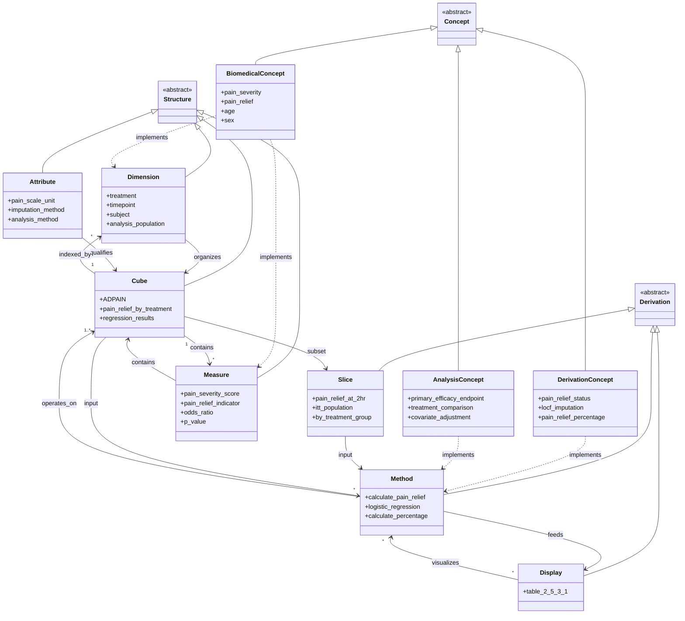

# AC/DC Model: Pain Relief Analysis (Example 5)

This AC/DC model describes the pain relief analysis from CDISC ADaM Example 5 (source: `examples/SAP/SAP_ex05_Pain.md`). The analysis evaluates pain relief at 2 hours post-baseline in a study comparing Drug XYZ versus Placebo, using a logistic regression model with covariates (age, sex, baseline pain severity). The primary endpoint is the percentage of subjects achieving pain relief, defined as reduction from moderate/severe pain (severity ≥2) to mild/no pain (severity ≤1) without rescue medication use.

## AC/DC Model

```yaml
model:
  concepts:
    biomedical:
      - pain_severity:
          description: "Pain severity measurement on ordinal scale"
          scale: "0=no pain, 1=mild, 2=moderate, 3=severe"
          domain: "clinical observation"

      - pain_relief:
          description: "Clinical outcome indicating pain relief achievement"
          definition: "Reduction from baseline pain severity ≥2 to post-dose severity ≤1"
          constraint: "No rescue medication use from baseline to timepoint"

      - rescue_medication_use:
          description: "Use of rescue medication during study period"
          values: ["Yes", "No"]

      - age:
          description: "Subject age demographic"
          type: "continuous"
          role: "covariate"

      - sex:
          description: "Subject sex demographic"
          type: "categorical"
          role: "covariate"

      - baseline_characteristics:
          description: "Subject characteristics measured at baseline"
          includes: ["age", "sex", "baseline_pain_severity"]

    derivation:
      - change_in_pain_severity:
          description: "Change from baseline in pain severity score"
          formula: "post_dose_severity - baseline_severity"

      - pain_relief_status:
          description: "Binary indicator of pain relief achievement"
          logic: "baseline_severity >= 2 AND post_dose_severity <= 1 AND rescue_medication = 'No'"
          values: [0, 1]

      - locf_imputation:
          description: "Last Observation Carried Forward imputation for missing values"
          method: "LOCF"
          application: "Missing pain severity measurements"

      - pain_relief_percentage:
          description: "Percentage of subjects with pain relief"
          formula: "(count_with_relief / total_n) * 100"

    analysis:
      - primary_efficacy_endpoint:
          description: "Primary endpoint for efficacy assessment"
          measure: "pain_relief_percentage"
          timepoint: "2 hours post-baseline"

      - treatment_comparison:
          description: "Comparison between treatment groups"
          groups: ["Placebo", "Drug XYZ"]
          method: "logistic_regression"

      - covariate_adjustment:
          description: "Adjustment for baseline characteristics"
          covariates: ["age", "sex", "baseline_pain_severity"]

      - response_variable:
          description: "Dependent variable in regression model"
          variable: "pain_relief_at_2hr"
          type: "binary"

  structures:
    dimension:
      - treatment:
          description: "Randomized treatment assignment"
          values: ["Placebo", "Drug XYZ"]
          role: "primary factor"
          cardinality: 2

      - timepoint:
          description: "Time of pain assessment relative to baseline"
          values: ["Baseline", "30min", "60min", "90min", "120min"]
          unit: "minutes"
          reference: "post-baseline"

      - subject:
          description: "Study subject identifier"
          type: "identifier"
          uniqueness: "unique per subject"

      - analysis_population:
          description: "Analysis population subset"
          value: "ITT"
          definition: "Intent-to-Treat population"

      - age_group:
          description: "Age as categorical or continuous dimension"
          type: "continuous_covariate"
          role: "stratification_factor"

      - sex_group:
          description: "Sex demographic grouping"
          values: ["Male", "Female"]
          role: "stratification_factor"

      - baseline_pain_category:
          description: "Baseline pain severity category"
          values: ["Moderate", "Severe"]
          criteria: "severity >= 2"
          role: "stratification_factor"

    attribute:
      - pain_scale_unit:
          description: "Unit for pain severity scale"
          value: "0-3 ordinal scale"
          interpretation: "0=none, 1=mild, 2=moderate, 3=severe"

      - time_unit:
          description: "Unit for time measurements"
          value: "minutes"
          conversion: "120 minutes = 2 hours"

      - imputation_method:
          description: "Method used for missing data imputation"
          value: "LOCF"
          full_name: "Last Observation Carried Forward"

      - analysis_method:
          description: "Statistical method for primary analysis"
          value: "Logistic Regression"

      - confidence_level:
          description: "Confidence level for interval estimation"
          value: 0.95
          percentage: "95%"

      - population_flag:
          description: "Flag indicating inclusion in analysis population"
          variable: "ITTFL"
          values: ["Y", "N"]

    measure:
      - pain_severity_score:
          description: "Observed pain severity value"
          range: [0, 3]
          type: "ordinal"
          source_variable: "pain severity response"

      - pain_relief_indicator:
          description: "Binary indicator of pain relief achievement"
          values: [0, 1]
          derivation: "pain_relief_status"
          variable_name: "CRIT1FL"

      - rescue_medication_flag:
          description: "Indicator of rescue medication use"
          values: ["Yes", "No"]
          source: "SDTM domain XX"

      - n_with_pain_relief:
          description: "Count of subjects achieving pain relief"
          type: "count"
          aggregation: "sum"

      - pct_with_pain_relief:
          description: "Percentage of subjects with pain relief"
          type: "percentage"
          format: "xx.x%"

      - odds_ratio:
          description: "Odds ratio for treatment effect"
          comparison: "Drug XYZ vs Placebo"
          reference: "Placebo"

      - ci_lower:
          description: "Lower bound of 95% confidence interval"
          for: "odds_ratio"

      - ci_upper:
          description: "Upper bound of 95% confidence interval"
          for: "odds_ratio"

      - p_value:
          description: "Statistical significance p-value"
          test: "treatment effect in logistic regression"
          format: "x.xxxx"

    cube:
      - ADPAIN:
          description: "Analysis dataset for pain relief study"
          source_datasets: ["ADSL", "SDTM_XX"]
          dimensions: ["subject", "timepoint", "treatment"]
          measures: ["pain_severity_score", "rescue_medication_flag"]
          attributes: ["pain_scale_unit", "time_unit", "imputation_method"]
          key: ["subject", "timepoint"]

      - pain_relief_by_treatment:
          description: "Pain relief outcomes by treatment group"
          dimensions: ["treatment", "timepoint"]
          measures: ["n_with_pain_relief", "pct_with_pain_relief"]
          filter: "timepoint = '120min' AND analysis_population = 'ITT'"

      - baseline_covariates:
          description: "Baseline characteristics by subject"
          dimensions: ["subject", "treatment"]
          measures: ["age", "baseline_pain_severity_score"]
          attributes: ["sex"]
          timepoint: "Baseline"

      - regression_results:
          description: "Logistic regression analysis results"
          dimensions: ["treatment"]
          measures: ["odds_ratio", "ci_lower", "ci_upper", "p_value"]
          reference_group: "Placebo"

  derivations:
    slice:
      - pain_relief_at_2hr:
          description: "Pain relief outcomes at 2 hours post-baseline"
          source_cube: "ADPAIN"
          fixed_dimensions:
            timepoint: "120min"
            analysis_population: "ITT"
          varying_dimensions: ["treatment", "subject"]

      - itt_population:
          description: "Intent-to-Treat population subset"
          source_cube: "ADPAIN"
          filter: "ITTFL = 'Y'"

      - by_treatment_group:
          description: "Results stratified by treatment"
          source_cube: "pain_relief_by_treatment"
          varying_dimensions: ["treatment"]
          fixed_dimensions:
            timepoint: "120min"

      - baseline_slice:
          description: "Baseline measurements only"
          source_cube: "ADPAIN"
          fixed_dimensions:
            timepoint: "Baseline"
          varying_dimensions: ["subject", "treatment"]

    method:
      - calculate_pain_relief:
          description: "Determine if subject achieved pain relief"
          input_measures: ["baseline_pain_severity", "post_dose_pain_severity", "rescue_medication_flag"]
          output_measure: "pain_relief_indicator"
          logic: |
            pain_relief_indicator =
              IF baseline_pain_severity >= 2
                AND post_dose_pain_severity <= 1
                AND rescue_medication_flag = 'No'
              THEN 1
              ELSE 0
          variable_names:
            criterion: "CRIT1"
            flag: "CRIT1FL"

      - apply_locf:
          description: "Impute missing pain severity values using LOCF"
          input: "pain_severity_score with missing values"
          output: "pain_severity_score imputed"
          algorithm: "Last Observation Carried Forward"
          application: "Within subject, ordered by timepoint"

      - count_pain_relief:
          description: "Count subjects with pain relief by treatment"
          input_slice: "pain_relief_at_2hr"
          input_measure: "pain_relief_indicator"
          output_measure: "n_with_pain_relief"
          aggregation: "SUM(pain_relief_indicator)"
          group_by: ["treatment"]

      - calculate_percentage:
          description: "Calculate percentage with pain relief"
          input_measures: ["n_with_pain_relief", "total_n"]
          output_measure: "pct_with_pain_relief"
          formula: "(n_with_pain_relief / total_n) * 100"
          format: "xx.x%"
          group_by: ["treatment"]

      - logistic_regression:
          description: "Logistic regression model for treatment comparison"
          model_type: "Binary logistic regression"
          response_variable: "pain_relief_indicator"
          independent_variables:
            - "treatment"
            - "age"
            - "sex"
            - "baseline_pain_severity"
          reference_treatment: "Placebo"
          output_measures:
            - "odds_ratio"
            - "ci_lower"
            - "ci_upper"
            - "p_value"
          confidence_level: 0.95
          population: "ITT"

      - calculate_odds_ratio:
          description: "Extract odds ratio from logistic regression"
          source_method: "logistic_regression"
          parameter: "treatment coefficient"
          transformation: "exp(beta_treatment)"
          comparison: "Drug XYZ vs Placebo"

      - calculate_confidence_interval:
          description: "Calculate 95% CI for odds ratio"
          source_method: "logistic_regression"
          input: "beta_treatment, SE(beta_treatment)"
          formula: "exp(beta ± 1.96 * SE)"
          outputs:
            lower: "ci_lower"
            upper: "ci_upper"

    display:
      - table_2_5_3_1:
          description: "Pain Relief at 2 Hours - Logistic Regression Analysis"
          title: "Summary E.5"
          subtitle: "Pain Relief at 2 Hours"
          subtitle2: "(ITT Population, LOGISTIC Model)"
          display_type: "table"

          structure:
            columns:
              - name: "Statistic"
                align: "left"
              - name: "Placebo"
                align: "center"
                header_suffix: "(N=xxx)"
              - name: "Drug XYZ"
                align: "center"
                header_suffix: "(N=xxx)"

            rows:
              - statistic: "Number (%) with pain relief"
                placebo_format: "xx (xx.x%)"
                drug_xyz_format: "xx (xx.x%)"
                source_measures: ["n_with_pain_relief", "pct_with_pain_relief"]

              - statistic: "Odds ratio"
                placebo_value: ""
                drug_xyz_format: "x.xx"
                source_measure: "odds_ratio"
                decimals: 2

              - statistic: "95% CI of odds ratio"
                placebo_value: ""
                drug_xyz_format: "(x.xx,x.xx)"
                source_measures: ["ci_lower", "ci_upper"]
                decimals: 2

              - statistic: "p-value"
                placebo_value: ""
                drug_xyz_format: "x.xxxx"
                source_measure: "p_value"
                decimals: 4

          footnotes:
            - "N=ITT population"
            - "Note: Analysis is based on a logistic regression model adjusting for treatment, age, sex, and baseline pain severity."

          data_sources:
            cubes: ["regression_results", "pain_relief_by_treatment"]
            slices: ["pain_relief_at_2hr", "itt_population"]
            methods: ["logistic_regression", "calculate_percentage"]
```

## Dependency Diagram

The AC/DC model for pain relief analysis has the following key dependency chain:

**End-to-end traceability (Display → Methods → Structures → Concepts):**

1. **Display Level**: `table_2_5_3_1` (Pain Relief at 2 Hours)
   - Shows: counts, percentages, odds ratio, CI, p-value

2. **Method Level**: Statistical computations
   - `logistic_regression`: Produces odds_ratio, CI, p-value
   - `calculate_percentage`: Produces pct_with_pain_relief
   - `count_pain_relief`: Produces n_with_pain_relief
   - `calculate_pain_relief`: Produces pain_relief_indicator
   - `apply_locf`: Imputes missing values

3. **Structure Level - Cubes**:
   - `regression_results`: Contains final statistical results
   - `pain_relief_by_treatment`: Aggregated outcomes by treatment
   - `ADPAIN`: Core analysis dataset with raw observations
   - `baseline_covariates`: Covariate data for model adjustment

4. **Structure Level - Measures/Dimensions**:
   - Measures: `pain_severity_score`, `pain_relief_indicator`, `odds_ratio`, `p_value`
   - Dimensions: `treatment`, `timepoint`, `subject`, `age_group`, `sex_group`
   - Attributes: `imputation_method`, `analysis_method`, `confidence_level`

5. **Concept Level**: Abstract domain entities
   - Biomedical: `pain_severity`, `pain_relief`, `age`, `sex`
   - Derivation: `pain_relief_status`, `locf_imputation`, `pain_relief_percentage`
   - Analysis: `primary_efficacy_endpoint`, `treatment_comparison`, `covariate_adjustment`

**Key Dependencies:**

- `table_2_5_3_1` → `logistic_regression` → `pain_relief_indicator` → `pain_relief_status` concept
- `table_2_5_3_1` → `calculate_percentage` → `n_with_pain_relief` → `pain_relief_by_treatment` → `ADPAIN`
- `logistic_regression` → `baseline_covariates` → `age`, `sex`, `baseline_pain_severity` concepts
- `ADPAIN` → `apply_locf` → `locf_imputation` concept
- All statistical results trace back through the method layer to the structural layer (cubes/measures) and ultimately to biomedical and analysis concepts

## Model Structure




## Definitions

### Concept Definitions

**Biomedical Concepts:**
- **pain_severity**: An ordinal clinical observation measuring pain intensity on a 4-point scale (0=none, 1=mild, 2=moderate, 3=severe)
- **pain_relief**: A binary clinical outcome indicating successful reduction of pain from moderate/severe to mild/none without rescue medication
- **rescue_medication_use**: Binary indicator of whether rescue medication was used during the observation period
- **age**: Continuous demographic variable representing subject age, used as a covariate in the analysis
- **sex**: Categorical demographic variable, used as a covariate in the analysis
- **baseline_characteristics**: Collective term for subject attributes measured at baseline (age, sex, baseline pain severity)

**Derivation Concepts:**
- **change_in_pain_severity**: Computed difference between post-dose and baseline pain severity scores
- **pain_relief_status**: Logical derivation determining if pain relief criteria are met (baseline ≥2 AND post-dose ≤1 AND no rescue medication)
- **locf_imputation**: Statistical method to impute missing pain severity values by carrying forward the last observed value
- **pain_relief_percentage**: Proportion of subjects achieving pain relief, expressed as a percentage

**Analysis Concepts:**
- **primary_efficacy_endpoint**: The main outcome measure for the study (percentage with pain relief at 2 hours)
- **treatment_comparison**: Statistical comparison of outcomes between treatment groups (Drug XYZ vs Placebo)
- **covariate_adjustment**: Statistical technique to adjust for baseline factors (age, sex, baseline pain) in the analysis
- **response_variable**: The dependent variable in the regression model (binary pain relief indicator)

### Structure Definitions

**Dimensions:**
- **treatment**: Primary factor dimension identifying the randomized treatment assignment (Placebo or Drug XYZ)
- **timepoint**: Temporal dimension identifying when pain assessments occurred (Baseline, 30min, 60min, 90min, 120min)
- **subject**: Identifier dimension uniquely identifying each study participant
- **analysis_population**: Dimension identifying the analysis population subset (ITT)
- **age_group**: Continuous covariate dimension representing subject age
- **sex_group**: Categorical dimension for sex stratification (Male/Female)
- **baseline_pain_category**: Categorical dimension for baseline pain severity (Moderate/Severe)

**Measures:**
- **pain_severity_score**: Observed ordinal value (0-3) representing pain intensity
- **pain_relief_indicator**: Binary measure (0/1) indicating pain relief achievement
- **rescue_medication_flag**: Binary measure indicating rescue medication use
- **n_with_pain_relief**: Count measure of subjects achieving pain relief
- **pct_with_pain_relief**: Percentage measure of subjects with pain relief
- **odds_ratio**: Effect size measure comparing odds of pain relief between treatments
- **ci_lower/ci_upper**: Confidence interval bounds for the odds ratio
- **p_value**: Statistical significance measure for treatment effect

**Attributes:**
- **pain_scale_unit**: Qualifies the pain severity measure (0-3 ordinal scale)
- **time_unit**: Qualifies temporal measurements (minutes)
- **imputation_method**: Describes how missing data were handled (LOCF)
- **analysis_method**: Describes the statistical approach (Logistic Regression)
- **confidence_level**: Specifies the confidence level for interval estimation (95%)
- **population_flag**: Indicates inclusion in the ITT population (ITTFL)

**Cubes:**
- **ADPAIN**: Core analysis dataset containing pain measurements across timepoints for all subjects, organized by subject, timepoint, and treatment
- **pain_relief_by_treatment**: Aggregated cube of pain relief outcomes summarized by treatment group at 2 hours
- **baseline_covariates**: Cube containing baseline subject characteristics used as covariates in the regression model
- **regression_results**: Cube containing the statistical results from the logistic regression (odds ratio, CI, p-value)

### Derivation Definitions

**Slices:**
- **pain_relief_at_2hr**: Subset of ADPAIN fixing timepoint to 120 minutes (2 hours) and analysis population to ITT
- **itt_population**: Subset of ADPAIN filtering to include only subjects in the Intent-to-Treat population
- **by_treatment_group**: Stratified view of pain relief outcomes by treatment, fixing timepoint to 2 hours
- **baseline_slice**: Subset of ADPAIN containing only baseline (pre-dose) measurements

**Methods:**
- **calculate_pain_relief**: Logical function implementing pain relief criteria (baseline≥2 AND post-dose≤1 AND no rescue medication) to produce binary indicator
- **apply_locf**: Imputation algorithm that replaces missing pain severity values with the last observed value for each subject
- **count_pain_relief**: Aggregation method summing pain relief indicators by treatment group
- **calculate_percentage**: Arithmetic method computing percentage as (count/total)*100 by treatment
- **logistic_regression**: Statistical model fitting binary logistic regression with pain relief as response and treatment, age, sex, baseline pain as predictors
- **calculate_odds_ratio**: Transformation method extracting and exponentiating the treatment coefficient from the logistic regression
- **calculate_confidence_interval**: Statistical method computing 95% CI bounds using the standard error of the treatment coefficient

**Displays:**
- **table_2_5_3_1**: Formatted table presenting pain relief analysis results with columns for Placebo and Drug XYZ, rows for count/percentage, odds ratio, 95% CI, and p-value, including title, subtitles, and explanatory footnotes

## Issues

1. **Missing Specification**: The exact definition of age groups or age categorization is not specified in the SAP - it's described as a continuous covariate but the specific encoding is unclear

2. **SDTM Source Ambiguity**: The source SDTM domain is referenced as "XX" - the actual domain name (likely QS for questionnaire or a custom domain) should be specified for implementation

3. **LOCF Implementation Details**: While LOCF is specified for imputation, the exact rules for when/how to apply it are not fully detailed (e.g., what happens if baseline is missing?)

4. **Rescue Medication Timing**: The definition states "no rescue medication from baseline up to the specified time point" but the exact data structure and timing of rescue medication assessments relative to pain assessments needs clarification

5. **Model Parameterization**: The logistic regression specification doesn't clarify whether age is modeled as continuous or categorical, or whether interactions are considered

6. **Sample Size**: The table shows "N=xxx" indicating sample sizes are not specified in this excerpt - actual values would be needed for implementation

7. **CRITy Variable Naming**: The document mentions CRITy and CRITyFL variables but only implies CRIT1/CRIT1FL for the 2-hour pain relief criterion - the full naming convention and potential for multiple criteria should be documented

8. **Reference Coding**: The logistic regression reference treatment is Placebo, but the specific coding scheme (e.g., Placebo=0, Drug XYZ=1) should be explicitly documented

9. **Multiple Testing**: No mention of multiplicity adjustment, though this is described as the primary analysis - clarification on whether this is the only primary endpoint or if multiple testing procedures apply

10. **Sensitivity Analyses**: No alternative imputation methods or sensitivity analyses are mentioned - it would be valuable to understand if the LOCF approach is supplemented by other methods (e.g., multiple imputation)
