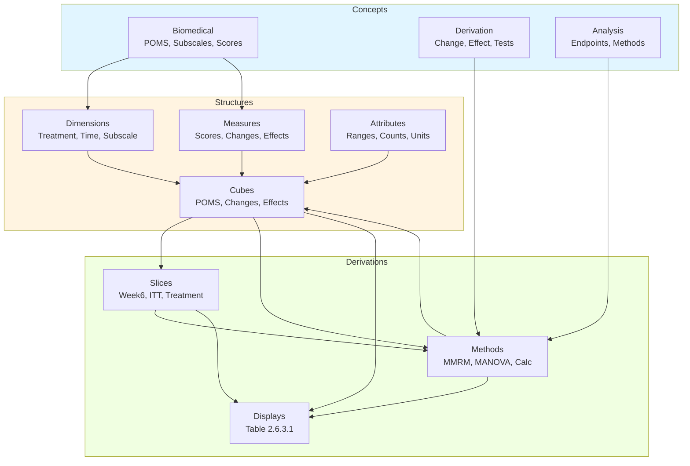
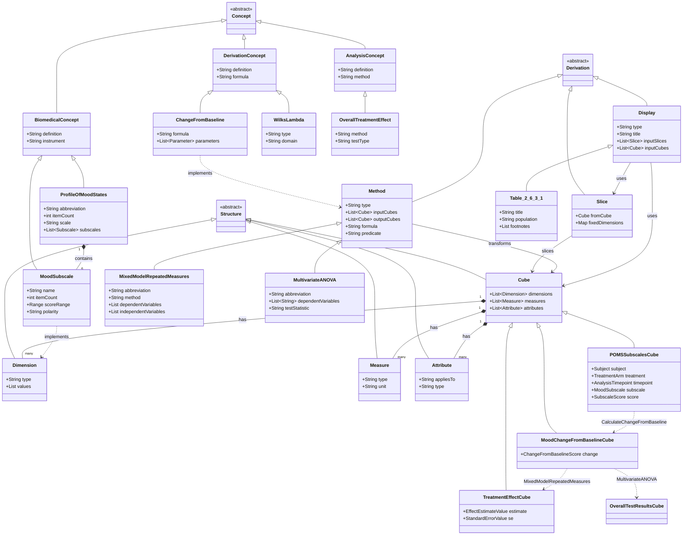

# AC/DC Model: Mood Assessment (POMS) Analysis

This document describes the AC/DC model derived from Example 6 (Mood Assessment) of the ADaM Examples (page 34), analyzing the Profile of Mood States (POMS) Assessment. The analysis involves a multivariate analysis of variance testing treatment effects on six mood subscales using mixed model repeated measures with an overall treatment effect test via Wilks' Lambda.

**Source:** examples/SAP/SAP_ex06_Mood.md

## AC/DC Model Structure

```yaml
model:
  concepts:
    biomedical:
      - MoodAssessment:
          definition: "Assessment of mood states using standardized instruments"
          instrument: ProfileOfMoodStates

      - ProfileOfMoodStates:
          abbreviation: POMS
          definition: "Standardized mood assessment containing 65 items rated on 5-point Likert scale"
          itemCount: 65
          scale: LikertScale5Point
          domain: Mood

      - LikertScale5Point:
          definition: "5-point ordinal rating scale"
          levels:
            - code: 0
              label: "Not at all"
            - code: 1
              label: "A little"
            - code: 2
              label: "Moderately"
            - code: 3
              label: "Quite a bit"
            - code: 4
              label: "Extremely"

      - TensionAnxiety:
          definition: "Mood subscale measuring tension and anxiety"
          instrument: POMS
          itemCount: 9
          scoreRange: [0, 36]
          polarity: negative

      - Depression:
          definition: "Mood subscale measuring depression"
          instrument: POMS
          itemCount: 15
          scoreRange: [0, 60]
          polarity: negative

      - AngerHostility:
          definition: "Mood subscale measuring anger and hostility"
          instrument: POMS
          itemCount: 12
          scoreRange: [0, 48]
          polarity: negative

      - VigorActivity:
          definition: "Mood subscale measuring vigor and activity"
          instrument: POMS
          itemCount: 8
          scoreRange: [0, 32]
          polarity: positive

      - Fatigue:
          definition: "Mood subscale measuring fatigue"
          instrument: POMS
          itemCount: 7
          scoreRange: [0, 28]
          polarity: negative

      - ConfusionBewilderment:
          definition: "Mood subscale measuring confusion"
          instrument: POMS
          itemCount: 7
          scoreRange: [0, 28]
          polarity: negative

      - TotalMoodDisturbance:
          definition: "Composite score of overall mood disturbance"
          scoreRange: [0, 200]
          formula: "TensionAnxiety + Depression + AngerHostility + Fatigue + ConfusionBewilderment - VigorActivity"

    derivation:
      - ChangeFromBaseline:
          definition: "Difference between post-baseline value and baseline value"
          formula: "PostBaselineValue - BaselineValue"
          parameterization: [Week6Value, BaselineValue]

      - EffectEstimate:
          definition: "Estimated treatment effect from statistical model"
          method: MixedModelRepeatedMeasures
          hasAttribute: StandardError

      - StandardError:
          definition: "Standard error of the effect estimate"
          relation: EffectEstimate

      - WilksLambda:
          definition: "Multivariate test statistic for overall treatment effect"
          type: TestStatistic
          domain: Multivariate
          hasAttribute: PValue

      - PValue:
          definition: "Probability value for hypothesis test"
          range: [0, 1]
          interpretation: "Probability of observing results as extreme under null hypothesis"

    analysis:
      - EfficacyEndpoint:
          definition: "Primary or secondary endpoint measuring treatment efficacy"
          assessmentType: PatientReportedOutcome
          instrument: POMS

      - OverallTreatmentEffect:
          definition: "Combined treatment effect across multiple dependent variables"
          method: MultivariateTest
          testType: WilksLambda

      - TreatmentEffect:
          definition: "Effect of treatment on outcome measure"
          comparisonType: BetweenGroup
          estimand: EffectEstimate

      - MultivariateAnalysis:
          definition: "Analysis involving multiple dependent variables"
          method: MANOVA
          dependentVariables: MoodSubscales
          independentVariables: Treatment

      - HypothesisTesting:
          definition: "Statistical test of null hypothesis"
          nullHypothesis: "No treatment effect"
          alternativeHypothesis: "Treatment effect exists"
          testStatistic: WilksLambda

  structures:
    dimension:
      - TreatmentArm:
          definition: "Randomized treatment assignment"
          type: Categorical
          role: IndependentVariable
          values:
            - Placebo
            - DrugZZZ
          cdiscDomain: DM
          cdiscVariable: ARM

      - AnalysisPopulation:
          definition: "Subject population included in analysis"
          type: Categorical
          values:
            - ITT
          cdiscVariable: ITTFL

      - AnalysisTimepoint:
          definition: "Scheduled time point for analysis"
          type: Categorical
          values:
            - Baseline
            - Week6
          cdiscDomain: ADMOOD
          cdiscVariable: AVISIT

      - MoodSubscale:
          definition: "Specific subscale of mood assessment"
          type: Categorical
          values:
            - TensionAnxietyTotal
            - DepressionTotal
            - AngerHostilityTotal
            - VigorActivityTotal
            - FatigueTotal
            - ConfusionBewildermentTotal
          cdiscDomain: ADMOOD
          cdiscVariable: PARAM

      - Subject:
          definition: "Individual study participant"
          type: Identifier
          cdiscDomain: DM
          cdiscVariable: USUBJID

    attribute:
      - ScoreRange:
          definition: "Minimum and maximum possible values for score"
          appliesTo: MoodSubscale
          type: NumericRange

      - ItemCount:
          definition: "Number of items comprising subscale"
          appliesTo: MoodSubscale
          type: Integer

      - SampleSize:
          definition: "Number of subjects in analysis group"
          symbol: N
          type: Integer

      - Polarity:
          definition: "Direction of scoring (positive or negative indicator)"
          appliesTo: MoodSubscale
          values: [positive, negative]

      - Unit:
          definition: "Unit of measurement"
          appliesTo: [EffectEstimate, SubscaleScore]
          value: "Score"

    measure:
      - SubscaleScore:
          definition: "Total score for mood subscale"
          type: Numeric
          unit: Score
          cdiscDomain: ADMOOD
          cdiscVariable: AVAL

      - ChangeFromBaselineScore:
          definition: "Change in subscale score from baseline"
          type: Numeric
          unit: Score
          derivedFrom: SubscaleScore
          cdiscDomain: ADMOOD
          cdiscVariable: CHG

      - EffectEstimateValue:
          definition: "Estimated treatment effect from model"
          type: Numeric
          unit: Score
          method: MixedModelRepeatedMeasures

      - StandardErrorValue:
          definition: "Standard error of effect estimate"
          type: Numeric
          unit: Score
          relatedTo: EffectEstimateValue

      - WilksLambdaValue:
          definition: "Value of Wilks' Lambda statistic"
          type: Numeric
          range: [0, 1]

      - PValueValue:
          definition: "P-value from hypothesis test"
          type: Numeric
          range: [0, 1]

    cube:
      - POMSSubscalesCube:
          definition: "Observations of POMS subscale scores"
          dimensions:
            - Subject
            - TreatmentArm
            - AnalysisTimepoint
            - MoodSubscale
          measures:
            - SubscaleScore
          attributes:
            - ScoreRange
            - ItemCount
            - Polarity

      - MoodChangeFromBaselineCube:
          definition: "Change from baseline in mood subscales"
          dimensions:
            - Subject
            - TreatmentArm
            - AnalysisTimepoint
            - MoodSubscale
          measures:
            - ChangeFromBaselineScore
          attributes:
            - Unit
          derivedFrom: POMSSubscalesCube

      - TreatmentEffectCube:
          definition: "Treatment effect estimates by subscale"
          dimensions:
            - TreatmentArm
            - AnalysisTimepoint
            - MoodSubscale
            - AnalysisPopulation
          measures:
            - EffectEstimateValue
            - StandardErrorValue
          attributes:
            - SampleSize

      - OverallTestResultsCube:
          definition: "Multivariate test results for overall treatment effect"
          dimensions:
            - AnalysisTimepoint
            - AnalysisPopulation
          measures:
            - WilksLambdaValue
            - PValueValue

  derivations:
    slice:
      - Week6Slice:
          definition: "Observations at Week 6 timepoint"
          fromCube: POMSSubscalesCube
          fixedDimensions:
            AnalysisTimepoint: Week6

      - BaselineSlice:
          definition: "Observations at baseline timepoint"
          fromCube: POMSSubscalesCube
          fixedDimensions:
            AnalysisTimepoint: Baseline

      - ITTPopulationSlice:
          definition: "Intent-to-treat population subset"
          fromCube: POMSSubscalesCube
          fixedDimensions:
            AnalysisPopulation: ITT

      - PlaceboSlice:
          definition: "Placebo treatment arm subset"
          fromCube: TreatmentEffectCube
          fixedDimensions:
            TreatmentArm: Placebo

      - DrugZZZSlice:
          definition: "Drug ZZZ treatment arm subset"
          fromCube: TreatmentEffectCube
          fixedDimensions:
            TreatmentArm: DrugZZZ

      - Week6ITTSlice:
          definition: "Week 6 observations in ITT population"
          fromCube: MoodChangeFromBaselineCube
          fixedDimensions:
            AnalysisTimepoint: Week6
            AnalysisPopulation: ITT

    method:
      - CalculateChangeFromBaseline:
          definition: "Compute change from baseline for each subscale score"
          type: Arithmetic
          inputCubes:
            - POMSSubscalesCube
          outputCubes:
            - MoodChangeFromBaselineCube
          formula: "ChangeFromBaselineScore = SubscaleScore[Week6] - SubscaleScore[Baseline]"
          predicate: "change_from_baseline(Subject, Subscale, Week6Score, BaselineScore, Change)"
          rule: "Change = Week6Score - BaselineScore"

      - MixedModelRepeatedMeasures:
          abbreviation: MMRM
          definition: "Mixed effects model for repeated measures data"
          type: Statistical
          method: LinearMixedModel
          inputCubes:
            - MoodChangeFromBaselineCube
          outputCubes:
            - TreatmentEffectCube
          dependentVariable: ChangeFromBaselineScore
          independentVariables:
            - TreatmentArm
          randomEffects:
            - Subject
          produces:
            - EffectEstimateValue
            - StandardErrorValue
          predicate: "mmrm_estimate(Subscale, Treatment, EffectEstimate, SE)"

      - MultivariateANOVA:
          abbreviation: MANOVA
          definition: "Multivariate analysis of variance"
          type: Statistical
          method: MultivariateLinearModel
          inputCubes:
            - MoodChangeFromBaselineCube
          outputCubes:
            - OverallTestResultsCube
          dependentVariables:
            - TensionAnxietyTotal
            - DepressionTotal
            - AngerHostilityTotal
            - VigorActivityTotal
            - FatigueTotal
            - ConfusionBewildermentTotal
          independentVariables:
            - TreatmentArm
          testStatistic: WilksLambda
          produces:
            - WilksLambdaValue
            - PValueValue
          predicate: "manova_test(DependentVars, Treatment, WilksLambda, PValue)"
          rule: "test_overall_effect(Treatment) :- manova_test([TensionAnxiety, Depression, AngerHostility, Vigor, Fatigue, Confusion], Treatment, Lambda, P)"

      - CalculateTotalMoodDisturbance:
          definition: "Compute total mood disturbance score"
          type: Arithmetic
          inputCubes:
            - POMSSubscalesCube
          formula: "TMD = TensionAnxiety + Depression + AngerHostility + Fatigue + Confusion - Vigor"
          predicate: "total_mood_disturbance(Subject, Time, TensionAnx, Depr, Anger, Vigor, Fatigue, Conf, TMD)"
          rule: "TMD = TensionAnx + Depr + Anger + Fatigue + Conf - Vigor"

    display:
      - Table_2_6_3_1:
          definition: "Multivariate Analysis of Variance Testing the Hypothesis of No Overall Treatment Effect at Week 6"
          type: SummaryTable
          title: "Table 2.6.3.1"
          subtitle: "Multivariate Analysis of Variance Testing the Hypothesis of No Overall Treatment Effect at Week 6"
          population: "ITT Population"
          inputSlices:
            - Week6ITTSlice
            - PlaceboSlice
            - DrugZZZSlice
          inputCubes:
            - TreatmentEffectCube
            - OverallTestResultsCube
          rows:
            - dimension: MoodSubscale
              order:
                - TensionAnxietyTotal
                - DepressionTotal
                - AngerHostilityTotal
                - VigorActivityTotal
                - FatigueTotal
                - ConfusionBewildermentTotal
              labels:
                TensionAnxietyTotal: "Tension/Anxiety Total Score"
                DepressionTotal: "Depression/Rejection Total Score"
                AngerHostilityTotal: "Anger/Hostility Total Score"
                VigorActivityTotal: "Vigor/Activity Total Score"
                FatigueTotal: "Fatigue/Inertia Total Score"
                ConfusionBewildermentTotal: "Confusion/Bewilderment Total Score"
          columns:
            - dimension: TreatmentArm
              values: [Placebo, DrugZZZ]
              headers:
                Placebo: "Placebo\n(N=xxx)"
                DrugZZZ: "Drug ZZZ\n(N=xxx)"
          cells:
            - measure: EffectEstimateValue
              format: "x.xx"
            - measure: StandardErrorValue
              format: "(x.xx)"
              displayAs: parenthetical
          sections:
            - sectionTitle: "Test for Overall Treatment Effect"
              rows:
                - label: "Wilks' Lambda"
                  measure: WilksLambdaValue
                  format: "x.xx"
                  span: columns
                - label: "p-value"
                  measure: PValueValue
                  format: "x.xxxx"
                  span: columns
          footnotes:
            - id: "N"
              text: "N=ITT Population"
            - id: 1
              text: "Mixed Model Repeated Measures Analysis"
            - id: 2
              text: "Wilks' Lambda multivariate test of treatment effect, with the six mood subscale scores as the dependent variables in the model and treatment the only independent variable."
          formatting:
            numberFormat:
              effectEstimate: "x.xx"
              standardError: "x.xx"
              wilksLambda: "x.xx"
              pValue: "x.xxxx"
```

## Dependency Diagram

### End-to-End Dependency Trace

The model exhibits clear dependency chains from display back to concepts:

**Display → Derivations → Structures → Concepts**

1. **Table_2_6_3_1** (Display)
   - ← **Week6ITTSlice**, **PlaceboSlice**, **DrugZZZSlice** (Slices)
   - ← **TreatmentEffectCube**, **OverallTestResultsCube** (Cubes)

2. **TreatmentEffectCube** (Cube)
   - ← **MixedModelRepeatedMeasures** (Method)
   - ← **MoodChangeFromBaselineCube** (Cube)

3. **MoodChangeFromBaselineCube** (Cube)
   - ← **CalculateChangeFromBaseline** (Method)
   - ← **POMSSubscalesCube** (Cube)

4. **POMSSubscalesCube** (Cube)
   - ← **SubscaleScore** (Measure)
   - ← **MoodSubscale**, **TreatmentArm**, **AnalysisTimepoint**, **Subject** (Dimensions)

5. **MoodSubscale** (Dimension)
   - ← **TensionAnxiety**, **Depression**, **AngerHostility**, **VigorActivity**, **Fatigue**, **ConfusionBewilderment** (Biomedical Concepts)
   - ← **ProfileOfMoodStates** (Biomedical Concept)

6. **OverallTestResultsCube** (Cube)
   - ← **MultivariateANOVA** (Method)
   - ← **MoodChangeFromBaselineCube** (Cube)
   - ← **OverallTreatmentEffect** (Analysis Concept)
   - ← **WilksLambda** (Derivation Concept)

### Key Dependencies

- **POMS Instrument → Subscales → Scores → Changes → Effects → Display**
- **Statistical Methods** (MMRM, MANOVA) transform raw observations into inferential results
- **Slicing Operations** filter cubes by fixed dimension values (Week 6, ITT, Treatment Arms)
- **Multivariate Test** aggregates across six subscales to produce overall treatment effect

## Model Structure

### Package Diagram



### Class Diagram



## Definitions

### Biomedical Concepts

| Concept | Definition | Key Attributes |
|---------|------------|----------------|
| **ProfileOfMoodStates** | Standardized 65-item mood assessment instrument using 5-point Likert scale | 6 subscales, score ranges vary by subscale |
| **TensionAnxiety** | Subscale measuring tension and anxiety states | 9 items, range 0-36, negative polarity |
| **Depression** | Subscale measuring depressive mood | 15 items, range 0-60, negative polarity |
| **AngerHostility** | Subscale measuring anger and hostile feelings | 12 items, range 0-48, negative polarity |
| **VigorActivity** | Subscale measuring energy and vigor | 8 items, range 0-32, positive polarity |
| **Fatigue** | Subscale measuring fatigue and inertia | 7 items, range 0-28, negative polarity |
| **ConfusionBewilderment** | Subscale measuring confusion | 7 items, range 0-28, negative polarity |
| **TotalMoodDisturbance** | Composite measure of overall mood disturbance | Range 0-200, computed as sum of 5 negative subscales minus vigor |

### Derivation Concepts

| Concept | Definition | Formula/Method |
|---------|------------|----------------|
| **ChangeFromBaseline** | Difference between post-baseline and baseline values | PostBaselineValue - BaselineValue |
| **EffectEstimate** | Estimated treatment effect from statistical model | Derived from MMRM analysis |
| **StandardError** | Standard error of effect estimate | Quantifies uncertainty in effect estimate |
| **WilksLambda** | Multivariate test statistic for overall effect | Range 0-1, smaller values indicate larger effects |
| **PValue** | Probability of observing results under null hypothesis | Range 0-1, typically α=0.05 threshold |

### Analysis Concepts

| Concept | Definition | Implementation |
|---------|------------|----------------|
| **EfficacyEndpoint** | Outcome measure for treatment efficacy | POMS subscales and total score |
| **OverallTreatmentEffect** | Combined treatment effect across multiple outcomes | Tested via Wilks' Lambda in MANOVA |
| **TreatmentEffect** | Effect of treatment on individual outcome | Estimated via MMRM for each subscale |
| **MultivariateAnalysis** | Analysis with multiple dependent variables | MANOVA with 6 subscales as dependent variables |
| **HypothesisTesting** | Statistical test of treatment effect | Null: no treatment effect; Alternative: treatment effect exists |

### Structure Definitions

| Structure Type | Entity | Definition | CDISC Mapping |
|----------------|--------|------------|---------------|
| **Dimension** | TreatmentArm | Randomized treatment assignment (Placebo, Drug ZZZ) | DM.ARM |
| **Dimension** | AnalysisTimepoint | Analysis visit (Baseline, Week 6) | ADMOOD.AVISIT |
| **Dimension** | MoodSubscale | POMS subscale identifier | ADMOOD.PARAM |
| **Dimension** | AnalysisPopulation | Subject population (ITT) | ADMOOD.ITTFL |
| **Measure** | SubscaleScore | Total score for subscale | ADMOOD.AVAL |
| **Measure** | ChangeFromBaselineScore | Change in score from baseline | ADMOOD.CHG |
| **Measure** | EffectEstimateValue | Model-based treatment effect estimate | Derived from MMRM |
| **Measure** | WilksLambdaValue | Multivariate test statistic value | Derived from MANOVA |
| **Attribute** | ScoreRange | Min-max possible values for subscale | Metadata |
| **Attribute** | ItemCount | Number of items in subscale | Metadata |

### Derivation Definitions

| Derivation Type | Entity | Definition | Input → Output |
|-----------------|--------|------------|----------------|
| **Slice** | Week6ITTSlice | Week 6 observations in ITT population | MoodChangeFromBaselineCube filtered by Week 6 & ITT |
| **Slice** | PlaceboSlice | Placebo arm observations | TreatmentEffectCube filtered by Placebo |
| **Method** | CalculateChangeFromBaseline | Compute change from baseline | POMSSubscalesCube → MoodChangeFromBaselineCube |
| **Method** | MixedModelRepeatedMeasures | MMRM analysis for treatment effects | MoodChangeFromBaselineCube → TreatmentEffectCube |
| **Method** | MultivariateANOVA | MANOVA for overall treatment effect | MoodChangeFromBaselineCube → OverallTestResultsCube |
| **Display** | Table_2_6_3_1 | Summary table of treatment effects | Multiple slices/cubes → Formatted table |

### Logic Programming Predicates

The following predicates represent logical rules in the model:

```prolog
% Change from baseline calculation
change_from_baseline(Subject, Subscale, Week6Score, BaselineScore, Change) :-
    Change = Week6Score - BaselineScore.

% MMRM estimation
mmrm_estimate(Subscale, Treatment, EffectEstimate, SE) :-
    mixed_model(ChangeFromBaseline ~ Treatment + (1|Subject), Data),
    extract_coefficient(Treatment, EffectEstimate, SE).

% MANOVA test
manova_test(DependentVars, Treatment, WilksLambda, PValue) :-
    multivariate_model(DependentVars ~ Treatment),
    wilks_test(WilksLambda, PValue).

% Overall treatment effect
test_overall_effect(Treatment) :-
    manova_test([TensionAnxiety, Depression, AngerHostility, Vigor, Fatigue, Confusion],
                Treatment, Lambda, P),
    P < 0.05.

% Total mood disturbance calculation
total_mood_disturbance(Subject, Time, TensionAnx, Depr, Anger, Vigor, Fatigue, Conf, TMD) :-
    TMD = TensionAnx + Depr + Anger + Fatigue + Conf - Vigor.

% Display row for subscale
display_row(Subscale, PlaceboEst, PlaceboSE, DrugEst, DrugSE) :-
    mmrm_estimate(Subscale, 'Placebo', PlaceboEst, PlaceboSE),
    mmrm_estimate(Subscale, 'DrugZZZ', DrugEst, DrugSE).

% Complete table generation
generate_table_2_6_3_1 :-
    forall(subscale(S), display_row(S, PE, PSE, DE, DSE)),
    manova_test(all_subscales, Treatment, Lambda, P),
    format_table(Rows, Lambda, P).
```

## Issues

### Open Questions

1. **Sample Size Specification**: The display shows "N=xxx" placeholders. Actual sample sizes should be specified or derived from the data.

2. **Missing CDISC Variables**: Some CDISC ADaM variables are not explicitly mentioned:
   - PARAMCD (parameter code for subscales)
   - ABLFL (baseline flag)
   - DTYPE (derivation type for change from baseline)
   - AVISITN (numeric visit identifier)

3. **MMRM Model Specification**: The SAP mentions "Mixed Model Repeated Measures Analysis" but doesn't specify:
   - Covariance structure (unstructured, AR(1), compound symmetry, etc.)
   - Additional covariates (e.g., baseline value, stratification factors)
   - Time as categorical or continuous
   - Visit by treatment interaction

4. **Total Mood Disturbance Score**: The SAP describes the TMD calculation but it's not clear if:
   - TMD is displayed in Table 2.6.3.1 (it appears not to be)
   - TMD is included as a 7th dependent variable in the MANOVA
   - TMD has separate univariate analyses

5. **Multiple Testing Adjustment**: No mention of:
   - Type I error control across six subscales
   - Family-wise error rate considerations
   - Step-down or hierarchical testing procedures

6. **Effect Estimate Interpretation**: The display shows "Effect Estimate (SE)" by treatment arm, but:
   - Is this the LS Mean change from baseline by treatment?
   - Or is it the treatment difference (Drug - Placebo)?
   - Footer [1] should clarify the estimand

7. **Missing Data Handling**: MMRM typically assumes MAR (Missing At Random), but:
   - No specification of how missing data is handled
   - No sensitivity analyses mentioned

8. **Population Definitions**: Only ITT is mentioned, but typical analyses include:
   - Modified ITT (mITT)
   - Per-Protocol (PP)
   - Safety population

### Model Enhancements

1. **Add Individual Item Level**: Currently model jumps from instrument to subscales. Could add intermediate "Item" concept linking to individual questionnaire items.

2. **Add Visit Schedule**: The timepoints could be enriched with a full visit schedule structure showing all planned visits (not just Baseline and Week 6).

3. **Add Estimands Framework**: Following ICH E9(R1), could formally specify:
   - Population
   - Variable (endpoint)
   - Population-level summary
   - Intercurrent events
   - Population-level summary

4. **Add Metadata Traceability**: Link back to:
   - Protocol sections
   - CRF pages
   - Database specifications
   - Analysis programs

5. **Visualization Extensions**: Beyond Table 2.6.3.1, could specify:
   - Forest plots of treatment effects
   - Profile plots of subscale scores over time
   - Correlation matrix of subscales

6. **Link to Controlled Terminology**:
   - NCI Thesaurus codes for mood concepts
   - SNOMED CT codes for mood assessments
   - LOINC codes for questionnaire items
   - STATO ontology terms for statistical methods
