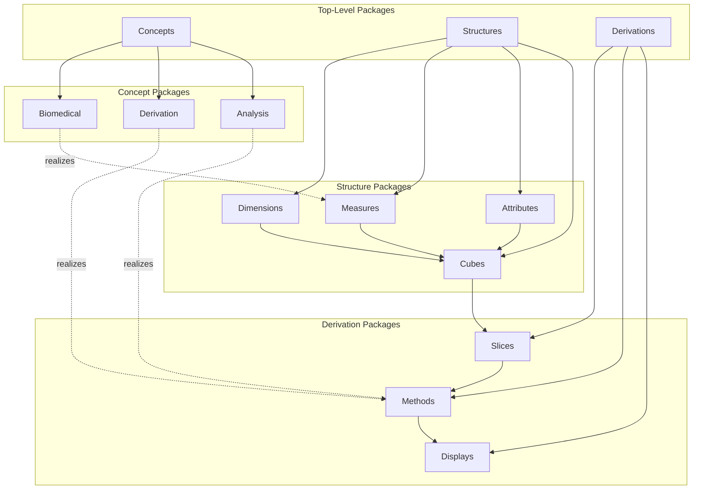
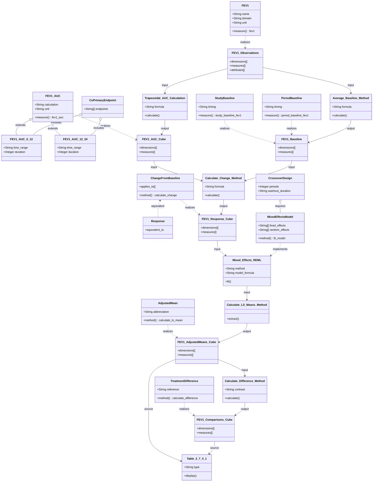

# AC/DC Model: FEV1 AUC Analysis in Crossover Trial

This model describes a randomized, double-blinded, placebo-controlled, 4-way crossover design study analyzing forced expiratory volume in one second (FEV1) from pulmonary function testing. The co-primary efficacy endpoints are FEV1 AUC(0-12) and AUC(12-24) responses after 6 weeks of treatment. The analysis uses a mixed effects repeated measures model to compare treatments (Drug A, Drug B, Drug C) against Placebo. The source document is `examples/SAP/SAP_ex07_FEV1.md` (ADaM Example 7, page 34).

## Structure

```yaml
model:
  concepts:
    biomedical:
      - FEV1:
          name: "Forced Expiratory Volume in one second"
          domain: "Pulmonary Function Testing"
          description: "Volume of air forcibly exhaled in one second"
          unit: "liters"
          standard: "CDISC SDTM"
      - PulmonaryFunctionTest:
          name: "Pulmonary Function Testing"
          abbreviation: "PFT"
          description: "Set of tests measuring lung function"
      - StudyBaseline:
          name: "Study Baseline"
          description: "Average of two FEV1 measurements (-1 hour and -10 min) prior to treatment at Visit 2"
          timing: "Visit 2, pre-dose"
      - PeriodBaseline:
          name: "Period Baseline"
          description: "Average of two FEV1 measurements (-1 hour and -10 min) at each treatment period"
          timing: "Each period start (Visits 2, 5, 8, 11)"

    derivation:
      - FEV1_AUC:
          name: "FEV1 Area Under Curve"
          description: "Area under the FEV1 curve normalized for time"
          calculation: "Trapezoidal rule divided by duration"
          unit: "liters"
      - FEV1_AUC_0_12:
          name: "FEV1 AUC 0-12 hours"
          parent: "FEV1_AUC"
          time_range: "0 to 12 hours"
          duration: "12 hours"
      - FEV1_AUC_12_24:
          name: "FEV1 AUC 12-24 hours"
          parent: "FEV1_AUC"
          time_range: "12 to 24 hours"
          duration: "12 hours"
      - ChangeFromBaseline:
          name: "Change from Baseline"
          description: "Post-baseline value minus baseline value"
          applies_to: ["FEV1", "FEV1_AUC"]
      - Response:
          name: "Response"
          description: "Change from baseline (synonym in this study)"
          equivalent_to: "ChangeFromBaseline"
      - AdjustedMean:
          name: "Adjusted Mean"
          description: "Least squares mean from mixed effects model"
          abbreviation: "LS Mean"
      - StandardError:
          name: "Standard Error"
          abbreviation: "SE"
          description: "Standard error of the adjusted mean"
      - TreatmentDifference:
          name: "Treatment Difference"
          description: "Difference between treatment and placebo adjusted means"
          reference: "Placebo"
      - ConfidenceInterval:
          name: "95% Confidence Interval"
          abbreviation: "95% C.I."
          confidence_level: 0.95
          description: "Confidence interval for treatment difference"
      - PValue:
          name: "p-value"
          description: "Statistical significance of treatment comparison"
      - RelativeStudyDay:
          name: "Relative Study Day"
          description: "Days relative to study start (Visit 2)"
          calculation: "Visit date - Visit 2 date + 1"
      - RelativePeriodDay:
          name: "Relative Period Day"
          description: "Days relative to period start"
          calculation: "Visit date - Period start date + 1"
      - TrapezoidalRule:
          name: "Trapezoidal Rule"
          description: "Numerical integration method for calculating AUC"
          formula: "sum of (t[i+1] - t[i]) * (y[i+1] + y[i]) / 2"

    analysis:
      - EfficacyEndpoint:
          name: "Efficacy Endpoint"
          description: "Primary measure of treatment effect"
      - CoPrimaryEndpoint:
          name: "Co-Primary Efficacy Endpoint"
          parent: "EfficacyEndpoint"
          description: "Multiple primary endpoints of equal importance"
          endpoints: ["FEV1_AUC_0_12_Response", "FEV1_AUC_12_24_Response"]
      - AnalysisPopulation:
          name: "Full Analysis Set"
          abbreviation: "FAS"
          description: "Population for efficacy analysis"
          principle: "Intention to treat"
      - RepeatedMeasuresAnalysis:
          name: "Repeated Measures Analysis"
          description: "Analysis accounting for within-subject correlation"
      - MixedEffectsModel:
          name: "Mixed Effects Model"
          parent: "RepeatedMeasuresAnalysis"
          description: "Model with fixed and random effects"
          fixed_effects: ["site", "treatment", "period"]
          random_effects: ["subject within site"]
      - CrossoverDesign:
          name: "Crossover Design"
          description: "Each subject receives multiple treatments in sequence"
          periods: 4
          washout_duration: "14 days"
      - TreatmentComparison:
          name: "Treatment Comparison"
          description: "Comparison of active treatments to placebo"
          reference_treatment: "Placebo"
          comparators: ["Drug A", "Drug B", "Drug C"]
      - WashoutPeriod:
          name: "Washout Period"
          description: "Time between treatment periods to eliminate carryover effects"
          duration: "14 days"
          count: 3

  structures:
    dimensions:
      - treatment:
          name: "Treatment"
          description: "Randomized treatment assignment"
          type: "categorical"
          values: ["Placebo", "Drug A", "Drug B", "Drug C"]
          role: "Fixed effect"
      - time_interval:
          name: "Time Interval"
          description: "Time window for AUC calculation"
          type: "categorical"
          values: ["0-12 hr", "12-24 hr"]
      - visit:
          name: "Visit"
          description: "Study visit number"
          type: "ordinal"
          values: [2, 4, 5, 7, 8, 10, 11, 13]
      - period:
          name: "Period"
          description: "Treatment period in crossover design"
          type: "ordinal"
          values: [1, 2, 3, 4]
          mapping:
            1: ["Visit 2", "Visit 4"]
            2: ["Visit 5", "Visit 7"]
            3: ["Visit 8", "Visit 10"]
            4: ["Visit 11", "Visit 13"]
      - subject:
          name: "Subject"
          description: "Study subject identifier"
          type: "identifier"
          role: "Random effect"
      - site:
          name: "Site"
          description: "Study site identifier"
          type: "identifier"
          role: "Fixed effect"
      - timepoint:
          name: "Timepoint"
          description: "Time of measurement relative to dose"
          type: "continuous"
          range: "-1 hour to 23:50"
          unit: "hours"
      - planned_study_day:
          name: "Planned Study Day"
          description: "Planned day of visit in study schedule"
          type: "ordinal"
      - relative_study_day:
          name: "Relative Study Day"
          description: "Calculated day relative to study start"
          type: "integer"
          calculation: "Date difference from Visit 2 + 1"
      - relative_period_day:
          name: "Relative Period Day"
          description: "Calculated day relative to period start"
          type: "integer"
          calculation: "Date difference from period start + 1"
      - baseline_type:
          name: "Baseline Type"
          description: "Type of baseline calculation"
          type: "categorical"
          values: ["Study", "Period"]

    measures:
      - fev1:
          name: "FEV1"
          description: "Forced expiratory volume in one second"
          unit: "liters"
          type: "continuous"
          scale: "ratio"
      - fev1_auc_0_12:
          name: "FEV1 AUC(0-12)"
          description: "FEV1 AUC from 0 to 12 hours"
          unit: "liters"
          type: "continuous"
          calculation: "Trapezoidal AUC / 12"
      - fev1_auc_12_24:
          name: "FEV1 AUC(12-24)"
          description: "FEV1 AUC from 12 to 24 hours"
          unit: "liters"
          type: "continuous"
          calculation: "Trapezoidal AUC / 12"
      - study_baseline_fev1:
          name: "Study Baseline FEV1"
          description: "Average of -1hr and -10min FEV1 at Visit 2"
          unit: "liters"
          type: "continuous"
      - period_baseline_fev1:
          name: "Period Baseline FEV1"
          description: "Average of -1hr and -10min FEV1 at period start"
          unit: "liters"
          type: "continuous"
      - change_from_baseline:
          name: "Change from Baseline"
          description: "Post-baseline value minus baseline"
          unit: "liters"
          type: "continuous"
      - adjusted_mean:
          name: "Adjusted Mean"
          description: "LS mean from mixed effects model"
          unit: "liters"
          type: "continuous"
      - standard_error:
          name: "Standard Error"
          description: "SE of adjusted mean"
          unit: "liters"
          type: "continuous"
      - treatment_difference:
          name: "Treatment Difference"
          description: "Difference vs placebo"
          unit: "liters"
          type: "continuous"
      - difference_se:
          name: "Difference Standard Error"
          description: "SE of treatment difference"
          unit: "liters"
          type: "continuous"
      - ci_lower:
          name: "95% CI Lower Bound"
          description: "Lower bound of 95% confidence interval"
          unit: "liters"
          type: "continuous"
      - ci_upper:
          name: "95% CI Upper Bound"
          description: "Upper bound of 95% confidence interval"
          unit: "liters"
          type: "continuous"
      - p_value:
          name: "p-value"
          description: "Statistical significance"
          type: "continuous"
          range: [0, 1]
      - n:
          name: "Sample Size"
          description: "Number of subjects"
          type: "count"

    attributes:
      - unit:
          name: "Unit"
          description: "Unit of measurement"
          values: ["liters", "hours", "days"]
      - population:
          name: "Analysis Population"
          values: ["FAS"]
          description: "Full Analysis Set population"
      - washout_indicator:
          name: "Washout Period Indicator"
          type: "boolean"
          description: "Indicates if visit is during washout"
      - baseline_timepoint:
          name: "Baseline Timepoint"
          values: ["-1 hour", "-10 minutes"]
          description: "Time points used for baseline calculation"
      - model_specification:
          name: "Model Specification"
          terms:
            fixed: ["site", "treatment", "period"]
            random: ["subject within site"]
          description: "Mixed effects model terms"
      - dose_timing:
          name: "Dose Timing"
          values: ["pre-dose", "post-dose"]
          description: "Measurement timing relative to dose"
      - treatment_duration:
          name: "Treatment Duration"
          value: "6 weeks"
          description: "Duration of treatment period"

    cubes:
      - FEV1_Observations:
          name: "FEV1 Observations"
          description: "Raw FEV1 measurements over time"
          dimensions: ["subject", "site", "treatment", "period", "visit", "timepoint"]
          measures: ["fev1"]
          attributes: ["unit", "population", "dose_timing"]

      - FEV1_Baseline:
          name: "FEV1 Baseline Values"
          description: "Baseline FEV1 calculations"
          dimensions: ["subject", "site", "baseline_type", "period"]
          measures: ["study_baseline_fev1", "period_baseline_fev1"]
          attributes: ["unit", "baseline_timepoint"]

      - FEV1_AUC:
          name: "FEV1 AUC Values"
          description: "Calculated AUC values for time intervals"
          dimensions: ["subject", "site", "treatment", "period", "visit", "time_interval"]
          measures: ["fev1_auc_0_12", "fev1_auc_12_24"]
          attributes: ["unit", "population"]

      - FEV1_Response:
          name: "FEV1 AUC Response"
          description: "Change from baseline in FEV1 AUC"
          dimensions: ["subject", "site", "treatment", "period", "time_interval", "baseline_type"]
          measures: ["change_from_baseline"]
          attributes: ["unit", "population"]

      - FEV1_AdjustedMeans:
          name: "FEV1 Adjusted Means"
          description: "Model-based adjusted means and SE"
          dimensions: ["treatment", "time_interval"]
          measures: ["adjusted_mean", "standard_error", "n"]
          attributes: ["unit", "population", "model_specification"]

      - FEV1_Comparisons:
          name: "Treatment Comparisons vs Placebo"
          description: "Treatment differences, CI, and p-values"
          dimensions: ["treatment", "time_interval"]
          measures: ["treatment_difference", "difference_se", "ci_lower", "ci_upper", "p_value"]
          attributes: ["unit", "population", "model_specification"]

      - Visit_Schedule:
          name: "Visit Schedule"
          description: "Study visit timing and period mapping"
          dimensions: ["visit", "period"]
          measures: ["planned_study_day", "relative_study_day", "relative_period_day"]
          attributes: ["washout_indicator"]

  derivations:
    slices:
      - FEV1_AUC_0_12_Slice:
          name: "FEV1 AUC 0-12 hours"
          source_cube: "FEV1_AUC"
          filter:
            time_interval: "0-12 hr"
          description: "AUC for first 12-hour interval"

      - FEV1_AUC_12_24_Slice:
          name: "FEV1 AUC 12-24 hours"
          source_cube: "FEV1_AUC"
          filter:
            time_interval: "12-24 hr"
          description: "AUC for second 12-hour interval"

      - Study_Baseline_Slice:
          name: "Study Baseline"
          source_cube: "FEV1_Observations"
          filter:
            visit: 2
            timepoint: ["-1 hour", "-10 minutes"]
          description: "FEV1 measurements for study baseline"

      - Period_Baseline_Slice:
          name: "Period Baseline"
          source_cube: "FEV1_Observations"
          filter:
            visit: [2, 5, 8, 11]
            timepoint: ["-1 hour", "-10 minutes"]
          description: "FEV1 measurements for period baselines"

      - FAS_Population_Slice:
          name: "Full Analysis Set"
          source_cube: "FEV1_Observations"
          filter:
            population: "FAS"
          description: "Subjects in full analysis set"

      - Active_Treatment_Slice:
          name: "Active Treatments"
          source_cube: "FEV1_Comparisons"
          filter:
            treatment: ["Drug A", "Drug B", "Drug C"]
          description: "Exclude placebo from comparisons"

      - Post_Baseline_Slice:
          name: "Post-Baseline Measurements"
          source_cube: "FEV1_Observations"
          filter:
            dose_timing: "post-dose"
          description: "Measurements after baseline"

    methods:
      - Trapezoidal_AUC_Calculation:
          name: "Trapezoidal AUC"
          description: "Calculate AUC using trapezoidal rule"
          input: "FEV1_Observations"
          output: "FEV1_AUC"
          formula: "sum((t[i+1] - t[i]) * (fev1[i+1] + fev1[i]) / 2)"
          parameters:
            time_range: ["0-12 hr", "12-24 hr"]

      - Normalize_AUC:
          name: "Normalize AUC by Duration"
          description: "Divide AUC by time duration"
          input: "Raw AUC"
          output: "Normalized AUC"
          formula: "AUC / duration"
          parameters:
            duration: 12  # hours

      - Average_Baseline:
          name: "Calculate Baseline Average"
          description: "Average of two baseline measurements"
          input: "Study_Baseline_Slice or Period_Baseline_Slice"
          output: "FEV1_Baseline"
          formula: "mean(fev1[-1hr], fev1[-10min])"

      - Calculate_Change_From_Baseline:
          name: "Change from Baseline"
          description: "Subtract baseline from post-baseline value"
          input: ["FEV1_AUC", "FEV1_Baseline"]
          output: "FEV1_Response"
          formula: "fev1_auc - baseline_fev1"

      - Mixed_Effects_REML:
          name: "Mixed Effects Model"
          description: "Fit repeated measures mixed model"
          input: "FEV1_Response"
          output: "FEV1_AdjustedMeans"
          method: "REML"
          model_formula: "response ~ site + treatment + period + (1|subject:site)"
          estimation: "Restricted Maximum Likelihood"

      - Calculate_LS_Means:
          name: "Least Squares Means"
          description: "Extract adjusted means from model"
          input: "Mixed_Effects_REML"
          output: "adjusted_mean, standard_error"
          by: ["treatment", "time_interval"]

      - Calculate_Treatment_Difference:
          name: "Treatment vs Placebo Difference"
          description: "Calculate difference from placebo"
          input: "FEV1_AdjustedMeans"
          output: "FEV1_Comparisons"
          formula: "mean[treatment] - mean[placebo]"
          contrast: "Each treatment vs Placebo"

      - Calculate_Confidence_Interval:
          name: "95% Confidence Interval"
          description: "Calculate CI for treatment difference"
          input: "FEV1_Comparisons"
          output: "ci_lower, ci_upper"
          formula: "difference ± t(0.975, df) * SE"
          confidence_level: 0.95

      - Calculate_P_Value:
          name: "Calculate p-value"
          description: "Test significance of treatment difference"
          input: "FEV1_Comparisons"
          output: "p_value"
          test: "t-test"
          hypothesis: "H0: difference = 0"

      - Calculate_Relative_Study_Day:
          name: "Relative Study Day Calculation"
          description: "Days from study start"
          input: "Visit_Schedule"
          output: "relative_study_day"
          formula: "visit_date - visit2_date + 1"

      - Calculate_Relative_Period_Day:
          name: "Relative Period Day Calculation"
          description: "Days from period start"
          input: "Visit_Schedule"
          output: "relative_period_day"
          formula: "visit_date - period_start_date + 1"

    displays:
      - Table_2_7_1:
          name: "Table 2.7.1: Visit Schedule and Baseline Derivations"
          description: "Trial diagram showing visit schedule and baseline calculations"
          type: "table"
          source_cube: "Visit_Schedule"
          dimensions: ["visit", "period"]
          measures: ["planned_study_day", "relative_study_day", "relative_period_day"]
          layout:
            rows: ["visit"]
            columns: ["baseline_type", "measure"]
          formatting:
            title: "Table 2.7.1 Trial Diagram of Visit Schedule and Baseline Derivations"
            column_headers: ["Visit", "Period", "Planned study day", "Calculation of relative study day", "Planned study day", "Calculation of relative study day"]
            notes: ["Baseline relative to study start", "Baseline relative to period start", "14 Day Washout periods indicated"]

      - Table_2_7_4_1:
          name: "Summary E.7: FEV1 AUC Adjusted Means and Comparisons"
          description: "Adjusted mean responses and comparisons to placebo"
          type: "table"
          source_cubes: ["FEV1_AdjustedMeans", "FEV1_Comparisons"]
          dimensions: ["time_interval", "treatment"]
          measures: ["n", "adjusted_mean", "standard_error", "treatment_difference", "difference_se", "p_value", "ci_lower", "ci_upper"]
          layout:
            rows: ["time_interval", "treatment"]
            columns: ["statistic"]
          formatting:
            title: "Summary E.7"
            subtitle: "FEV1 AUC(0-12) and AUC(12-24) Adjusted Mean (SE) Responses and Comparisons to Placebo After 6 weeks Treatment"
            subtitle2: "(FAS Population, Repeated Measures Analysis)"
            column_headers:
              - "Time Interval"
              - "Treatment"
              - "N"
              - "Treatment Mean (SE)"
              - "Difference Mean (SE)"
              - "p-value"
              - "95% C.I."
            number_format:
              n: "xxx"
              adjusted_mean: "x.xxx"
              standard_error: "(x.xxx)"
              treatment_difference: "x.xxx"
              difference_se: "(x.xxx)"
              p_value: "x.xxxx"
              ci: "(x.xxx,x.xxx)"
            footnotes:
              - "N= FAS (full analysis set) population"
              - "Based on a mixed effects repeated measures model with terms for site, subject within site, treatment and period"
              - "Response is defined as change from baseline; Common Baseline Mean (SE) = x.xxx (x.xxx)"
            treatment_order: ["Placebo", "Drug A", "Drug B", "Drug C"]
            time_interval_order: ["0-12 hr", "12-24 hr"]
```

## Dependency Diagram

The model demonstrates clear end-to-end dependency linkage from output displays back to source concepts:

**Display → Derivations → Structure → Concepts:**

1. **Table 2.7.4.1 (Summary E.7)** depends on:
   - FEV1_Comparisons cube (treatment differences, CI, p-values)
   - FEV1_AdjustedMeans cube (LS means and SE)

2. **FEV1_Comparisons** is derived from:
   - Calculate_Treatment_Difference method
   - Calculate_Confidence_Interval method
   - Calculate_P_Value method
   - Which operate on FEV1_AdjustedMeans

3. **FEV1_AdjustedMeans** is derived from:
   - Mixed_Effects_REML method
   - Calculate_LS_Means method
   - Which operate on FEV1_Response cube

4. **FEV1_Response** is derived from:
   - Calculate_Change_From_Baseline method
   - Which operates on FEV1_AUC and FEV1_Baseline cubes

5. **FEV1_AUC** is derived from:
   - Trapezoidal_AUC_Calculation method
   - Normalize_AUC method
   - Which operate on FEV1_Observations cube (sliced by time intervals)

6. **FEV1_Baseline** is derived from:
   - Average_Baseline method
   - Which operates on Study_Baseline_Slice or Period_Baseline_Slice
   - Which are slices of FEV1_Observations cube

7. **FEV1_Observations** is the primary structure cube with dimensions:
   - subject, site, treatment, period, visit, timepoint
   - And measure: fev1

8. **fev1 measure** represents the biomedical concept **FEV1**:
   - Forced Expiratory Volume in one second
   - From Pulmonary Function Testing domain

**Key Dependencies:**
- Co-primary endpoints (FEV1_AUC_0_12, FEV1_AUC_12_24) → Analysis concept
- Response → Derivation concept (Change from Baseline)
- Adjusted means → Analysis concept (Mixed Effects Model)
- FEV1 measurements → Biomedical concept (Pulmonary function)
- Baseline calculations → Biomedical concept (Study/Period Baseline)
- Crossover design → Analysis concept (4-period crossover with washout)

## Model Structure





## Definitions

### Biomedical Concepts

- **FEV1 (Forced Expiratory Volume in one second)**: Volume of air that can be forcibly exhaled in one second, measured in liters. A key pulmonary function test measurement.

- **Pulmonary Function Testing (PFT)**: Set of diagnostic tests that measure lung function, capacity, and efficiency.

- **Study Baseline**: The average of two FEV1 measurements (-1 hour and -10 minutes pre-dose) taken at Visit 2, prior to any treatment administration. Used as reference for entire study.

- **Period Baseline**: The average of two FEV1 measurements (-1 hour and -10 minutes pre-dose) taken at the start of each treatment period (Visits 2, 5, 8, 11). Allows sensitivity analysis accounting for inter-period variation.

### Derivation Concepts

- **FEV1 AUC (Area Under Curve)**: The area under the FEV1-time curve, calculated using the trapezoidal rule and normalized by dividing by the time duration. Provides a summary measure of FEV1 over a time interval.

- **FEV1 AUC(0-12)**: FEV1 AUC from 0 to 12 hours post-dose. Co-primary efficacy endpoint.

- **FEV1 AUC(12-24)**: FEV1 AUC from 12 to 24 hours post-dose. Co-primary efficacy endpoint.

- **Trapezoidal Rule**: Numerical integration method that approximates the area under a curve by dividing it into trapezoids. Formula: sum of (t[i+1] - t[i]) × (y[i+1] + y[i]) / 2.

- **Change from Baseline**: Post-baseline value minus baseline value. Synonymous with "Response" in this study.

- **Adjusted Mean**: Least squares mean (LS mean) estimated from the mixed effects model, adjusted for covariates and random effects.

- **Standard Error (SE)**: Standard error of the adjusted mean, reflecting uncertainty in the estimate.

- **Treatment Difference**: The difference between an active treatment's adjusted mean and placebo's adjusted mean.

- **95% Confidence Interval**: Range of values that contains the true treatment difference with 95% confidence, calculated as difference ± t(0.975, df) × SE.

- **p-value**: Probability of observing the data (or more extreme) under the null hypothesis of no treatment difference.

- **Relative Study Day**: Number of days from the study start (Visit 2 date), calculated as: Visit date - Visit 2 date + 1.

- **Relative Period Day**: Number of days from the period start, calculated as: Visit date - Period start date + 1.

### Analysis Concepts

- **Efficacy Endpoint**: Primary measure used to evaluate treatment effectiveness.

- **Co-Primary Efficacy Endpoint**: Multiple primary endpoints of equal importance. In this study: FEV1 AUC(0-12) response and FEV1 AUC(12-24) response.

- **Full Analysis Set (FAS)**: Population for efficacy analysis based on intention-to-treat principle. Includes all randomized subjects who received at least one dose.

- **Repeated Measures Analysis**: Statistical analysis method that accounts for within-subject correlation when the same subject is measured multiple times.

- **Mixed Effects Model**: Statistical model containing both fixed effects (site, treatment, period) and random effects (subject within site). Accounts for correlation structure in repeated measures and crossover data.

- **Crossover Design**: Study design where each subject receives multiple treatments in sequence, separated by washout periods. This study has 4 periods with 3 washout periods.

- **Washout Period**: 14-day period between treatment periods to eliminate carryover effects from previous treatment.

- **Treatment Comparison**: Statistical comparison of active treatments (Drug A, Drug B, Drug C) versus reference treatment (Placebo).

### Structure Definitions

- **Dimension**: Data component that identifies observations. Unique combinations of dimension values define distinct observations. Examples: treatment, time_interval, subject, period, visit.

- **Measure**: Data component containing observed or calculated quantitative values. Examples: fev1, fev1_auc_0_12, adjusted_mean, p_value.

- **Attribute**: Data component that qualifies and interprets observations without identifying them. Examples: unit (liters), population (FAS), model_specification.

- **Cube**: Collection of observations (measures) organized by dimensions and qualified by attributes. Examples: FEV1_Observations, FEV1_AUC, FEV1_Comparisons.

### Derivation Definitions

- **Slice**: Subset of a cube created by fixing one or more dimension values. Example: FEV1_AUC_0_12_Slice (time_interval = "0-12 hr").

- **Method**: Statistical or mathematical computation that transforms input cubes/slices into output cubes/slices. Examples: Trapezoidal_AUC_Calculation, Mixed_Effects_REML, Calculate_LS_Means.

- **Display**: Visual representation of results as tables, figures, or listings, including formatting specifications (titles, footnotes, number formats). Examples: Table 2.7.1, Table 2.7.4.1 (Summary E.7).

## Issues

### Open Questions

1. **Baseline Selection**: The SAP defines both study baseline and period baseline. The display footnote mentions "Common Baseline Mean" but doesn't specify which baseline type is used in the primary analysis. Clarification needed on:
   - Which baseline is primary for the main analysis?
   - Are sensitivity analyses using alternative baselines planned?
   - How is the "common baseline" calculated across periods?

2. **Missing Sample Size Details**: Table 2.7.4.1 shows N by treatment, but details are unclear:
   - Is N the same for all treatments (as expected in crossover)?
   - How are missing data handled in the crossover analysis?
   - Are subjects counted if they complete only some periods?

3. **Statistical Testing Strategy**: Not fully specified in the excerpt:
   - Multiple comparison adjustment for co-primary endpoints?
   - Type I error control strategy given two co-primary endpoints?
   - Are comparisons tested separately for each time interval?

4. **Model Specification Details**: Additional details needed:
   - Covariance structure for repeated measures?
   - Estimation method for degrees of freedom (Kenward-Roger, Satterthwaite)?
   - Handling of carryover effects beyond washout?
   - Site effect: fixed or random?

5. **Post-Dose Time Points**: SAP states "FEV1 measurements are collected from 1 hour pre-dose to 23 hours 50 minutes post-dose" but doesn't specify:
   - Exact time points for PFT assessments?
   - Number of measurements in each 12-hour interval?
   - How missing time points affect AUC calculation?

6. **Period Baseline Calculation**: For periods 2-4, baseline is at period start, but:
   - Are these measurements before or after the washout period?
   - Is there potential carryover effect on period baselines?
   - How is this addressed in the model?

7. **Normalization Method**: AUC is "normalized for time" by dividing by 12 hours:
   - What if measurements don't cover the full interval?
   - Are partial AUCs excluded or imputed?
   - Does normalization affect the variance structure?

8. **Display Specifications**:
   - The exact format for presenting Mean (SE) in single column needs clarification
   - Should difference CI be in separate columns or combined as "(lower, upper)"?
   - Treatment ordering: alphabetical vs effect size vs protocol-specified?

9. **Traceability**: Need to establish clear mapping between:
   - ADaM datasets and cubes in this model
   - SDTM domains and FEV1_Observations cube
   - ADaM variables and measures/dimensions

10. **CDISC Standards Alignment**:
    - Which ADaM structure (BDS, ADSL, other)?
    - Variable naming conventions (PARAMCD, AVAL, BASE, CHG)?
    - Required CDISC metadata and controlled terminology?

### Implementation Notes

1. **Model Extensibility**: This model focuses on the co-primary FEV1 AUC endpoints. Additional secondary endpoints or safety analyses would extend the structure packages and derivation methods.

2. **Baseline Sensitivity**: The dual baseline definition (study vs period) suggests importance of sensitivity analyses. The model supports both through the baseline_type dimension.

3. **Crossover Complexity**: The 4-period crossover with washout periods requires careful attention to:
   - Period effects in the model
   - Sequence/carry-over effects
   - Within-subject correlation structure

4. **Integration Points**: This model should integrate with:
   - SDTM domains (LB for labs if applicable, EX for exposure, VS for FEV1)
   - ADaM datasets (ADEFF for efficacy)
   - Analysis-ready datasets feeding the mixed effects model
   - TLF production systems

5. **Validation Requirements**: Critical validation points:
   - Trapezoidal AUC calculation accuracy
   - Baseline averaging and assignment
   - Change from baseline calculation
   - Model convergence and assumptions
   - LS means extraction and contrasts
   - Confidence interval calculations
