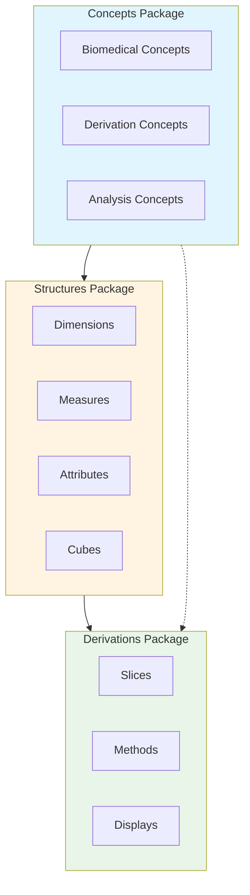
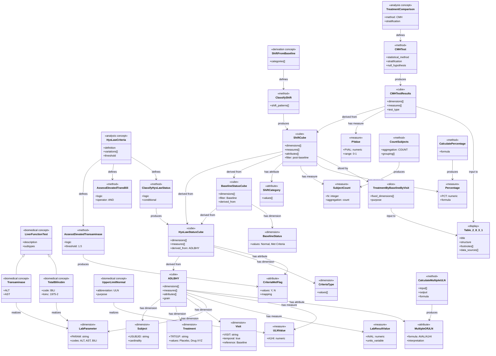

# AC/DC Model: Hy's Law Safety Analysis

This model represents a safety analysis of laboratory data based on Hy's Law criteria for drug-induced liver injury (DILI), as described in `examples/SAP/SAP_ex08-HysLaw.md`. The analysis evaluates liver function parameters (transaminase and bilirubin) to assess whether subjects meet modified Hy's Law criteria during treatment. The analysis includes shift tables showing changes from baseline status and Cochran-Mantel-Haenszel (CMH) tests comparing treatment groups, stratified by baseline status.

## AC/DC Model Structure

```yaml
model:
  name: HysLaw_Safety_Analysis
  version: 1.0
  source: SAP_ex08-HysLaw.md

  concepts:
    biomedical:
      - liver_function_test:
          description: "Laboratory tests that measure liver function"
          subtypes:
            - transaminase:
                description: "Enzymes indicating liver cell damage"
                subtypes:
                  - alt:
                      name: "Alanine Transaminase"
                      code: "ALT"
                      loinc: "1742-6"
                  - ast:
                      name: "Aspartate Transaminase"
                      code: "AST"
                      loinc: "1920-8"
            - bilirubin:
                description: "Marker of liver function and bile excretion"
                subtypes:
                  - total_bilirubin:
                      name: "Total Bilirubin"
                      code: "BILI"
                      loinc: "1975-2"

      - upper_limit_normal:
          description: "Reference value representing the upper boundary of normal range"
          abbreviation: "ULN"
          purpose: "Threshold for determining abnormal elevations"

      - drug_induced_liver_injury:
          description: "Liver damage caused by medications"
          abbreviation: "DILI"
          assessment_framework: "Hy's Law"

      - laboratory_value:
          description: "Quantitative result from laboratory test"
          properties:
            - numeric_result
            - units
            - collection_timepoint

    derivation:
      - elevation:
          description: "Laboratory value exceeding normal range"
          computation: "Value compared to ULN"
          threshold_basis: "Multiple of ULN"

      - multiple_of_uln:
          description: "Ratio of laboratory value to upper limit of normal"
          formula: "Lab_Value / ULN_Value"
          interpretation: "Degree of abnormality"

      - shift_from_baseline:
          description: "Change in status category from baseline to post-baseline"
          categories:
            - normal_to_normal: "Remained normal"
            - normal_to_met_criteria: "Shifted from normal to meeting criteria"
            - met_criteria_to_normal: "Shifted from meeting criteria to normal"
            - met_criteria_to_met_criteria: "Continued to meet criteria"

      - criteria_met_status:
          description: "Boolean/categorical outcome indicating whether subject meets defined criteria"
          values: ["Normal", "Met Criteria"]

    analysis:
      - hys_law_criteria:
          description: "Criteria for identifying potential drug-induced liver injury"
          purpose: "Safety assessment of hepatotoxicity"
          reference: "Hy Zimmerman's observations"
          variations:
            - modified_hys_law_v1:
                name: "Elevated Transaminase"
                definition: "Transaminase (ALT or AST) > 1.5 × ULN"
                threshold:
                  parameter: ["ALT", "AST"]
                  operator: ">"
                  value: 1.5
                  unit: "× ULN"
            - modified_hys_law_v2:
                name: "Elevated Transaminase and Elevated Bilirubin"
                definition: "Transaminase (ALT or AST) > 1.5 × ULN AND Total Bilirubin > 1.5 × ULN"
                threshold:
                  transaminase:
                    parameter: ["ALT", "AST"]
                    operator: ">"
                    value: 1.5
                    unit: "× ULN"
                  bilirubin:
                    parameter: "BILI"
                    operator: ">"
                    value: 1.5
                    unit: "× ULN"
                logic: "AND"

      - shift_analysis:
          description: "Analysis of changes in categorical status from baseline"
          stratification: "By baseline status"
          purpose: "Assess emergence or resolution of abnormalities"

      - treatment_comparison:
          description: "Statistical comparison between treatment groups"
          method: "CMH test"
          stratification: "Baseline Hy's Law status"

      - safety_analysis:
          description: "Analysis focused on adverse safety signals"
          domain: "Laboratory safety"
          population: "Safety Population"

  structures:
    dimension:
      - subject:
          description: "Individual participant in clinical trial"
          key: "USUBJID"
          cardinality: "multiple"
          role: "Observation unit"

      - treatment:
          description: "Assigned intervention"
          key: "TRT01P"
          values: ["Placebo", "Drug XYZ"]
          role: "Primary comparison factor"

      - visit:
          description: "Scheduled clinical assessment timepoint"
          key: "VISIT"
          values: ["Baseline", "Week 2", "Week 4", "Week 8", "etc."]
          temporal: true
          ordering: "chronological"
          reference_timepoint: "Baseline"

      - lab_parameter:
          description: "Type of laboratory test performed"
          key: "PARAM"
          values: ["Alanine Transaminase", "Aspartate Transaminase", "Total Bilirubin"]
          codes: ["ALT", "AST", "BILI"]
          standard: "CDISC LBTESTCD"

      - criteria_type:
          description: "Variant of Hy's Law criteria being evaluated"
          key: "CRIT1FL"
          values:
            - "Elevated Transaminase"
            - "Elevated Transaminase and Elevated Bilirubin"
          role: "Analysis stratification"

      - baseline_status:
          description: "Subject's Hy's Law criteria status at baseline"
          key: "BASEC"
          values: ["Normal at Baseline", "Met Criteria at Baseline"]
          role: "CMH stratification factor"

      - analysis_population:
          description: "Set of subjects included in analysis"
          key: "SAFFL"
          values: ["Safety Population"]
          inclusion_criteria: "All subjects who received at least one dose"

    measure:
      - lab_result_value:
          description: "Numeric laboratory test result"
          variable: "AVAL"
          data_type: "numeric"
          units_variable: "AVALU"
          range: "positive real numbers"

      - uln_value:
          description: "Upper limit of normal for laboratory parameter"
          variable: "A1HI"
          data_type: "numeric"
          purpose: "Reference threshold"

      - subject_count:
          description: "Number of subjects in category"
          variable: "N"
          data_type: "integer"
          aggregation: "count"

      - percentage:
          description: "Proportion of subjects in category"
          variable: "PCT"
          data_type: "numeric"
          formula: "(n / N) × 100"
          format: "x.x%"

      - p_value:
          description: "Statistical test significance level"
          variable: "PVAL"
          data_type: "numeric"
          range: "[0, 1]"
          format: "x.xxx"
          interpretation: "Probability under null hypothesis"

    attribute:
      - units:
          description: "Unit of measurement for laboratory value"
          variable: "AVALU"
          values: ["U/L", "mg/dL", "μmol/L"]
          role: "Qualifies measure interpretation"

      - multiple_of_uln:
          description: "Laboratory value expressed as multiple of ULN"
          variable: "R2A1HI"
          formula: "AVAL / A1HI"
          data_type: "numeric"
          interpretation: "Fold change above normal"

      - shift_category:
          description: "Classification of change from baseline"
          values:
            - "Normal"
            - "Met Criteria"
          derived_from: "criteria_met_status"

      - criteria_met_flag:
          description: "Indicator of whether Hy's Law criteria are met"
          variable: "CRIT1FL"
          values: ["Y", "N"]
          mapping:
            "Y": "Met Criteria"
            "N": "Normal"

      - baseline_flag:
          description: "Indicator of baseline visit"
          variable: "ABLFL"
          values: ["Y", ""]
          purpose: "Identify reference timepoint"

      - same_sample_flag:
          description: "Indicator that lab values are from same blood sample"
          purpose: "Ensure temporal alignment for Hy's Law assessment"
          requirement: "Values must be from same blood draw"

    cube:
      - adlbhy:
          description: "Analysis dataset for laboratory Hy's Law analysis"
          base_domain: "ADLB"
          dimensions:
            - subject
            - treatment
            - visit
            - lab_parameter
            - analysis_population
          measures:
            - lab_result_value
            - uln_value
          attributes:
            - units
            - multiple_of_uln
            - baseline_flag
            - same_sample_flag
          grain: "One record per subject per visit per lab parameter"
          source: "ADLBHY dataset"

      - hys_law_status_cube:
          description: "Hy's Law criteria assessment by subject and visit"
          dimensions:
            - subject
            - treatment
            - visit
            - criteria_type
            - analysis_population
          measures:
            - subject_count
          attributes:
            - criteria_met_flag
          derived_from: "adlbhy"
          grain: "One record per subject per visit per criteria type"

      - baseline_status_cube:
          description: "Baseline Hy's Law status for each subject"
          dimensions:
            - subject
            - treatment
            - criteria_type
            - baseline_status
            - analysis_population
          measures:
            - subject_count
          derived_from: "hys_law_status_cube"
          filter: "visit == 'Baseline'"
          grain: "One record per subject per criteria type"

      - shift_cube:
          description: "Shift analysis from baseline to post-baseline"
          dimensions:
            - subject
            - treatment
            - visit
            - criteria_type
            - baseline_status
          measures:
            - subject_count
            - percentage
          attributes:
            - shift_category
          derived_from:
            - hys_law_status_cube
            - baseline_status_cube
          filter: "visit != 'Baseline' AND has_baseline_result == TRUE"
          grain: "One record per subject per post-baseline visit per criteria type"

      - cmh_test_results:
          description: "CMH test results comparing treatments"
          dimensions:
            - visit
            - criteria_type
          measures:
            - p_value
          attributes:
            - test_type: "CMH"
            - stratification_factor: "baseline_status"
            - null_hypothesis: "No association between treatment and shift status"
          derived_from: "shift_cube"
          grain: "One record per visit per criteria type"

  derivations:
    slice:
      - by_treatment:
          description: "Subset of data for specific treatment group"
          fixed_dimension: "treatment"
          values: ["Placebo", "Drug XYZ"]

      - by_visit:
          description: "Subset of data for specific visit"
          fixed_dimension: "visit"
          values: ["Week 2", "Week 4", "Week 8"]
          excludes: "Baseline"

      - by_baseline_status:
          description: "Subset stratified by baseline Hy's Law status"
          fixed_dimension: "baseline_status"
          values: ["Normal at Baseline", "Met Criteria at Baseline"]

      - by_criteria_type:
          description: "Subset for specific Hy's Law criteria variant"
          fixed_dimension: "criteria_type"
          values:
            - "Elevated Transaminase"
            - "Elevated Transaminase and Elevated Bilirubin"

      - treatment_by_baseline_by_visit:
          description: "Multi-dimensional slice for shift table"
          fixed_dimensions:
            - treatment
            - baseline_status
            - visit
          purpose: "Display template for Table 2.8.3.1"

    method:
      - calculate_multiple_uln:
          description: "Compute laboratory value as multiple of ULN"
          input:
            - lab_result_value
            - uln_value
          output: multiple_of_uln
          formula: "multiple_of_uln = lab_result_value / uln_value"
          data_type: "arithmetic"

      - assess_elevated_transaminase:
          description: "Determine if transaminase exceeds threshold"
          input:
            - alt_multiple_of_uln
            - ast_multiple_of_uln
          output: elevated_transaminase_flag
          logic: |
            IF (alt_multiple_of_uln > 1.5 OR ast_multiple_of_uln > 1.5) THEN
              elevated_transaminase_flag = 'Y'
            ELSE
              elevated_transaminase_flag = 'N'
          data_type: "rule-based classification"
          threshold: 1.5

      - assess_elevated_trans_and_bili:
          description: "Determine if both transaminase and bilirubin exceed thresholds"
          input:
            - elevated_transaminase_flag
            - bili_multiple_of_uln
          output: elevated_trans_bili_flag
          logic: |
            IF (elevated_transaminase_flag = 'Y' AND bili_multiple_of_uln > 1.5) THEN
              elevated_trans_bili_flag = 'Y'
            ELSE
              elevated_trans_bili_flag = 'N'
          data_type: "rule-based classification"
          threshold: 1.5
          operator: "AND"

      - classify_hys_law_status:
          description: "Assign Hy's Law criteria met status"
          input:
            - criteria_type
            - elevated_transaminase_flag
            - elevated_trans_bili_flag
          output: criteria_met_flag
          logic: |
            IF criteria_type = 'Elevated Transaminase' THEN
              criteria_met_flag = elevated_transaminase_flag
            ELSE IF criteria_type = 'Elevated Transaminase and Elevated Bilirubin' THEN
              criteria_met_flag = elevated_trans_bili_flag
          data_type: "conditional assignment"

      - classify_shift:
          description: "Determine shift category from baseline to post-baseline"
          input:
            - baseline_criteria_met_flag
            - visit_criteria_met_flag
          output: shift_category
          logic: |
            IF baseline_criteria_met_flag = 'N' AND visit_criteria_met_flag = 'N' THEN
              shift_category = 'Normal'
            ELSE IF baseline_criteria_met_flag = 'N' AND visit_criteria_met_flag = 'Y' THEN
              shift_category = 'Met Criteria'
            ELSE IF baseline_criteria_met_flag = 'Y' AND visit_criteria_met_flag = 'N' THEN
              shift_category = 'Normal'
            ELSE IF baseline_criteria_met_flag = 'Y' AND visit_criteria_met_flag = 'Y' THEN
              shift_category = 'Met Criteria'
          data_type: "categorical derivation"
          shift_patterns:
            - "Normal → Normal"
            - "Normal → Met Criteria"
            - "Met Criteria → Normal"
            - "Met Criteria → Met Criteria"

      - count_subjects:
          description: "Count number of subjects in category"
          input: shift_cube
          output: subject_count
          aggregation: "COUNT(DISTINCT subject)"
          grouping:
            - treatment
            - visit
            - criteria_type
            - baseline_status
            - shift_category
          data_type: "aggregation"

      - calculate_percentage:
          description: "Compute percentage within group"
          input:
            - subject_count (numerator)
            - total_subjects_in_group (denominator)
          output: percentage
          formula: "percentage = (subject_count / total_subjects_in_group) × 100"
          grouping_for_denominator:
            - treatment
            - visit
            - criteria_type
            - baseline_status
          data_type: "arithmetic"

      - cmh_test:
          description: "Cochran-Mantel-Haenszel test for general association"
          input: shift_cube
          output: p_value
          statistical_method: "CMH test"
          comparison: "Placebo vs Drug XYZ"
          stratification: "baseline_status"
          null_hypothesis: "No association between treatment and shift status, controlling for baseline status"
          test_type: "general association"
          degrees_of_freedom: "Based on contingency table dimensions"
          grouping:
            - visit
            - criteria_type
          data_type: "inferential statistics"

    display:
      - table_2_8_3_1:
          description: "Table 2.8.3.1 - Shifts of Hy's Law Values During Treatment"
          title: "Summary E.8"
          subtitle: "Shifts of Hy's Law Values During Treatment"
          population: "(Safety Population)"
          type: "shift_table"

          structure:
            rows:
              primary: "criteria_type"
              secondary: "visit"
              categories:
                criteria:
                  - "Elevated Transaminase"
                  - "Elevated Transaminase and Elevated Bilirubin"
                visits:
                  - "Week 2"
                  - "Week 4"
                  - "Week 8"
                  - "etc."

            columns:
              level1: "treatment"
              level2: "baseline_status"
              level3: "shift_category"
              categories:
                treatment: ["Placebo", "Drug XYZ"]
                baseline_status:
                  - "Normal at Baseline"
                  - "Met Criteria at Baseline"
                shift_category:
                  - "Normal"
                  - "Met Criteria"

            cells:
              row1:
                label: "n"
                statistic: "subject_count"
                format: "xxx"
              row2:
                label: "Normal"
                statistic: "count and percentage"
                format: "xxx (x.x%)"
                filter: "shift_category = 'Normal'"
              row3:
                label: "Met Criteria"
                statistic: "count and percentage"
                format: "xxx (x.x%)"
                filter: "shift_category = 'Met Criteria'"

            statistics:
              p_value:
                position: "rightmost column"
                label: "p-value [2]"
                format: "x.xxx"
                source: "cmh_test_results"

          footnotes:
            - number: ""
              text: "N=Safety Population"
            - number: ""
              text: "Only subjects with baseline results are included in the summary."
            - number: "[1]"
              text: "A change will be considered shifting from normal at baseline to met criteria or from met criteria at baseline to normal at each visit during the treatment."
            - number: "[2]"
              text: "CMH test for general association."
            - number: "[3]"
              text: "Transaminase 1.5 x ULN (i.e., ALT or AST)"
            - number: "[4]"
              text: "Transaminase 1.5 x ULN (i.e., ALT or AST) and Total Bili 1.5 x ULN"

          data_sources:
            - shift_cube
            - cmh_test_results

          filters:
            - "analysis_population = 'Safety Population'"
            - "has_baseline_result = TRUE"
            - "visit != 'Baseline'"

          programming_notes:
            - "Ensure ALT, AST, and Total Bilirubin are from same blood sample"
            - "CMH test stratifies by baseline Hy's Law status"
            - "Percentages calculated within baseline status × treatment group"
```

## Dependency Diagram

The model exhibits clear dependency chains from concepts through structures to derivations and finally to displays:

### End-to-End Dependencies:

1. **Display ← Derivations ← Structures ← Concepts**
   - Table 2.8.3.1 ← cmh_test ← shift_cube ← adlbhy ← liver_function_test, hys_law_criteria

2. **Key Dependency Paths:**

   a. **Laboratory Measurement Path:**
   - `biomedical.liver_function_test` (concept)
     → `dimension.lab_parameter` (structure)
     → `measure.lab_result_value` (structure)
     → `cube.adlbhy` (structure)
     → `method.calculate_multiple_uln` (derivation)
     → `attribute.multiple_of_uln` (structure)

   b. **Criteria Assessment Path:**
   - `analysis.hys_law_criteria` (concept)
     → `method.assess_elevated_transaminase` (derivation)
     → `method.assess_elevated_trans_and_bili` (derivation)
     → `method.classify_hys_law_status` (derivation)
     → `attribute.criteria_met_flag` (structure)
     → `cube.hys_law_status_cube` (structure)

   c. **Shift Analysis Path:**
   - `derivation.shift_from_baseline` (concept)
     → `cube.baseline_status_cube` (structure)
     → `cube.hys_law_status_cube` (structure)
     → `method.classify_shift` (derivation)
     → `cube.shift_cube` (structure)
     → `method.count_subjects` (derivation)
     → `method.calculate_percentage` (derivation)

   d. **Statistical Test Path:**
   - `analysis.treatment_comparison` (concept)
     → `cube.shift_cube` (structure)
     → `method.cmh_test` (derivation)
     → `cube.cmh_test_results` (structure)

   e. **Display Path:**
   - `cube.shift_cube` + `cube.cmh_test_results` (structures)
     → `slice.treatment_by_baseline_by_visit` (derivation)
     → `display.table_2_8_3_1` (derivation)

### Critical Dependencies:

- **Same Sample Requirement**: Laboratory parameters (ALT, AST, Total Bilirubin) must be from the same blood draw to properly assess Hy's Law criteria
- **Baseline Requirement**: Shift analysis requires baseline assessment; subjects without baseline are excluded
- **Threshold Dependencies**: All criteria assessments depend on ULN values being available
- **Stratification Dependency**: CMH test requires baseline status classification before execution

## Model Structure

### Package Diagram



### Class Diagram



## Definitions

### Biomedical Concepts

- **Liver Function Test**: Laboratory tests that measure liver health and function, including enzyme levels and metabolic markers
- **Transaminase**: Liver enzymes (ALT and AST) that are released into bloodstream when liver cells are damaged
- **Alanine Transaminase (ALT)**: An enzyme found primarily in liver cells; elevated levels indicate liver cell damage
- **Aspartate Transaminase (AST)**: An enzyme found in liver and other tissues; elevated levels may indicate liver damage
- **Total Bilirubin**: A yellow pigment produced during the breakdown of red blood cells; elevated levels may indicate liver dysfunction or bile duct obstruction
- **Upper Limit of Normal (ULN)**: The highest value in the reference range for a laboratory parameter; values above ULN are considered elevated
- **Drug Induced Liver Injury (DILI)**: Liver damage caused by medications or drugs

### Derivation Concepts

- **Elevation**: A laboratory value that exceeds the upper limit of normal range
- **Multiple of ULN**: A normalized measure expressing how many times higher a laboratory value is compared to the upper limit of normal (calculated as Value/ULN)
- **Shift from Baseline**: A change in categorical status (Normal vs Met Criteria) from the baseline timepoint to a post-baseline timepoint
- **Criteria Met Status**: A binary or categorical indicator showing whether a subject meets defined Hy's Law criteria at a given timepoint

### Analysis Concepts

- **Hy's Law**: A principle stating that patients with drug-induced liver injury who have elevated transaminases (indicating hepatocellular injury) combined with elevated bilirubin (indicating decreased hepatic function) have a high risk of mortality (approximately 10-50%)
- **Modified Hy's Law Criteria**: Variations of Hy's Law with different threshold definitions:
  - **Variation 1 (Elevated Transaminase)**: Transaminase (ALT or AST) > 1.5 × ULN
  - **Variation 2 (Elevated Transaminase and Elevated Bilirubin)**: Transaminase > 1.5 × ULN AND Total Bilirubin > 1.5 × ULN
- **Shift Analysis**: Analysis examining changes in categorical outcomes from baseline to post-baseline visits
- **Treatment Comparison**: Statistical comparison between treatment groups (Placebo vs Drug XYZ)
- **Safety Analysis**: Analysis focused on identifying and quantifying adverse safety signals
- **Cochran-Mantel-Haenszel (CMH) Test**: A statistical test for assessing association between two variables while controlling for stratification factors (here: baseline status)

### Structure Definitions

#### Dimensions

- **Subject (USUBJID)**: Unique identifier for each study participant
- **Treatment (TRT01P)**: Assigned treatment arm (Placebo or Drug XYZ)
- **Visit**: Scheduled study timepoint (Baseline, Week 2, Week 4, etc.)
- **Lab Parameter**: Type of laboratory test (ALT, AST, Total Bilirubin)
- **Criteria Type**: Which variant of modified Hy's Law is being evaluated
- **Baseline Status**: Subject's Hy's Law criteria status at baseline (Normal at Baseline or Met Criteria at Baseline)
- **Analysis Population**: Set of subjects included in analysis (Safety Population)

#### Measures

- **Lab Result Value (AVAL)**: Numeric result from laboratory test
- **ULN Value (A1HI)**: Upper limit of normal for the specific laboratory parameter
- **Subject Count (N)**: Number of subjects in a category
- **Percentage (PCT)**: Proportion of subjects in a category, expressed as percentage
- **P-value (PVAL)**: Probability value from statistical test indicating evidence against null hypothesis

#### Attributes

- **Units**: Unit of measurement for laboratory value (U/L, mg/dL, μmol/L)
- **Multiple of ULN**: Laboratory value expressed as fold-change relative to ULN
- **Shift Category**: Classification of status at a visit (Normal or Met Criteria)
- **Criteria Met Flag**: Indicator (Y/N) of whether Hy's Law criteria are met
- **Baseline Flag**: Indicator (Y/"") identifying the baseline visit
- **Same Sample Flag**: Indicator ensuring lab values are from same blood draw (critical for valid Hy's Law assessment)

#### Cubes

- **ADLBHY**: Analysis Dataset for Laboratory Hy's Law analysis containing laboratory results with one record per subject per visit per lab parameter
- **Hy's Law Status Cube**: Derived dataset containing Hy's Law criteria assessment for each subject at each visit
- **Baseline Status Cube**: Subset of Hy's Law Status Cube containing only baseline assessments
- **Shift Cube**: Dataset containing shift classifications showing changes from baseline to post-baseline visits
- **CMH Test Results**: Dataset containing statistical test results (p-values) from CMH tests comparing treatment groups

### Derivation Definitions

#### Methods

- **Calculate Multiple ULN**: Arithmetic method dividing lab value by ULN to produce normalized measure
- **Assess Elevated Transaminase**: Rule-based classification determining if either ALT or AST exceeds 1.5 × ULN threshold
- **Assess Elevated Transaminase and Bilirubin**: Rule-based classification determining if both transaminase AND bilirubin exceed 1.5 × ULN threshold
- **Classify Hy's Law Status**: Conditional assignment of criteria met status based on criteria type
- **Classify Shift**: Categorical derivation determining shift pattern from baseline to post-baseline
- **Count Subjects**: Aggregation method counting distinct subjects within defined groups
- **Calculate Percentage**: Arithmetic method computing proportion within group
- **CMH Test**: Inferential statistical method testing association between treatment and shift status, stratified by baseline status

#### Slices

- **By Treatment**: Subset fixing treatment dimension to specific value (Placebo or Drug XYZ)
- **By Visit**: Subset fixing visit dimension to specific post-baseline visit
- **By Baseline Status**: Subset fixing baseline status dimension (Normal at Baseline or Met Criteria at Baseline)
- **By Criteria Type**: Subset fixing criteria type dimension to specific Hy's Law variant
- **Treatment × Baseline × Visit**: Multi-dimensional slice used as template for shift table display

#### Displays

- **Table 2.8.3.1 - Shifts of Hy's Law Values During Treatment**: Shift table showing changes in Hy's Law status from baseline, presented by treatment group, baseline status, visit, and criteria type, with CMH test p-values for treatment comparisons

## Issues

### Open Questions

1. **Timing of Laboratory Assessments**
   - Q: What is the acceptable time window for lab draws to be considered "same sample"?
   - Impact: Critical for valid Hy's Law assessment; need clear definition in implementation

2. **Missing Baseline Handling**
   - Q: How are subjects with partial baseline data handled (e.g., have ALT/AST but missing bilirubin)?
   - Options:
     a) Exclude from all criteria
     b) Include in Variation 1 (Elevated Transaminase only) but exclude from Variation 2
   - Recommendation: Clarify in SAP and implement consistently

3. **Multiple Lab Values per Visit**
   - Q: If subject has multiple lab draws at same visit, which value is used?
   - Options:
     a) Last value at visit
     b) Worst case (highest multiple of ULN)
     c) Average of values
   - Impact: Could affect criteria met classification

4. **CMH Test Stratification**
   - Q: Are there sufficient subjects in each stratum (baseline status) for valid CMH test?
   - Consideration: Small cell counts may require alternative analysis approach or combining categories

5. **Post-Baseline Visit with Missing Data**
   - Q: How are subjects handled who have baseline but are missing post-baseline visits?
   - Impact: Affects denominator for shift analysis

6. **ULN Source**
   - Q: Is ULN from central lab, local lab, or study-specific reference ranges?
   - Q: Does ULN vary by subject demographics (age, sex)?
   - Impact: Consistency of threshold application

### Implementation Considerations

1. **ADLBHY Dataset Structure**
   - Need to ensure ADLBHY contains:
     - All required lab parameters (ALT, AST, BILI)
     - ULN values (A1HI)
     - Baseline flag (ABLFL)
     - Same sample indicator/grouping variable

2. **Baseline Identification**
   - Clear logic needed for identifying baseline visit, especially if:
     - Subject has multiple pre-treatment assessments
     - Subject has missing scheduled baseline but has later visits

3. **Programming Validation**
   - Recommend cross-checking:
     - Shift logic: verify all 4 shift patterns are correctly classified
     - CMH test: validate stratification is correctly applied
     - Same sample: confirm lab parameters are properly grouped

4. **Display Formatting**
   - Clarify:
     - How to handle cells with n=0 (display "0" or "---"?)
     - Decimal precision for percentages (shown as "x.x%")
     - P-value formatting (shown as "x.xxx")
     - Column width requirements for layout

### Model Extensions

1. **Potential Additional Analyses**
   - Time-to-first criteria met (Kaplan-Meier analysis)
   - Persistence of criteria met status (consecutive visits)
   - Severity grades (1.5x, 3x, 5x, 10x ULN categories)
   - Relationship to dose/exposure

2. **Alternative Hy's Law Definitions**
   - Classic Hy's Law: Transaminase > 3× ULN AND Total Bilirubin > 2× ULN
   - Could extend model to support multiple threshold definitions

3. **Additional Laboratory Parameters**
   - Alkaline Phosphatase (ALP) - to distinguish hepatocellular vs cholestatic pattern
   - INR (International Normalized Ratio) - marker of liver synthetic function
   - Albumin - marker of liver synthetic function

### Relationship to CDISC Standards

1. **SDTM Mapping**
   - Source domain: LB (Laboratory)
   - Key variables: LBTESTCD, LBSTRESN, LBSTRESU, A1HI, LBBLFL

2. **ADaM Mapping**
   - Base: ADLB (Analysis Dataset Laboratory)
   - Specialized: ADLBHY (custom dataset for Hy's Law)
   - Recommended additional variables:
     - CRIT1 (description of criterion)
     - CRIT1FL (flag for meeting criterion)
     - BASE (baseline value)
     - CHG (change from baseline)
     - R2A1HI (ratio to upper limit normal)

3. **Controlled Terminology**
   - LBTESTCD: should use CDISC CT for ALT, AST, BILI
   - PARAMCD: suggest codes like HYSLAW1, HYSLAW2 for criteria
   - AVISIT: analysis visit standardization

### Next Steps

1. Review and validate model against actual ADLBHY dataset structure
2. Confirm CMH test implementation details with statistician
3. Clarify handling of edge cases (missing data, same sample definition)
4. Develop validation test cases for shift classification logic
5. Map model to specific CDISC ADaM metadata
